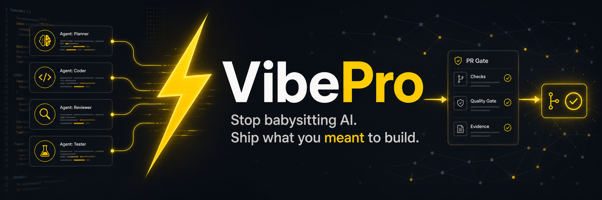

# VibePro



[](README.md)
[](README.ja.md)
[](package.json)
[](LICENSE)

AIを見張り続けるのをやめる。作りたかったものを出荷する。

VibePro は、Codex や Claude Code などの AI コーディングエージェントに実装を任せても、プロダクト意図・責務境界・品質基準がブレないようにするための CLI です。

作りたいもの、守るべき設計、受け入れ基準、実装タスク、検証結果、レビュー結果、PRに必要な証跡を `.vibepro/` に残します。AI エージェントが並列に作業しても、人間は「何が完成か」を握ったまま進められます。

必要な証跡が揃っていなければ、VibePro は機械的に作業を止めます。途中で Codex や Claude Code に役割別レビューを依頼し、その結果を現在の git 状態に紐づけます。必須の検証、レビュー、例外判断、意思決定記録が揃うまで、PR 作成には進めません。

## なぜ VibePro か

AI コーディングは、小さいタスクでは速い。問題は、プロダクト全体をブレずに完成させることです。

本当の課題は、AI がコードを書けるかどうかではありません。AI は書けます。課題は、複数のエージェントが画面、API、データの流れ、性能、セキュリティ境界、責務分担、状態遷移を触っても、プロダクトの意図を保ち続けることです。

最後にチェックリストを見るだけでは足りません。VibePro は、実装依頼から PR 作成まで必要な証跡をつなげて管理します。リスクが高い変更では確認項目を増やし、必要ならサブエージェントレビューを求めます。必要な成果物が欠けている PR は、準備完了として扱いません。

VibePro は AI に渡すための「プロダクト契約」を作ります。

- Story: どんなユーザー価値を満たすべきか。
- 設計境界: どの責務、依存方向、外部連携を守るべきか。
- 仕様: どの振る舞い、不変条件、受け入れ基準を満たすべきか。
- タスク: AI に渡せる粒度で、どこまでを作るべきか。
- リスク分類: 軽い変更か、API契約か、画面操作か、複数の導線をまたぐ重い変更か。
- Gate: 画面、E2E、性能、セキュリティ、統合、状態遷移、レビューの何が未解決か。
- エージェントレビュー: 今のリスクに対して、どの役割の Codex / Claude Code / 人間レビューが必要か。
- PR証跡: 変更・レビュー・マージ前に人間と AI エージェントが読むべき共通文脈。

基本の流れ:

```text
Story -> 設計 -> 仕様 -> Task -> AI実装 -> リスクに応じたGate -> PR証跡 -> VibePro経由でPR作成
```

VibePro は対象アプリを自動で書き換えるツールではありません。人間が AI エージェントへ実装を渡し、その実装が意図したプロダクトからズレていないかを確認し、マージ可能な状態まで運ぶための制御レイヤです。変更が状態遷移、実行時の契約、検証証跡、レビュー運用にまたがる場合、VibePro は通常より重い Gate に切り替えます。

## 主な機能

- プロダクト意図の記録: Story、設計、仕様、タスク、受け入れ基準を `.vibepro/` に保存
- 影響範囲の把握: Graphify のコードグラフを取り込み、対象ファイル、中心となる処理、隣接する責務を参照
- AI エージェントへの引き渡し: Codex、Claude Code、人間エンジニアへ渡す作業指示、実装計画、引き渡し資料を生成
- リスクに応じた Gate: 完了をブロックしている品質条件、重い変更に必要な確認、足りない証跡を可視化
- 機械的な停止: 必須の検証・レビュー・例外判断・意思決定記録が揃うまで PR 作成を止める
- 役割別レビュー: Codex / Claude Code へのレビュー依頼を作り、並列サブエージェントレビューの出所を現在の git 状態に紐づけて記録
- PR証跡: PR 前に `pr-body.md`、`review-cockpit.html`、`gate-dag.html`、`split-plan.html` を生成
- 品質チェック: 画面、導線設計、操作性、ネットワーク契約、セキュリティ境界、DBアクセス、ローカル開発、コード品質、設計、PR準備、公開準備
- 検証証跡: Unit、Integration、E2E、Build、Type-check、Playwright Flow の結果を現在の git 状態に紐づけて記録
- 性能証跡: Story 単位の性能主張に対して、指標定義、実行記録、before/after 比較を保存
- 意思決定記録: `needs_review`、ノイズ判定、waiver、secret 混入判断を会話ではなく VibePro の成果物として保存
- PR作成経路の強制: 未解決Gateとwaiver理由を `vibepro pr create` 経路で記録
- 画面改善支援: 既存ルート、コード、スタイル証跡、任意のGraphify文脈から VibePro-native Design System artifact と改善計画を生成
- Skills / Codex instructions の導入による AI 駆動開発ワークフロー標準化

## インストール

VibePro は Node.js 20 以上が必要です。

VibePro は現在 alpha OSS 公開候補です。まだ public npm registry に存在しない場合、`npm install -D vibepro` や `pnpm add -D vibepro` を実行しても npm からは解決できません。

利用方法は次のどれかです。

```bash
# このリポジトリをcloneしてローカルから使う
cd /path/to/vibepro
npm install
node bin/vibepro.js --help

# npm公開前にGitHubからinstallする
npm install -g git+https://github.com/Unson-LLC/vibepro.git
vibepro --help
```

npm公開後は次の形で使えます。

```bash
npx vibepro --help
```

VibePro本体を開発する場合:

```bash
npm install
node bin/vibepro.js --help
```

## 任意連携: Graphify

Graphify は任意ですが、影響範囲調査の精度を上げるため推奨です。VibePro は Graphify 本体や Graphify のコードを同梱しません。`--run-graphify` を使う場合は、外部インストール済みの `graphify` コマンドを呼びます。`--from graphify-out` を使う場合は、Graphify が生成済みの成果物を取り込みます。

```bash
uv tool install graphifyy
```

Graphify のインストールと利用は Graphify 側のライセンスに従ってください。Graphify がなくても、多くの Story / Diagnosis / Checkpoint / PR Gate ワークフローは利用できます。ただし、変更ファイルの隣接調査は弱くなります。

以下の例では `vibepro` コマンドを使います。global install していない場合は、`vibepro` を `node /path/to/vibepro/bin/vibepro.js` に置き換えてください。

## 初回: 目的別にこれだけ実行

まずリポジトリ全体を診断したいだけなら、既存の Story ID は不要です。

```bash
vibepro check all /path/to/repo --base <base-branch>
```

終わったら次を共有してください。

- `.vibepro/checks/all/<run-id>/check.md`
- 先頭の `Status`
- `needs_review` / `fail` になっている項目

特定の機能や不具合に紐づけて診断する場合は、まずローカル Story を作ります。

```bash
vibepro init /path/to/repo \
  --story-id story-<short-name> \
  --title "<機能名または不具合名>" \
  --language ja

vibepro check all /path/to/repo \
  --story-id story-<short-name> \
  --base <base-branch>
```

すでに VibePro Story があるリポジトリでは、先に一覧や map を確認します。

```bash
vibepro story list /path/to/repo
vibepro story map /path/to/repo
```

PR前の確認が目的なら、見るべき入口は check report ではなく PR prepare の成果物です。

```bash
vibepro pr prepare /path/to/repo \
  --story-id <story-id> \
  --base <base-branch>
```

見る順番:

1. `.vibepro/pr/<story-id>/review-cockpit.html`
2. `.vibepro/pr/<story-id>/gate-dag.html`
3. `.vibepro/pr/<story-id>/split-plan.html`
4. `.vibepro/pr/<story-id>/pr-body.md`

`<base-branch>` はリポジトリごとに異なります。`origin/main`、`main`、`origin/develop`、`develop` など、そのリポジトリの既定 branch を指定してください。

`pr prepare` は Gate DAG を作る前に変更リスクを分類します。ドキュメントだけ、画面だけのような狭い変更は軽い Gate に留まります。一方、複数の画面・API・状態遷移をまたぐ変更では、導線の再現確認、本番経路の確認、リリース判断、より広いレビューが必要になります。必須 Gate が未解決の間、VibePro の `next_commands` は PR 作成ではなく、レビュー・検証・再準備を案内します。

## Quick Start

対象リポジトリを初期化します。

```bash
npx vibepro init /path/to/repo \
  --story-id story-internal-beta \
  --title "社内β診断" \
  --view dev \
  --period 2026-W18 \
  --language ja
```

Story 診断を実行します。

```bash
npx vibepro story diagnose /path/to/repo --id story-internal-beta --run-graphify
```

PR 証跡を生成します。

```bash
npx vibepro pr prepare /path/to/repo \
  --base <base-branch> \
  --story-id story-internal-beta
```

現在の git 状態で実際に走らせた検証証跡を記録します。

```bash
npx vibepro verify record /path/to/repo \
  --id story-internal-beta \
  --kind unit \
  --status pass \
  --command "npm test"
```

実装完了扱いにする前に checkpoint を通します。

```bash
npx vibepro checkpoint verification /path/to/repo \
  --base <base-branch> \
  --story-id story-internal-beta
```

必要なエージェントレビューを準備・記録し、Gate DAG が準備完了になるまで PR 準備を再実行します。

```bash
npx vibepro review prepare /path/to/repo --id story-internal-beta --stage gate
npx vibepro review status /path/to/repo --id story-internal-beta
npx vibepro pr prepare /path/to/repo --base <base-branch> --story-id story-internal-beta
```

`pr prepare` が準備完了を返した後、VibePro 経由で PR を作成します。

```bash
npx vibepro pr create /path/to/repo \
  --base <base-branch> \
  --head <feature-branch> \
  --story-id story-internal-beta
```

通常の PR 作成経路として直接 `gh pr create` は使わないでください。VibePro の Gate DAG と例外判断の記録を通らないためです。

`<base-branch>` はリポジトリごとに異なります。`origin/main`、`main`、`origin/develop`、`develop` など、そのリポジトリの既定 branch を指定してください。VibePro は `init` や `pr prepare` の出力で候補 branch も表示します。

## VibePro が作るもの

VibePro は対象リポジトリの `.vibepro/` に作業領域を作ります。

```text
.vibepro/
  config.json
  vibepro-manifest.json
  diagnostics/
  graphify/
  pr/
  qa/
  raw/
  stories/
```

PR 前に見る主な成果物:

- `pr-body.md`: Story、リスク、Gate、検証文脈を含む PR 本文ドラフト。
- `review-cockpit.html`: 人間が見るレビュー画面。
- `gate-dag.html`: 完了条件の依存関係。
- `split-plan.html`: PR 分割レーンと merge order。
- `pr-prepare.json`: AI エージェント向けの機械可読な正本。

人間は Markdown / HTML を読みます。AI エージェントには `pr-body.md`、`review-cockpit.html`、`gate-dag.html`、`split-plan.html`、関連 JSON を渡すのが基本です。

## よく使うワークフロー

### リポジトリを診断する

```bash
npx vibepro check all /path/to/repo --story-id <story-id> --base <base-branch>
```

診断パッケージを絞る場合:

```bash
npx vibepro check ui /path/to/repo --story-id <story-id>
npx vibepro check security /path/to/repo --story-id <story-id>
npx vibepro check oss-readiness /path/to/repo --story-id <story-id>
npx vibepro check performance /path/to/repo --story-id <story-id>
npx vibepro check architecture /path/to/repo --story-id <story-id>
npx vibepro check pr-readiness /path/to/repo --story-id <story-id> --base <base-branch>
```

### UI フローを検証する

```bash
npx vibepro verify flow /path/to/repo \
  --base-url http://127.0.0.1:3000 \
  --id <story-id>
```

VibePro は Playwright 証跡を記録し、API `4xx` / `5xx`、console error、unhandled rejection、既知の画面エラー文言を Gate finding として扱います。

### 検証証跡を記録する

```bash
npx vibepro verify record /path/to/repo \
  --id <story-id> \
  --kind unit \
  --status pass \
  --command "npm test"
```

記録した証跡は `pr prepare` と PR Gate で再利用されます。

複数の導線をまたぐ重い変更では、Unit/API の証跡だけでは不十分です。VibePro は、現在の git 状態に紐づいた Story E2E / Flow 証跡、実行可能な assertion、Gate DAG が要求するリスク別レビューも確認します。

### エージェントレビューを準備する

```bash
npx vibepro review prepare /path/to/repo --id <story-id> --stage implementation
```

レビュー結果を記録します。

```bash
npx vibepro review record /path/to/repo \
  --id <story-id> \
  --stage implementation \
  --role regression_risk \
  --status pass \
  --summary "変更フローに回帰リスクは見つからなかった。" \
  --agent-system codex \
  --execution-mode parallel_subagent \
  --agent-id <spawned-subagent-id> \
  --agent-thread-id <thread-id> \
  --agent-model <model> \
  --agent-closed
```

`gate:agent_review` は、必須レビューについて Codex / Claude Code の並列サブエージェント証跡と、レビュー用セッションを閉じた証跡がある場合だけ、検証済みレビューとして扱います。
各レビュー結果を受け取ったら、記録前にレビューに使ったサブエージェントを終了し、`--agent-closed` を渡して記録してください。Claude Code の場合は `--agent-system claude_code` と、Task ID、サブエージェントID、セッションID、または transcript artifact を渡してください。
人間レビューは監査用の文脈として記録できますが、必須サブエージェントレビューの代替にはなりません。

```bash
npx vibepro review record /path/to/repo \
  --id <story-id> \
  --stage implementation \
  --role regression_risk \
  --status pass \
  --summary "手動レビューで問題は見つからなかった。" \
  --agent-system human \
  --execution-mode manual_review \
  --recorded-by <reviewer>
```

手動レビュー証跡は監査文脈としては有用ですが、required Agent Review Gate は通しません。
実行環境がサブエージェントを起動できない場合、coordinator は gate を通した扱いにせず、
block するか別の waiver decision として記録します。

### VibePro 経由で PR を作成する

```bash
npx vibepro pr prepare /path/to/repo --story-id <story-id> --base <base-branch>
npx vibepro pr create /path/to/repo --story-id <story-id> --base <base-branch> --head <feature-branch>
```

`pr create` は `pr prepare` が生成した PR 本文を使い、branch push と GitHub PR 作成を実行します。critical Gate が未解決の場合、PR作成前に失敗します。非critical Gate だけが未解決の場合は、`--allow-needs-verification` と `--verification-waiver <reason>` の両方が必要です。

### 既存UIをModernizeする

```bash
npx vibepro design-modernize derive-system /path/to/repo \
  --id <story-id> \
  --product <name> \
  --routes /home,/map,/detail \
  --brief "日本語ホテル探索アプリ。地図探索とプロダクト固有CTAを重視する"

npx vibepro design-modernize plan /path/to/repo \
  --id <story-id> \
  --product <name> \
  --routes /home,/map,/detail \
  --base-url http://127.0.0.1:3000
```

`derive-system` は、プロダクト概要と現行UIの証跡から、VibePro内の派生デザインシステムを作ります。プロダクトの意味づけ、色の役割、コンポーネントの責務、画面構成ルール、仮説デザインの扱い、明示的なデザインシステムGateを生成し、画面候補を作る前に「そのプロダクトで許されるデザイン判断の範囲」を固定します。

`design-modernize` は、既存のルート、情報構造、CTA、状態、データ依存を保ったまま実プロダクト画面を改善するための流れです。外部のデザインシステムや生成された画面案は参照材料であり、VibePro が作ったデザインシステム、現行スクリーンショット、Graphify / Codex の証跡、Gate DAG が実装判断の正本です。

主な成果物は `.vibepro/design-modernize/<story-id>/` 配下に出力されます。

- `design-system-derivation.json` / `.md`: プロダクトの意味づけと派生デザインシステムの要約
- `derived-design-system.json`: 意味を持つトークン、コンポーネントの役割、CTAの優先順位、避けるべき表現、画面案の扱い
- `design-modernize.json`: 画面別の改善計画と Design Quality DAG
- `ds-gate.json`: 暗黙のfallbackを禁止した、デザインシステム逸脱・UX回帰の明示的な確認条件

外部デザインシステムや画像生成案は、あくまで仮説として扱います。実装前に、仕様が現行ルート、情報構造、CTA優先度、状態、データ依存を保持していることを確認してください。PR作成前には `vibepro pr prepare` で、デザイン、要求、Unit、Integration、エージェントレビューの Gate が現在の HEAD に対して解消されている必要があります。

### 性能を測る

Story ごとの指標を定義します。

```bash
npx vibepro performance define /path/to/repo \
  --id <story-id> \
  --metric-id session-switch.user-terminal-ready \
  --user-story "ユーザーがsessionを切り替え、terminalに入力できる" \
  --start-condition "session row click" \
  --completion-condition "owner and inputReady=true" \
  --evidence-source browser_e2e \
  --readiness-kind user_perceived
```

変更前後の実行結果を記録します。

```bash
npx vibepro performance record /path/to/repo \
  --id <story-id> \
  --metric-id session-switch.user-terminal-ready \
  --label before \
  --status completed \
  --duration-ms 2400

npx vibepro performance compare /path/to/repo --id <story-id>
```

VibePro は同じ `metricId` と互換性のある完了条件を持つ実行結果だけを比較します。比較できない場合は、その理由を表示します。

## AIエージェント設定

Claude / Claude Code 向けの同梱 Skills を対象リポジトリへ導入します。

```bash
npx vibepro skills list
npx vibepro skills install /path/to/repo
npx vibepro skills verify /path/to/repo
```

同梱 Skills:

- `vibepro-workflow`: Story、設計、仕様、Graphify、Gate の実行順。design-modernize とエージェントレビューの流れも含む。
- `vibepro-story-refactor`: Story、設計、仕様、タスク、コード、Gate証跡を揃えながら進めるリファクタリング手順。
- `vibepro-diagnosis-packages`: 画面、セキュリティ、性能、設計、PR、公開準備の目的別チェック。
- `vibepro-human-review`: PR準備証跡、分割計画、レビュー画面、waiver 判断の読み方。

Codex 向け instructions を導入します。

```bash
npx vibepro codex install /path/to/repo
npx vibepro codex verify /path/to/repo
```

目的は、AIエージェントが Story を読み、証跡を作り、レビューを実行し、PR Gate を守る流れを標準化することです。

## 出力言語

VibePro は人間が読む CLI 出力とレポートで日本語・英語を切り替えられます。

```bash
npx vibepro init /path/to/repo --language ja
npx vibepro config language /path/to/repo --language en
npx vibepro pr prepare /path/to/repo --language en --base <base-branch>
```

機械可読 JSON のキーは安定性のため英語系のまま維持します。

## ドキュメント

- [English README](README.md)
- [Changelog](CHANGELOG.md)
- [Contributing guide](CONTRIBUTING.md)
- [Security policy](SECURITY.md)
- [OSS readiness architecture](https://github.com/Unson-LLC/vibepro/blob/main/docs/architecture/vibepro-oss-apache2-readiness.md)
- [OSS readiness spec](https://github.com/Unson-LLC/vibepro/blob/main/docs/specs/vibepro-oss-apache2-readiness.md)

## プロジェクト状態

VibePro は現在 alpha OSS 公開候補です。安定版公開前に API、report schema、diagnosis pack は変わる可能性があります。

## License

VibePro は [Apache License 2.0](LICENSE) で公開されています。
