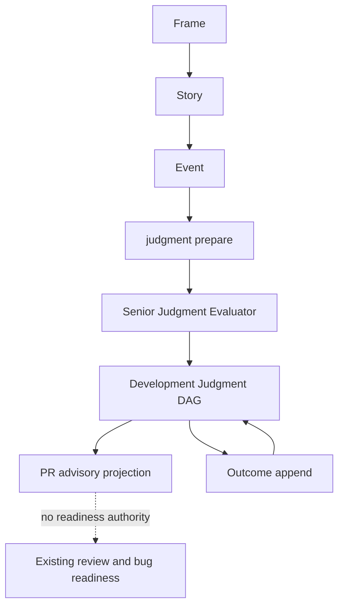

# Development Judgment Workflow Diagram

```mermaid
flowchart TD
  Frame[Frame] --> Story[Story]
  Story --> Event[Event]
  Event --> Prepare[judgment prepare]
  Prepare --> Senior[Senior Judgment Evaluator]
  Senior --> Durable[Development Judgment DAG]
  Durable --> Projection[PR advisory projection]
  Durable --> Outcome[Outcome append]
  Projection -. no readiness authority .-> Existing[Existing review and bug readiness]
  Outcome --> Durable
```

The dotted edge is informational only. Development Judgment never changes PR readiness, merge, or release authority.
