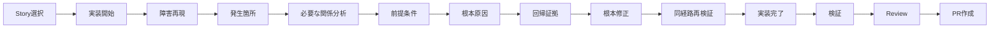

# バグ診断DAG統合アーキテクチャ

## 判断

VibeProのStory実行DAGを唯一の上位ワークフローとする。`contract_type` が `bug_fix`、`regression_fix`、`bug` のStoryだけに、型付きバグ診断ノードを挿入する。Verify-firstは同じ `story diagnose` 実装を呼ぶ非推奨の互換入口に限定する。

## 責務境界

- `bug-diagnosis-dag.js`: 証拠スキーマ、順序、状態遷移、fail-closed判定、戻り先を所有する。
- `diagnostic-engine.js`: バグStoryの診断run開始時に初期証拠を作り、manifestへ結び付ける。
- `managed-worktree.js`: 既存実行DAGの実装開始と実装完了の間へ診断ノードを接続する。
- `pr-manager.js`: 最新診断証拠と実行DAGをPR準備artifactへ投影し、未完了ならPR作成を拒否する。
- `cli.js`: Story契約の登録、ノード証拠の記録、Verify-first互換転送だけを担当する。

Story、Spec、Graphify、検証証拠、Review、既存PR処理は複製しない。通常StoryのPR準備契約も変更しない。

## 実行順

## Fail-closed契約

`passed` のノードは記録時のHEADと1件以上の証拠参照を必要とし、PR準備時には診断の対象HEADが現在のHEADと一致しなければならない。診断は定義順にのみ進める。関係分析は必要な分析種別だけを選択し、不要なら理由付きで適用外にできる。回帰テストも決定的に作れない場合だけ理由付きで適用外にできる。再検証は再現時と同じ `path_id` が必要である。

未完了または失敗した最初のノードを `return_to_node` とし、Storyとrunに結び付いた `next_actions` を返す。単体テストを含む既存検証結果は診断ノードの代用にしない。

## 互換性とロールバック

新フィールドとartifactは追加のみで、バグ契約を持たないStoryには診断DAGを挿入しない。旧入口を使う自動化には非推奨警告を出し、同じStory診断へ転送する。ロールバック時は診断モジュール、DAG接続、PR判定、CLI入口、関連文書とテストを同一変更として戻せる。外部データ移行はない。
