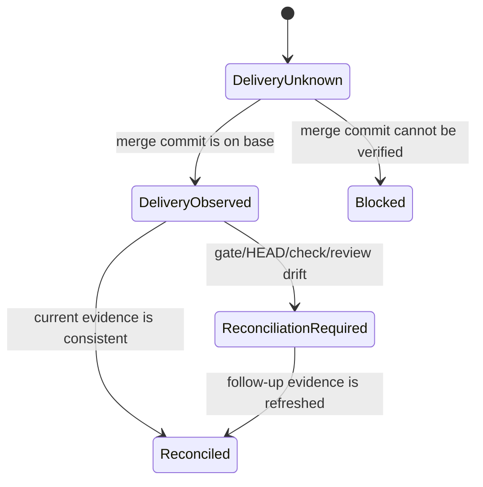
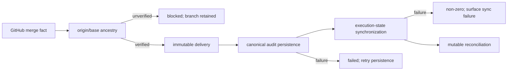

# Delivery and Reconciliation State Architecture

## Decision

`execute merge`の結果を一つの可変`status`へ押し込めず、次の二軸へ分ける。

- `delivery`: GitHub PRとbase refから観測した配送事実。merge commit、merged_at、PR URLを保持し、後続のローカルgate driftで未配送へ戻さない。
- `reconciliation`: 現在のworktree、HEAD、gate evidence、CI、review policyを配送事実へ整合させるfollow-up状態。再実行ごとに更新できる。

外部マージではOPEN PRとbranch-base freshnessは成立しないのが正常なので、再調整理由から除外する。一方、gate未ready、dirty worktree、PR head不一致、failing checks、review policy未充足は明示的な再調整理由とする。

VibePro自身が`gh pr merge`を実行した場合も、成功応答を配送事実とはみなさない。直後に
`origin/<base>`を再fetchしてからGitHubのmerged viewを再取得し、そのmerge commitが
更新済み`origin/<base>`の祖先であることを確認する。
確認できなければdeliveryは`unverified`、reconciliationは`blocked`としてfail closedする。
branch cleanupはこの確認より後にだけ実行し、delivery未確認時は復旧用branchを保持する。

## State transition

## Compatibility

既存のtop-level `status`は表示互換のため残す。ただしCLI exit、execution follow-up、今後のledger bindingは`delivery`と`reconciliation`を参照する。traceabilityは`delivery.status`を正本にする。

状態を変更する`execute merge` / `execute reconcile`の終了コードは意図的なfail-closed契約である。
`0`はdelivery確認済みかつreconciled、`2`はdelivery未確認またはreconciliation_required、
`1`はprovider後処理・永続化・同期などの実行失敗を表す。一方、read-onlyな`execute status`は
未解消状態をJSON/textへ投影しても照会自体が成功した限り`0`を返し、状態判定は出力fieldで行う。
旧consumerはtop-level `status`を読み続けられるが、自動化は制御コマンドの終了コードを
無視せず、`delivery`を配送事実、`reconciliation`を次actionの正本として段階移行する。
rollback時もadditive fieldsは残し、終了コードpolicyだけを戻せる。

同じ障害でも、最初のprovider後処理・永続化・同期処理が失敗したコマンドは運用上の失敗として
`1`を返す。その失敗を永続化済みartifactから後続の`execute reconcile`で再評価する場合は、
未解消のreconciliation状態として`2`を返す。したがって`1`は発生時の実行失敗、`2`は保存された
未解消状態の再評価であり、同一コマンド経路の不整合ではない。

## Failure policy

The recovery boundary is intentionally split into three independently reviewable risk lanes:

- `DRS-CONTRACT-007 state semantics/projection`: owns immutable delivery, mutable reconciliation,
  identity-bound recovery guidance, and consistent CLI/HTML/audit projections.
- `DRS-CONTRACT-008 transaction/concurrency`: owns generation fencing, observed-value CAS, and
  per-write transaction-owned rollback. It does not define general-purpose locking semantics.
- `DRS-CONTRACT-009 routed/linked authority`: owns configured PR routes and the local/linked
  authority set touched by delivery reconciliation. It does not migrate unrelated artifacts.

Each lane fails closed independently and can identify its own rollback surface; a passing state
projection cannot hide transaction damage or a routed-authority mismatch.

- delivery未確認: fail closed (`blocked`)。
- delivery確認済み・reconciliation不足: 配送事実を保存し、状態変更コマンドは
  `reconciliation_required`として非0終了する。read-onlyな`execute status`は状態を表示して0終了する。
- provider command非0またはprovider JSON parse失敗: deliveryを推測せずblocked artifactを保存する。
- canonical artifact persistence失敗: delivery事実を残したままtop-level処理とexecution
  completionを`failed`にし、永続化再試行を次actionに残す。
- canonical follow-up transaction が失敗して local/canonical/manifest を rollback した後は、失敗した
  transaction の成功を装わない。expected-merge CAS が成立する場合に限り、観測済み delivery と exact PR/base selector は recovery authority として
  local `pr-merge.json` に `recovery_persistence=persisted_local` で保存し、CLI は exit 1 を返す。CAS が不成立なら
  newer operator state を上書きせず、`merge_recovery_state_conflict` と `recovery_persistence=failed` を返す。この local-only
  intermediate state は可用性のための明示的 degraded mode であり、canonical authority の代替正本にはしない。
  後続の `execute reconcile` が同じ identity を検証して canonical authority と execution state を再構成した時点で
  のみ `reconciled` へ収束する。
- execution-state同期失敗: local/canonical merge artifact自体を`reconciliation_required`へ更新し、
  非default baseとPR selectorを含む単一の順序付き`reconciliation_action`を永続化する。CLI、HTML、
  usage、compact canonicalは同じactionを投影し、この経路にprepare→merge guidanceを混在させない。
  follow-up CASのbaselineは、canonical audit最終化後の返却objectではなく、直前にlocalへ永続化された
  `pr-merge.json`を使う。これにより自処理内のcanonical metadata差分をoperator競合と誤認せず、実際の
  operator更新だけを拒否する。
  後続の`execute reconcile`がexecution stateを書けた時点で、この失敗理由だけを消費してlocal/canonical
  merge artifactを更新する。保存済みbase/PRと入力base/PRはすべて必須かつ完全一致とし、省略や不一致では
  failureを消費しない。delivery、base、PR identityは不変とし、別理由がなければ`reconciled`へ収束させる。
  local/canonical/manifestのfollow-up永続化は一単位でrollbackし、途中失敗または最終state書込失敗時は
  元のsync-failure artifactを復元して成功を装わない。rollbackは当該transactionが書いた値だけを復元し、
  local/source authorityをstory単位の共通lockで直列化し、各write直後のfingerprintとrecovered follow-upの
  expected valueをownership tokenとして使う。rollback対象はtransactionが所有を証明できた個別artifact pathに
  限定し、promotionが所有結果を返す前の未知のpartial outputや無関係writerのfileは推測して削除しない。
  競合writerの更新は上書きせず明示的なconflictにする。JSON出力は元error、error code、authority別の
  restore errorを分離して保持する。
- story lockはowner token、PID、hostname、heartbeatを永続化する。owner metadataをunique staging generationで
  完成させ、atomic renameに成功したgenerationだけをownerとするため、停止したinitializerが後から新ownerを
  上書きできない。heartbeatが古くても同一hostのowner processが生存している限りtakeoverしない。abandoned lockは
  directory renameで隔離してから再取得し、stale判定・heartbeat・releaseはlock generation内の固定`.transition`
  guardで直列化する。releaseは隔離前に現行owner tokenを再検証し、release/heartbeatはlockとguard双方の
  generation tokenが一致する場合だけ行う。guard自体が
  staleでも、同一host ownerの非生存とageを検証できた場合だけ隔離し、それ以外はfail closedにする。timeout JSONは
  lock/transition path、観測owner、検証条件と安全な再試行案内を返し、無条件の手動削除を要求しない。通常
  `execute merge`とfollow-up/reconcileの全VibePro writerは
  同じlockを通り、同期失敗後のfollow-upは同期前merge snapshotとのCASに成功した場合だけ更新する。
  reconcileは初回writeでも、既存stateまたは「未作成」を観測値としてstory lock内でCASし、build中に作成・更新された
  operator stateを上書きしない。この比較はlocalとlinked-sourceの全authorityを一つのbaselineとして扱い、linked側だけに
  観測値がある場合は受理する一方、いずれかの既存authorityが観測値と異なる場合はmutation前に停止する。
  PR artifactのcanonical routeが設定されている場合、merge writer、CAS、transaction snapshot、sync-failure consumer、
  verification projection、およびmanaged worktreeからsource repoへのartifact同期・rollback ownershipは各rootでresolverが返す同一directoryをauthorityとして使う。legacy `.vibepro/pr` を並行authorityにせず、
  routed JSON/HTMLとcanonical auditだけをtransaction内で収束させる。
  sync-failure消費後の最終writeは、初回writeが返したstateを再度CASする。
  merge-state成功経路も観測済みexecution-state snapshotをstory lock内で最終write前に再比較し、より新しいoperator stateを上書きしない。
- release rollbackはadditiveな`delivery`/`reconciliation` fieldを削除しない。問題時は新規自動判定を停止し、
  保存済みdeliveryを維持したまま従来のtop-level status/exit policyへ戻す。operatorは`execute status --json`で
  delivery identityを確認し、未解消なら保存済みbase/PRを指定した`execute reconcile`だけを再実行する。
- external deliveryの観測だけから、過去に`merge_ready`だったとは推測しない。delivery nodeは
  passedでも、historical readinessは`not_applicable`として区別する。
