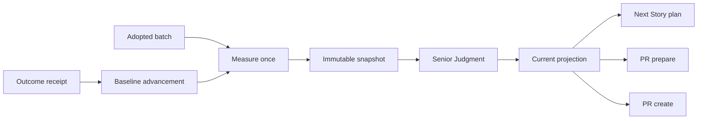

# Architecture

## Decision

開発制御を`measure adopted batch -> immutable snapshot -> Senior Judgment -> next batch admission`の閉ループにする。計測は実行中のreviewを止めず、採用済みbatchの境界で一度だけ行う。判断結果は新しいGateではなく、既存のStory plan、PR prepare、PR createの入口で共有する。

## Architecture Quality

- Alternatives considered: 旧delivery-efficiencyの全面復活、PR Gate追加、Story別上書き、adopted-batch制御を比較した。前3案は予算増額の自己正当化、HEAD変化による再計測、Gate DAG肥大化を再発させるため採用しない。
- Compatibility impact: 既存のSenior Judgment、Story plan、PR prepare、PR createへ小さなprojection/admissionを追加する。並列agent数を直接制限せず、legacy設定は読まない。スリム化で削除された旧`execute merge` commandは復活させず、現行release surfaceへ接続する。
- Rollback plan: `development_control.enforcement`を`shadow`へ戻せばsnapshotとstatusを残したままadmission blockを解除できる。既存PR artifactとGate DAGは変更せず継続できる。
- Boundary: 予算は開発投資の制御であり、correctness、security、UX、business valueの証明ではない。不明な計測は`VALIDATE`へ送り、0件や合格へ倒さない。
- Accepted followups: rolling capの高度な季節性補正やUI可視化は、outcome receipt付きの実運用データが貯まった後に別Storyで扱う。

## Control Flow

## Budget Model

### Structural budget

- LOCとimport edgeはbaseline比`+5%`でwarning、`+10%`で`SIMPLIFY`。
- file countは`+3%`でwarning、`+5%`で`SIMPLIFY`。
- dependency cycleの新規発生、またはworkflow-control surfaceの純増は即時`SIMPLIFY`。

### Consumption budget

- 履歴が十分なら各指標の`max(rolling 5 median * 2, rolling 20 p95)`をcapにする。
- bootstrap capはfresh input token 8,000,000、agent execution 6、repair batch 3、expensive verification 1、verification duration 45分。
- unknown attributionは超過と断定せず`VALIDATE`へ送る。0としてcap内に見せない。

## Admission Rules

- `VALUE`: `development_intent: value`、`validation`、`simplification`を許可する。
- `VALIDATE`: `validation`または`simplification`を許可する。
- `SIMPLIFY`: `simplification`だけを許可する。
- `shadow`: 判定と理由をartifactへ出すがblockしない。
- `enforced`: Story plan、PR prepare、PR createが同じprojectionを読み、intent不一致をfail closedする。

## Persistence

- batch snapshotはStory IDとadopted commitで一意にし、既存snapshotを上書きしない。
- current projection、直近20件までのconsumption summary、最新の改善receiptは`docs/management/development-control-state.json`へboundedに投影し、clone/worktree間で共有する。raw snapshotとraw receiptはlocal audit用のまま肥大化させない。
- outcome receiptはappend-onlyとし、`improved`のreceiptがあるsnapshotだけbaseline候補にできる。

## Non Goals

- review実行中の停止。
- agent並列度の直接制限。
- Storyごとのcap上書き。
- strict HEAD bindingを使った再計測。
- 新しいGate DAG nodeまたは巨大なaudit graph。
