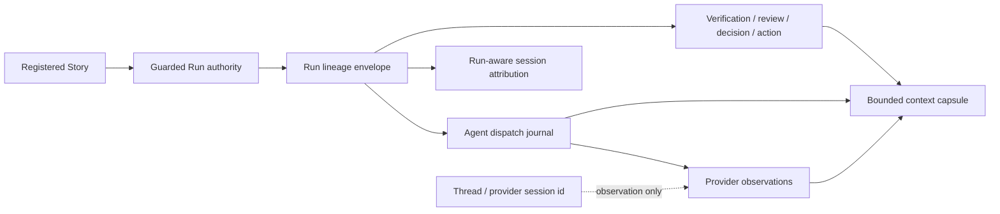

# Architecture

## Decision

VibeProが開始した作業のStory帰属は、Codex Threadやprovider sessionの形ではなく、Guarded Runが発行するversioned lineage envelopeを正本にする。`story_id`、`run_id`、`dispatch_id`、worktree、branch、HEADはRun authorityから生成し、provider run/session/thread idはappend-onlyな観測値としてのみ保存する。

lineageのschema、normalization、binding validation、provider observation conflict、Run-aware attribution resolutionは新しい独立module `src/run-lineage.js` に置く。`src/session-efficiency-audit.js`はsession event/token accountingと公開結果の集約に集中し、lineage moduleが返した帰属判定を消費する。Agent Runtime Adapter、Guarded Run、evidence recorder、context capsuleは同じcontractを利用し、独自のStory推定を実装しない。

## Authority model



Authoritative binding fields are immutable for one dispatch. A caller may omit lineage for backward-compatible, VibePro-external use, but once lineage is present it must be complete and internally consistent. An explicit caller value that disagrees with the selected Run is rejected with a typed mismatch; it is never silently replaced. Provider observations may add identifiers to the same dispatch, but the same provider identity cannot be rebound to another Story/Run and an observation cannot weaken the recorded HEAD binding.

## Artifact contract

The first envelope schema is `0.1.0`:

```json
{
  "schema_version": "0.1.0",
  "story_id": "story-vibepro-example",
  "run_id": "run-example",
  "dispatch_id": "dispatch-example",
  "provider_run_id": null,
  "provider_session_id": null,
  "thread_id": null,
  "worktree_root": "/absolute/authoritative/worktree",
  "branch": "codex/story-vibepro-example",
  "head_sha": "40-hex-sha"
}
```

The dispatch journal stores the envelope beside the dispatch record. Provider observations are normalized, deduplicated, and appended without changing authoritative fields. Evidence and action records store either the validated envelope or a stable repository-relative reference plus its binding summary. Existing artifacts without lineage remain readable and are reported as inferred, ambiguous, or unavailable rather than migrated by guesswork.

## Attribution resolution

`audit session-cost` accepts an optional Run selection and resolves evidence in this order:

1. explicit validated Run lineage;
2. validated artifact binding;
3. branch/worktree inference;
4. textual heuristic.

Every classification returns `method`, `source_artifact`, `confidence`, and `run_id` when known. Events are partitioned exactly once into `story_attributed`, `shared_parent`, `other_story`, `unattributed`, or `replayed_context`. Shared parent context, mixed tool output without a decisive event binding, and unmatched activity are never proportionally assigned to a Story. Replayed compaction replacement and repeated world-state remain separate from fresh exposure.

The resolver works at the smallest event/exposure unit available. If one indivisible tool output contains multiple lineages, it is `shared_parent` or `unattributed`, not assigned by changed lines or path majority. Classification totals must reconcile to the considered event/token totals.

## Integration boundaries

- `src/run-lineage.js`: pure schema validation, binding comparison, observation merge, artifact discovery, and attribution resolution.
- `src/guarded-run-session.js`: supplies authoritative Run identity and worktree/HEAD state; it does not parse provider transcripts.
- `src/agent-runtime-adapter.js`: creates a dispatch id, persists the validated envelope, and appends provider observations.
- verification/review/decision/action recorders: validate an optional active-Run binding before their authoritative write and preserve legacy return shapes when no Run is active.
- `src/session-efficiency-audit.js`: owns token/event accounting and renders the resolver result; it does not infer or mutate Run identity.
- `src/run-context-capsule.js`: projects bounded lineage refs and confidence summaries, never transcripts or hidden reasoning.

## Compatibility and failure contract

All public additions are additive. Existing `audit session-cost --session-id`, Guarded Run readers, runtime adapter callers, and evidence recorders remain valid without lineage arguments. New typed failures include `invalid_run_lineage`, `run_lineage_mismatch`, `stale_run_lineage_head`, and `provider_observation_conflict`. These errors are non-mutating and include the conflicting field without copying provider transcript content.

VibePro-external sessions continue through inference. A Thread id alone never raises confidence to authoritative. Missing Run artifacts, multiple candidate Runs, or an unresolved mixed parent produce honest ambiguous/unavailable or independent buckets.

## Handoff and privacy

The context capsule and PR decision surface expose only bounded identity, artifact refs, classification method/confidence, and the presence of shared/unattributed work. Provider transcripts, prompts, tool output, and hidden reasoning are not duplicated. A fresh process can reconstruct Story to Run to dispatch to evidence and provider observation by following artifact refs and validating bindings.

## Verification matrix

- valid envelope creation from a Guarded Run and exact dispatch persistence;
- missing field, Story/Run/worktree mismatch, stale HEAD, duplicate provider id, and cross-Run rebinding rejection;
- legacy adapter/evidence/session-cost calls without lineage;
- single Run and two-Run mixed-parent fixtures with exhaustive partition totals;
- shared, unattributed, and replayed exposure excluded from Story-attributed totals;
- Thread-only and VibePro-external sessions remain inferred or unavailable;
- fresh-process capsule recovery without transcript input;
- Graphify confirms lineage resolution remains outside `session-efficiency-audit.js`.

## Rollback

Remove the additive envelope fields, propagation hooks, capsule projection, and Run-aware audit option, then remove `src/run-lineage.js`. Existing Guarded Run state, dispatch journals, evidence, and heuristic session-cost paths remain readable; persisted unknown lineage fields are ignored by older readers.
