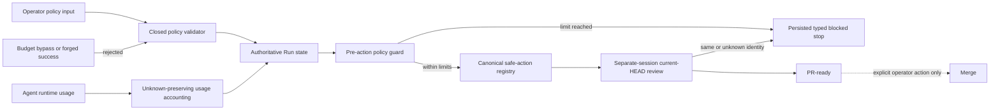

# Guarded Autonomy Hardening Architecture

## Decision

Guarded Autonomy remains an orchestration boundary over the existing Guarded Run, safe-action registry, Agent Runtime, review provenance, validation sequencing, repair loop, and Portfolio controller. The Run authority artifact owns policy, counters, deadline, usage accounting, and typed stop reasons. It does not own merge, deployment, waiver, or external-side-effect authority.

## Components and flow

1. `execute run --until pr-ready --autonomy guarded` validates a closed policy input and persists it with the new Run.
2. Every orchestration or resume reads the authoritative Run and evaluates attempts, iterations, deadline, token, and cost limits before executing an action.
3. A limit produces a persisted `blocked` state and a typed, non-retryable stop reason. Unknown usage remains `null` with `status=unknown`; it is never coerced to zero.
4. The safe-action registry remains closed to repository-local preparation actions. Critical gates, waivers, merge, deployment, and other external side effects remain outside it.
5. Existing runtime-review provenance is reused: only a closed, read-only, current-HEAD, separate-session review dispatch may enter the Agent Review Gate.
6. The cockpit renders progress, attempt/iteration budget, elapsed time, deadline, human interruptions, selection reason, usage, stop reason, and next safe recovery action.

## Compatibility and rollback

Legacy Run artifacts remain readable. New policy fields are additive; predecessor migration preserves unknown accounting. Rollback disables `--until pr-ready` auto-advance and uses explicit `execute status`, `resume`, and existing manual Gate commands. No rollback may reinterpret a blocked Run as success.

## Failure boundaries

- Policy exhaustion: `blocked` plus `max_attempts_exceeded`, `max_iterations_exceeded`, `deadline_exceeded`, `token_budget_exceeded`, or `cost_budget_exceeded`.
- Runtime quota/timeout, CI pending, and review timeout remain typed recoverable operational stops governed by the persisted retry policy.
- Human decisions remain `waiting_for_human`; cancellation remains terminal.
- HEAD mutation requires existing rebind and final `pr prepare` readiness confirmation.

## Threat model

The Run artifact is the trust boundary for limits and usage. CLI input and runtime telemetry are untrusted until validated; absent telemetry remains unknown. The safe-action registry cannot grant waiver, merge, deployment, or external-side-effect authority, and reviewer identity cannot be supplied by the implementation session itself.
