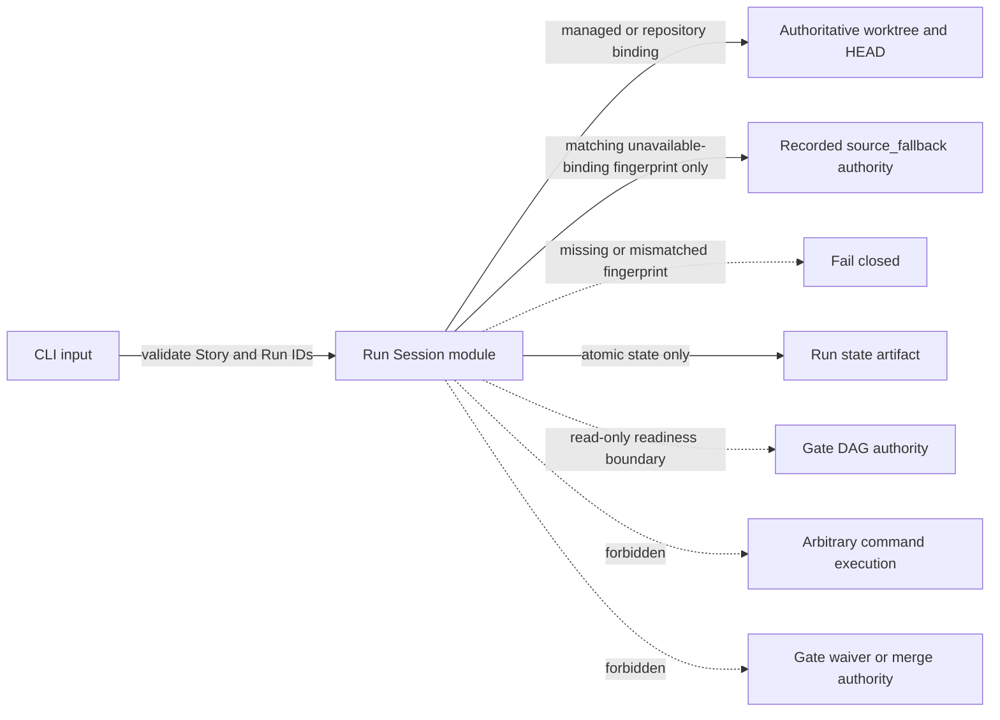

# Architecture

## Decision

Add a versioned, Story-scoped Run Session layer beside the existing Execution State layer. The Run Session is a resumable control contract for a single guarded attempt to reach `pr_ready`; it does not replace Gate DAG, the legacy Story execution state, or the managed-worktree state.

The implementation lives in a dedicated `src/guarded-run-session.js` module. `src/cli.js` only parses the additive command surface and delegates to that module. This keeps lifecycle persistence and transition validation out of the already broad CLI and Execution State modules, and gives the later action-orchestrator and runtime-adapter Stories one stable boundary to call.

## Persistence and identity

The canonical artifact for one Run is:

`.vibepro/executions/<story-id>/runs/<run-id>/state.json`

Each persisted state includes:

- `schema_version`
- `run_id`, `story_id`, `target`, `autonomy_mode`
- `created_at`, `updated_at`
- `status`, `stop_reason`, `attempt`, `iteration`
- `budget`, `deadline`, `last_progress_at`, `pending_decision`
- `current_head_sha`
- `execution_context` with `authority_kind` (`managed`, `repository`, or `source_fallback`), the canonical real path of the Run's execution root, and its Git worktree directory in every mode
- `managed_worktree` binding snapshot with status, mode, source repository, recorded path, branch, base ref, creation HEAD, and failure reason; `source_fallback` additionally stores a `bootstrap_binding_fingerprint`
- append-only `transitions` entries containing sequence, from, to, reason, and timestamp

Initial creation takes one clock reading `created_at`. It writes `updated_at=created_at`, `status=running`, `stop_reason=null`, `attempt=1`, `iteration=0`, `budget={"max_attempts":1,"max_iterations":0}`, `deadline=null`, `last_progress_at=created_at`, `pending_decision=null`, and `transitions=[{"sequence":1,"from":null,"to":"running","reason":"run_created","timestamp":created_at}]`. The binding resolver supplies `current_head_sha`, `execution_context`, and `managed_worktree`. This Story exposes no CLI override for these guarded initial budget/deadline values. The budget is persisted policy input but is deliberately advisory in this persistence-only Story: explicit operator `resume` increments `attempt` even past `max_attempts`, and no command increments `iteration`. The later safe-action orchestrator must define and enforce automatic attempt/iteration limits before dispatching any action; it may change these values only through a separately specified validated mutation.

`stop_reason`, `deadline`, and `pending_decision` are closed nullable unions rather than unvalidated JSON slots. A non-null stop reason is a plain object with non-empty string `code` and `message` plus optional plain-object `details`; a non-null deadline is a canonical ISO timestamp; and a non-null pending decision is a plain object. Every transition into `waiting_for_human`, `waiting_for_runtime`, `blocked`, or `failed` requires a fresh typed stop reason and never inherits the previous stop. Returning to `running` or reaching `pr_ready` clears the stop reason. Invalid transition metadata is rejected before authority persistence, and canonical plus recognized predecessor artifacts with invalid nullable-field shapes return nonmutating `invalid_state`. Historical stopped artifacts whose explicitly persisted stop reason is `null` remain readable for compatibility; this does not permit a new reasonless stopped transition.

Story identity is selected from the registered VibePro Story catalog and must match `^story-[a-z0-9][a-z0-9._-]*$`; raw or encoded separators and traversal segments are invalid. `execute run` alone generates an opaque id in the form `run-YYYYMMDDTHHMMSSZ-<8 lowercase hex>` and does not accept a caller-supplied Run id. A syntactically valid supplied id fails with `run_id_not_allowed`; a supplied id that does not match `^run-\d{8}T\d{6}Z-[0-9a-f]{8}$` fails with `invalid_run_id`. Both rejection paths return contract exit `2` before Story lookup, Git identity resolution, legacy bootstrap, lock creation, or Run/mirror persistence. Story and selected Run identities are otherwise validated before any filesystem path is composed. Invalid input fails with `invalid_story_id` or `invalid_run_id` and cannot escape the Story execution directory.

Run context resolution happens before any Run path is composed or `startExecution` is called:

1. Resolve the existing legacy execution state through its local/linked metadata. When it records an available managed worktree, that canonical managed path is the authority. The caller may be either the recorded `managed_worktree.source_repo` control root or the managed authority root; every other checkout, including another worktree at the same HEAD, fails with `worktree_mismatch`.
2. If existing legacy execution metadata records a managed binding whose status is unavailable or whose canonical path/Git directory no longer resolves, `execute run` fails with `worktree_unavailable` in both `preferred` and `required` modes. It does not fall back to the source repository, call `startExecution`, create a replacement or nested worktree, create a Run, or promote a linked copy. This applies from the source control root and, when the recorded path still resolves but is marked unavailable, from that recorded managed root.
3. Reuse an available recorded managed execution as-is. Calling `execute run` from its managed root never calls `startExecution` or creates a nested managed worktree. Calling it from the source control root delegates persistence and binding to that same managed authority.
4. Only when no legacy execution exists may `execute run` call the existing `startExecution` contract once from the invoking repository. A successfully created managed worktree becomes authority. When managed-worktree mode is `disabled`, the returned disabled binding creates a `repository` Run whose authority is the canonical invoking repository root/Git directory/HEAD and which has no linked mirror. In `preferred` mode, an unavailable newly attempted managed worktree creates the Run at the invoking source repository with `execution_context.authority_kind=source_fallback` and the exact unavailable binding fingerprint described below recorded in its `managed_worktree` snapshot. In `required` mode it fails with `worktree_unavailable` and creates no Run.
5. Once a Run records a managed authority, loss of that worktree fails every Run read or mutation with `worktree_unavailable`. The linked copy is preserved only as forensic/recovery material and is never returned as a degraded authority fallback. Explicit mirror repair also requires the authority to be available.

Every Run persists `execution_context.authority_kind`, `execution_context.root_realpath`, and `execution_context.git_dir_realpath` for the resolved authority, not merely the caller, plus its authoritative HEAD. Managed Runs also retain the resolved canonical real path of the source control root through `managed_worktree.source_repo`; a legacy symlink spelling is never copied into the Run binding or its fingerprint. Resume accepts the recorded source control root, any symlink that resolves to it, or authority root as its invocation root, then validates the canonical authority root, Git directory, and HEAD against `execution_context`; repository and source-fallback Runs accept only their recorded authority root after the same real-path resolution.

Read precedence is Run-specific. For `managed` Runs, legacy managed-execution metadata is resolved first and selects the managed authority. For `repository` Runs, the recorded repository context is authority and only that recorded root is an allowed caller after restart. For a caller-local candidate that declares `source_fallback`, its recorded source root is authority only when the current legacy metadata is still `unavailable` and its normalized unavailable binding has the same `bootstrap_binding_fingerprint`; that Run binding takes precedence over the matched unavailable legacy binding after process restart. The fingerprint is SHA-256 over canonical JSON containing only the persisted legacy binding fields `status`, `mode`, canonical `source_repo`, `relative_path`, expected `branch`, `actual_branch`, `base_ref`, `created_from_sha`, `current_head_sha`, and `failure_reason`, with absent optional values normalized to `null` and keys serialized in that fixed order. `path` is derivable from canonical `source_repo` plus `relative_path`; `required` is derivable from `mode`; the remaining availability/dirty fields are fixed null/false values for this unavailable constructor, so no independently variable authority field is omitted. The fingerprint is computed from the exact `managed_worktree` returned and persisted by the single `startExecution` attempt, then copied into the Run before creation returns. This introduces no new legacy `execution_id` field. Older or manually constructed Runs without the fingerprint, unknown `authority_kind` values, and any fingerprint mismatch return `invalid_state` or `worktree_mismatch` as applicable without mutation. This exception applies only to an already persisted matching Run: a new `execute run` still sees the pre-existing unavailable legacy binding and fails under resolution step 2. Omitted selection validates every syntactically named candidate visible from the authority before ordering. If any candidate is missing its state artifact or fails JSON, schema, shape, identity, or authority validation, selection fails nonmutating with `run_selection_blocked`, enumerates each rejected Run and artifact, and requires an explicit validated `--run-id`; it never silently chooses an older candidate.

`execute run` holds an exclusive Story-scoped creation lock from the initial legacy-state absence check through `startExecution` and Run authority commit. Before legacy authority exists, every linked worktree derives that lock from Git's canonical common directory and places it under the shared repository root, so callers cannot obtain worktree-local bootstrap locks. Once managed legacy authority exists, the canonical source control root remains the lock root. This lock serializes Run creators only; it does not claim to lock or alter legacy `execute start`. A competing invocation returns typed `run_creation_locked` without mutation. The lock is removed in `finally`; an existing orphan lock remains fail-closed and is reported with its artifact rather than silently stolen.

The wrapper treats `startExecution` as authority-first legacy persistence but never infers authority from a thrown call. If `startExecution` throws after committing a source-local legacy state but before returning because a linked legacy copy cannot be written, `execute run` returns typed `legacy_bootstrap_partial` with the source legacy artifact and underlying failure details, creates no Run, preserves the committed legacy state, and releases its Run-creation lock in `finally`. The next `execute run` resolves that pre-existing state normally and, when it is unavailable, returns `worktree_unavailable`; it does not convert the partial write into a fallback Run. If no legacy artifact was committed, the original unexpected failure propagates and no Run is created. This fail-closed boundary does not require attempt attribution, new legacy fields, or a lock shared with legacy `execute start`, and it does not change the legacy command contract.

Each individual artifact write uses temp-file-plus-rename. A mutating operation commits the authority first and then attempts the linked copy. If mirror synchronization fails, the transition remains committed in the authority and the command returns `linked_copy_sync_failed` with `run_id`, authoritative artifact, and mirror artifact details. For an existing Run mutation such as resume or cancel, subsequent recovery reads the already-advanced authority and must not repeat the transition; the operator repairs the mirror explicitly. Run creation is intentionally different: every fresh `execute run` creates a distinct Run, so a blind rerun after partial creation is not idempotent. The returned `run_id` is the recovery handle and the supported route is `execute watch --run-id <id> --repair-linked-copy`, not another `execute run`.

A later read that detects different authority/mirror content returns `linked_copy_out_of_sync` without changing either copy. This comparison precedes schema migration: when both managed copies use a recognized older schema, their raw artifact bytes must match before either copy is migrated; pre-existing divergent old copies return `linked_copy_out_of_sync` byte-for-byte unchanged. `execute watch --repair-linked-copy` validates both identities and the available authority, overwrites only the mirror from authoritative state, and records no Run transition. This is an authority-first recoverable protocol, not cross-directory atomicity.

The first schema version is `0.1.0`. The recognized predecessor set is deliberately narrow: an unversioned Run with no `schema_version`, or a Run with `schema_version: "0.0.0"`, is migratable only when every other field already satisfies the complete `0.1.0` required shape and validation rules. The unique mapping adds or replaces only `schema_version` with `"0.1.0"`; every other semantic value and structure is deep-preserved. No other required field has a migration default, and a predecessor missing any such field returns nonmutating `invalid_state`. Readers apply this mapping in memory and persist the canonical shape before command semantics. Migration is a persistence operation, not a lifecycle transition. For a managed Run whose raw authority and mirror bytes match, migration commits the authority first and then its linked mirror under the same synchronization protocol as every other existing-Run mutation. Mirror failure returns `linked_copy_sync_failed` with `run_id` and both artifact paths while leaving the authority migrated exactly once; the next read returns `linked_copy_out_of_sync` until explicit repair copies the canonical authority to the mirror. A repository Run migrates only its authority. A recognized older `source_fallback` Run may migrate only after its existing authority kind and `bootstrap_binding_fingerprint` pass the normal binding validation; a missing or mismatched fingerprint remains nonmutating `invalid_state` or `worktree_mismatch`. Consequently, the byte-for-byte repeated-cancel guarantee applies after the selected Run is already canonical `0.1.0`: cancelling an older `cancelled` Run performs only this migration, with no cancellation transition or timestamp change, and every later cancel is a byte-for-byte no-op. Unknown future schema versions fail with `unsupported_schema` without mutation. Invalid state shapes fail with `invalid_state` without mutation. Corrupt JSON is renamed beside the artifact as `state.json.corrupt-<UTC timestamp>` and fails with `corrupt_state`, including the quarantine artifact in error details; it is never overwritten as a valid state.

For `watch`, `resume`, and `cancel`, omitted `--run-id` selects the newest Run by `created_at` descending and then `run_id` lexical descending only when every syntactically named candidate validates. Any rejected candidate fails closed with `run_selection_blocked` and explicit-selection guidance; no candidates fail with `run_not_found`. `execute status` is deliberately excluded: omitted `--run-id` always follows the exact legacy route, while Run status requires an explicit valid `--run-id`.

## Construction and test seam

`guarded-run-session.js` exports `createGuardedRunSession(dependencies)` plus production default functions built from the real dependencies. The injectable dependency set is closed to: `now`, `randomBytes`, `startExecution`, `readGateReadiness`, a minimal artifact IO adapter (`readFile`, `writeFile`, `rename`, `mkdir`, `readdir`, `rm`), and a Git identity resolver. The factory rejects unknown dependency keys. The CLI uses production defaults; `runCli` may receive only `io.guardedRunDependencies`, which is passed through the same closed factory, as an in-process integration-test seam. It cannot replace the constructed Run service. Agent/runtime dispatch, arbitrary actions or shell execution, waiver creation, and merge are neither imports nor injectable dependencies of the Run module. Tests use the factory for deterministic clocks/IDs, bootstrap and Gate spies, directory enumeration, and write-failure injection; a static import/call-surface assertion enforces absence of forbidden capabilities and whole-service replacement.

## Lifecycle

Allowed statuses are:

- active: `running`
- recoverable stopped: `waiting_for_human`, `waiting_for_runtime`, `blocked`, `failed`
- terminal: `cancelled`, `pr_ready`

The state machine allows:

- creation to `running`
- `running` to any recoverable or terminal state
- recoverable states to `running`, another recoverable state, or a terminal state
- `failed` to `running` only through explicit `resume`
- a repeated cancel of canonical `0.1.0` `cancelled` state returns the exact persisted state without a write, `updated_at` change, or appended transition; recognized older state first follows the migration-only precedence above
- `pr_ready` to `pr_ready` only

Every transition is validated centrally. Unknown statuses or transitions return a typed stop reason and do not mutate the artifact.

## Command contract

- `execute run`: requires a Story id and requires the Run id to be generated by VibePro. A caller-supplied syntactically valid `--run-id` returns `run_id_not_allowed`; malformed input returns `invalid_run_id`; both stop with exit `2` before every creation side effect. The command then resolves and reuses an existing available managed execution before considering bootstrap, fails closed when a pre-existing managed binding is unavailable, never creates a replacement or nested managed worktree for that binding, binds the resolved authoritative root/Git directory/HEAD and authority kind, and persists a new `running` Run. A newly attempted preferred-mode unavailable binding may create only the explicit matching `source_fallback` Run described above. It does not dispatch agents or execute arbitrary actions.
- `execute status`: without `--run-id`, retains the exact legacy behavior. With `--run-id`, returns the selected Run Session.
- `execute watch`: returns the current Run and ordered transition history. This Story intentionally provides a snapshot contract; long-polling and runtime streaming belong to the runtime-adapter Story.
- `execute watch --repair-linked-copy`: after detecting mirror drift, explicitly restores only the linked mirror from the authority and returns the unchanged transition history. A `repository` or `source_fallback` Run has no linked mirror, so repair returns `linked_copy_not_configured` without mutation.
- `--repair-linked-copy` on every recognized `execute` subcommand other than `watch` returns `repair_linked_copy_not_supported` before Story lookup, Git identity resolution, legacy/Run reads, or mutation. Unknown `execute` subcommands retain the existing unknown-command error and exit code instead of being reclassified as a supported command with an unsupported option. The option is never a silent no-op.
- `execute resume`: loads the persisted Run from the available authority, rejects callers outside the recorded source/authority control roots, validates that the authoritative canonical root, Git directory, and HEAD equal the recorded execution context, increments `attempt`, and transitions an allowed recoverable Run to `running`.
- `execute cancel`: loads the available authority under the same control-root rule and records `cancelled` without launching a new side effect; recognized older state is migrated before lifecycle evaluation, and repeated cancellation of canonical `0.1.0` state returns the artifact byte-for-byte unchanged.

Human-readable renderers expose Run id, status, stop reason, binding, and transitions. Success with `--json` returns the persisted contract without presentation-only fields. Contract failures use `{ "status": "error", "stop_reason": { "code": "...", "message": "...", "details": {} } }`; human output prints the code, message, and any artifact reference. Contract stops exit `2`; unexpected internal failures exit `1`.

## Typed stop reasons

Run operations use machine-readable stop reasons with a stable `code`, a human-readable `message`, and optional details. Initial codes include:

- `unknown_status`
- `invalid_transition`
- `run_not_found`
- `stale_head`
- `worktree_mismatch`
- `worktree_unavailable`
- `terminal_state`
- `invalid_run_id`
- `run_id_not_allowed`
- `invalid_story_id`
- `invalid_target`
- `repair_linked_copy_not_supported`
- `invalid_state`
- `corrupt_state`
- `unsupported_schema`
- `linked_copy_sync_failed`
- `linked_copy_out_of_sync`
- `linked_copy_not_configured`
- `run_creation_locked`
- `legacy_bootstrap_partial`
- `run_selection_blocked`

Contract violations return a non-zero CLI result and the typed reason; they never silently repair a binding mismatch.

## Authority and compatibility

- Gate DAG remains the authority for PR readiness. This Story can represent `pr_ready`, but only later orchestration may set it after reading a ready Gate DAG.
- Existing `.vibepro/executions/<story-id>/state.json` and `execute start/status/next/reconcile/merge` behavior remain unchanged.
- Run artifacts are additive children of the existing Story execution directory.
- Managed Worktree metadata is reused for locality; Run Session does not invent another worktree owner.
- Brainbase remains upstream intent/context SSOT. VibePro owns downstream execution, verification, and PR-gate state.

## Failure and rollback

All writes use temp-file-plus-rename atomic persistence. On read or validation failure, the last valid artifact remains authoritative. Rollback removes the additive CLI routes and Run Session module/artifacts; the legacy Execution State and Gate DAG paths continue to function.

## Threat model and trust boundaries

- Path traversal is rejected before path composition by registered-catalog Story selection plus strict Story and Run identity validation.
- No command treats a missing recorded authority as permission to read or promote the mirror. Status, watch, resume, cancel, and repair return `worktree_unavailable` without mutation.
- Resume never repairs a stale HEAD, missing worktree, or worktree mismatch; source-root invocation is a control-plane alias for a managed Run, while the authoritative execution identity remains the managed root/Git directory/HEAD.
- Corrupt state is quarantined and unknown future schema is preserved untouched, preventing downgrade writes.
- The module persists lifecycle state only. It cannot launch arbitrary commands, dispatch agents, waive gates, mark `pr_ready` without Gate DAG authority, or merge.
- Source and managed linked copies cannot grant authority: existing managed-execution metadata decides the canonical location for managed Runs. A persisted `source_fallback` Run may select its recorded source authority only when the current unavailable binding matches its canonical bootstrap fingerprint; missing or mismatched fingerprints fail closed. Divergence is an error, and only explicit `watch --repair-linked-copy` copies authority to a configured mirror.

## Verification matrix

The committed test plan at `docs/management/test-plans/story-vibepro-guarded-run-session-contract.md` is part of this Architecture. It covers every new command in human and JSON form; explicit and omitted Run selection; deterministic multi-Run ordering; source, managed, and unmanaged secondary worktree invocation; restart, stale HEAD, missing/mismatched worktree; invalid Story/Run identity, transition, and status; authority-first mirror failure and explicit repair; migration, corrupt JSON, and future schema; and byte-for-byte legacy status output plus status nonmutation.

## Follow-up boundary

This Architecture deliberately excludes safe action selection/execution, human decision creation, external agent runtime launching, automatic review repair, budget enforcement loops, CI waiting, and merge. Those capabilities consume this contract in the five ordered follow-up Stories.
