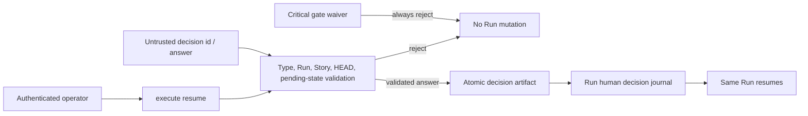

# Human Decision Checkpoint Architecture

## Decision

Guarded Runを実行状態の正本、`decisions/<decision-id>.json`を質問と回答の正本にする。`pending_decision`は正本への参照だけを持ち、回答の検証とdecision artifactのcommitが完了した後にだけRunを`running`へ遷移させる。

## Boundary

- `human-decision-checkpoint.js`: decisionの型、重複排除、永続化、回答検証、index再構築を所有する。
- `guarded-run-session.js`: Runの停止・再開、`resume_from_node_id`の消費、journal参照を所有する。
- `cli.js`: `--decision`、`--answer`、回答者、反映先をtransportするだけで、policy判断を持たない。
- 既存`decision-records.js`のPR/Gate判断、Human Review Override、merge承認は変更しない。

## Invariants

1. pending artifactを永続化する前にRunを`waiting_for_human`へしない。
2. decisionのRun、Story、HEAD、pending状態が一致しない回答はRunを変更しない。
3. critical gate waiverは回答経路でも拒否する。
4. Brainbase handoff referenceはopaqueな参照として保持し、VibeProが内容を再定義しない。
5. crash後もdecision indexとRunのhuman decision journalから停止点と反映先を再構築できる。index writeの部分失敗は同一decisionの再作成時に全decision artifactから自己修復する。
6. 回答済みRunは停止nodeを`resume_from_node_id`へ移し、次のorchestrationが正規Safe Action planをそのnodeからsliceして実行した後にだけcursorを消費する。

## Threat Model

Trust boundaryはCLI入力と永続artifactの間に置く。path-safeなdecision id、16KiB上限、同一Story/Run/HEAD、pending状態を検証し、critical waiver・stale/cancelled/duplicate入力ではRun authorityを変更しない。

## Rollback

CLIのdecision引数を使わず、従来どおりblocked/failed Runをoperator resumeする。追加artifactは読み取り互換で、既存PR/Gate decision recordには影響しない。
