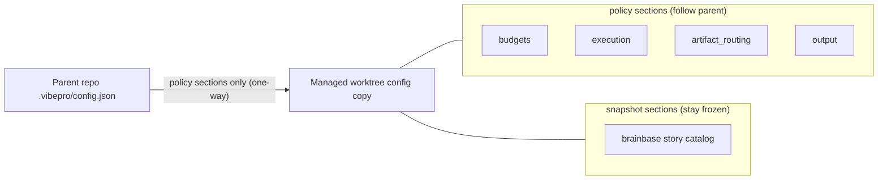

# Architecture

## Decision

Managed worktreeの `.vibepro/config.json` コピーは、役割の異なる2種類のセクションを持つ。**ポリシーセクション**（`budgets` / `execution` / `artifact_routing` / `output`）はenforcementの入力であり、常に親repo（`managed_worktree.source_repo`）のconfigを正本として追従する。**スナップショットセクション**（`brainbase` story catalog等）はworktree作成時の実行文脈であり、凍結を維持する。

この境界を `refreshManagedWorktree()` に実装する。refreshは保護コマンド経路（`evaluateManagedWorktreeCommandContext` / `buildManagedWorktreeGate` / `execution-state.js`）から毎回呼ばれるため、ポリシー配布の反映点として最も遅延が小さく、追加の同期デーモンや手動手順を必要としない。同期は片方向（親→worktree）のみで、worktree側の変更を親へ書き戻すことはない。

同期結果は `policy_sync` フィールド（`synced` / `unchanged` / `skipped` / `failed` + `sections_updated`）としてrefresh結果に載り、execution stateへ流れて監査可能になる。親configの欠如・破損は `policy_sync.status` に記録するだけでrefresh自体は成功させる（fail-soft）。refreshはstatus判定経路であり、ポリシー配布の一時的不整合で保護コマンドを壊してはならないため。

## Boundary model

## Alternatives considered

- **`ensureManagedWorktree()` の再実行を要求する**: ensureは作成/明示再利用の経路でしか呼ばれず、既存worktreeの日常経路（refresh）にポリシーが届かない現状の欠陥がそのまま残る。また、ensureは全量コピーのためスナップショットセクションまで上書きしてしまう。
- **読み取り側（delivery-efficiency guardrail等）が常に親configを読む**: 読み取り側全員がsource_repo解決を実装する必要があり、worktree内のconfigというSSOTが「一部だけ嘘をつく」状態になる。境界をrefresh1箇所に置く方が保守境界が小さい。
- **config全量をrefreshごとに再コピーする**: 実行中のstory catalog束縛が親のcatalog変動に引きずられ、mid-executionでcurrent_story_idが変わる事故を許してしまう。

## Rollback

`refreshManagedWorktree()` 内の `syncWorktreePolicySections()` 呼び出しをrevertすれば、従来の凍結スナップショット挙動へ完全に戻る。`policy_sync` フィールドは追加情報であり、既存consumerはフィールド欠如を前提にしていないため互換である。
