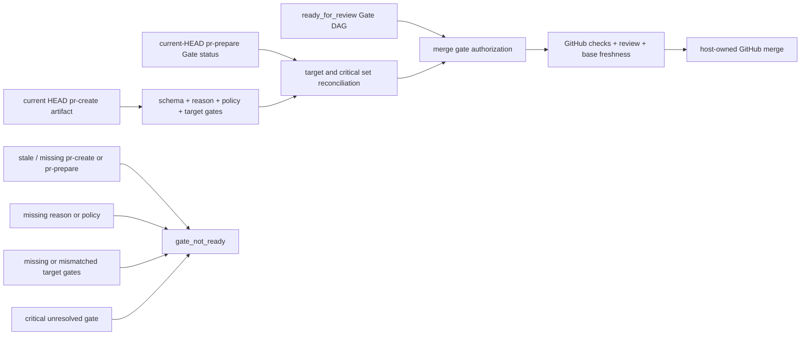

# Architecture: PR作成時のGate waiverをexecute mergeへ伝播する

## 判断

`execute merge` はcurrent HEADに束縛された `pr-create.json` をPR lifecycle authorityとして既に解決している。そのartifact内の `gate_override` を、Gate DAGの通常ready判定に次ぐ唯一の代替authorizationとして評価する。

## データフロー

1. `pr create` が非critical unresolved gateだけを許可し、理由・policy・対象Gateを `gate_override` へ永続化する。
2. `execute merge` が `artifact_freshness` とHEAD SHAの一致を検証し、currentな `pr-create.json` だけを採用する。
3. `gate_dag.overall_status=ready_for_review` なら通常authorizationを返す。
4. 通常readyでない場合、`gate_override.allowed=true`、空でないreason/policy、空でない有効な対象Gate一覧、`critical_unresolved_gates=[]` を検証する。
5. `pr-prepare.git.head_sha` がcurrent HEADと一致し、その `pr_context.gate_dag` が実際に評価するGate DAGと同じoverall status・required node ID・type・status・critical classificationを持つ場合だけ `gate_status` をauthorityとして採用する。
6. waiverの対象Gate ID集合とcritical Gate ID集合をcurrent `pr-prepare.gate_status` と完全照合し、対象欠落・集合不一致・現行critical Gateありはfail-closedにする。
7. merge artifactへauthorization sourceとwaiver監査情報を記録し、その他のGitHub preconditionとANDでmerge可否を決める。
8. self-dogfood reviewでは、事前authorization済みlifecycleが `completed` で明示close済みでも、続く `review record` が同じlifecycleへresult artifact/statusを結線する。timeout/manual shutdownには結果を後付けしない。

## Threat model

`pr-create.json` のHEAD bindingを信頼境界とし、stale・欠落・schema不正・critical gateを
理由だけで昇格させない。VibeProはauthorization policyと監査artifactを所有し、GitHubは
外部preconditionと実mergeを所有する。

## Authority / compatibility / rollback

- Authority: Gate waiverの正本は同一HEADの `pr-create.json`。`execute merge` のCLI引数や推測では再生成しない。
- Compatibility: `ready_for_review` の既存経路、GitHub checks、review policy、base freshness、remote HEAD一致は変更しない。
- Fail-closed: stale artifact、staleまたは別Gate DAG由来のpr-prepare status、schema不足、対象Gateの欠落・現行statusとの不一致、critical unresolvedありは `gate_not_ready`。
- Review lifecycle: completed closeだけが結果回収可能。timeout/replaced/manual shutdownへpass結果を後付けする経路は拒否する。
- Rollback: merge authorization helperとprecondition配線を戻せば従来のGate DAG only判定へ戻る。永続artifactの追加フィールドはreader互換を保つ。

## 影響範囲

- `src/merge-gate-authorization.js`: pure policy evaluation
- `src/merge-manager.js`: current PR lifecycle artifactとのbindingと監査出力
- `src/execution-state.js`: current pr-prepare authorityを使う実行状態投影
- `src/agent-review.js`: authorization済みcompleted lifecycleのclose後結果回収
- `docs/specs/story-vibepro-merge-waiver-propagation.spec.md`: Story/Architecture/Code/Test lineage
- `test/merge-gate-authorization.test.js`: contract matrix
- `test/vibepro-cli.test.js`: `execute merge` dry-run/integration contract
- `test/review-inspection-first.test.js`: close後recordとresult collectionの回帰契約

PR #381のruntime lifecycleおよびPR #370のbudget policyは依存先でも変更対象でもない。
