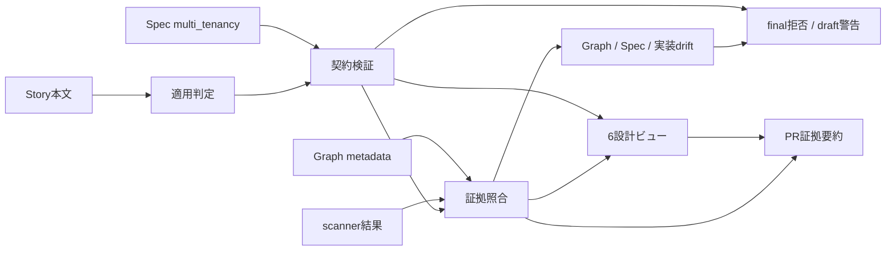

# Multi-tenant Architecture Contract設計

## 結論

Issue #466はVibeProのminimal-coreへ次の形で追加する。

1. Story本文の構造化シグナルから適用要否を判定する。
2. 適用Storyでは、最終Specの`multi_tenancy`契約をfail-closedで検証する。
3. 同じ契約から6つの設計ビューを投影する。
4. PR証拠要約へ状態、finding、3つのreview lensを表示する。

VibePro本体で廃止済みのGate DAG、実装着手判定、専用check pack、review lifecycleは復活させない。VibePro自身の開発にも自己dogfoodは行わない。

## 適用境界

`multi-tenant`、`tenant_id`、cross-tenant、BYOCなどの強いシグナル、またはtenant actorとcredential・storage・queue・runtime等の境界面が同じStoryにある場合に適用する。

文言変更だけのStory、単一利用者のローカルCLI、単に`tenant`という語を含むだけのStoryは対象外にする。契約側の`applicability`で明示指定もできるが、強い境界シグナルがあるStoryを`not_applicable`へ上書きすることはできない。

## データフロー

## 6つの投影ビュー

| ビュー | 判断対象 |
|---|---|
| `system_context` | tenancy model、tenant entity、正本data owner |
| `tenant_resolution` | canonical key、取得元、解決点、欠落・曖昧時の動作 |
| `trust_data_boundary` | resource sharing、trust zone、credential scope、residency |
| `runtime_execution` | 必須伝播面、検証済み面、cross-tenant fallback |
| `deployment_variants` | managed shared、dedicated、customer-managed、self-hosted |
| `migration_rollback` | migration、rollback、負のシナリオ、失敗時の意味 |

## 失敗時の扱い

- 契約項目の欠落・矛盾は`invalid`にする。
- 検査範囲を確認できない場合は`needs_review`にし、`ready`へ丸めない。
- 最終Specでは`invalid`をエラーにする。
- 下書きSpecでは同じfindingを警告として保存できる。
- PR作成には独自Gateを追加せず、状態とfindingを証拠要約へ明示する。

## 証拠とdriftの境界

- Contractの宣言と実行証拠を分ける。`verified_surfaces`の自己申告だけでは`ready`にしない。
- Graphのtenant entityとboundary edgeは、tenant scope、tenant key source、trust zone、data owner、sharing、credential、connection、deploymentのmetadataを持つ。
- 10種のscanner結果は`pass | fail | inconclusive`で記録し、`inconclusive`をpassへ丸めない。
- ContractとGraph、Spec、実装のtenant key、sharing mode、deployment modeを比較し、不一致はsource付きdriftにする。
- cross-tenant候補を含む5つのnegative scenarioは、契約の列挙と実行証拠を別々に要求する。

## 保存とレビュー

Contractはaccepted Specの`multi_tenancy`としてStory ID単位で保存する。保存前に最終モードで検証し、`ready`でなければ既存Specを上書きしない。

PR要約にはcoverage、scanner状態、findingを表示する。3つのreview lensには状態、関連finding、未確認点を隣接表示し、役割名だけでpassを生成しない。

## 配備形態

共有、専用、顧客管理の3 fixtureを同じスキーマで検証する。customer-managed fixtureはmana-runtimeのようなdownstream構成を表現するが、この変更でmana-runtime実環境を検証済みとは扱わない。

段階導入の開始・停止・rollback条件は`docs/management/multi-tenant-rollout-policy.md`を正本とする。downstream実リポジトリのidentity、接続先、credential、state、receipt readbackは別Storyへ分離する。
