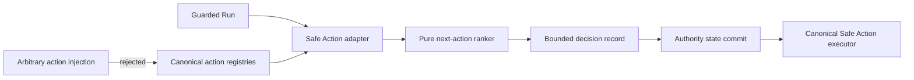

# Next Best Action Controller Architecture

## Decision

`src/next-best-action-controller.js` is a pure, provider-neutral ranking boundary between the Safe Action registry and execution. It receives only actions already marked policy-allowed and dependency-ready. It cannot grant authority, invoke a command, waive a gate, or mutate a repository.

`selectSafeActionCandidate` in `src/safe-action-orchestrator.js` is the production adapter: it projects the canonical Safe Action and escape registries plus the completed action journal into eligible candidates. Callers may request canonical escape action IDs and supply metrics, but cannot inject action objects or replace registry authority.

`orchestrateRun` in `src/guarded-run-session.js` is the production checkpoint. Before canonical Safe Action execution, it selects a recommendation, appends the bounded record to `next_best_action_decisions`, and commits that state through the existing authority-then-mirror persistence boundary. Status and watch read the same persisted record back. The recommendation remains advisory; `runSafeActionPlan` independently enforces the complete canonical execution plan.

The controller evaluates candidates only at named material checkpoints. Its persisted decision projection contains the state fingerprint, policy version, selected and rejected candidates, normalized metrics, scores, and short reason codes. Reusing the same checkpoint, state fingerprint, and policy reuses the previous decision instead of producing reflection after every tool call.

## Safety and failure boundaries

- Only `read_only` and `repo_local_safe` actions enter normal ranking. `ask`, `split`, `wait`, `stop`, and `rediagnose` are explicit escape actions and may be approval-required.
- Missing time, token/cost, invalidation, or rework estimates stay `unknown`; ranking applies an uncertainty penalty rather than treating them as free.
- Two consecutive no-progress checkpoints remove ordinary retry actions from the candidate set.
- Identical inputs produce identical scores and an action-id tie-break.
- The record stores decision inputs and reason codes, never provider transcripts or hidden reasoning.
- Unknown escape IDs fail closed before ranking, and persisted decision history is shape-validated on read.

## Threat model

## Compatibility and rollback

The module is additive. Safe Action dependency-order execution remains the fallback when the controller is disabled. Removing the module does not alter Gate DAG semantics, action classifications, or existing CLI commands.
