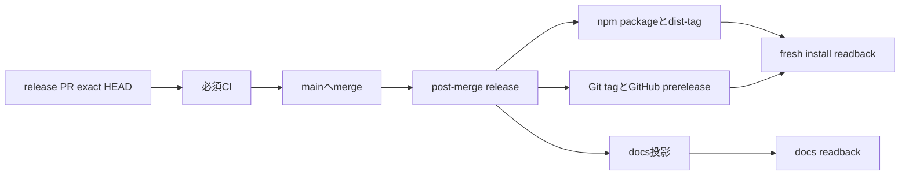

# Architecture: VibePro 0.2.0-beta.14 release

## 目的

PR #486で`main`へ入ったReview DAGの収束修正を、既存のpost-merge release経路から
`vibepro@0.2.0-beta.14`として配布する。

## 境界

- release PRは`package.json`と`package-lock.json`のroot version、およびStory・Architecture・Specだけを変更する。
- `src`、`bin`、依存、`.github/workflows/post-merge-release.yml`、公開スクリプトは変更しない。
- npm publish、dist-tag、Git tag、GitHub prerelease、docs投影は既存のpost-merge workflowを正本とする。
- ローカルnpm認証は公開権限の根拠にせず、GitHub ActionsのEnvironmentとtrusted publishing境界を維持する。

## 実行順序

## 完了判定

workflow成功だけでは完了としない。npmの`gitHead`、`beta` / `latest` dist-tag、Git tag、
GitHub prerelease target、fresh installのruntime identityをrelease merge commitへ照合する。
docs投影は別結果として確認し、失敗または未確認なら配布成功と分けて報告する。

## 復旧

公開前はPRを閉じる。公開後はimmutable versionを削除・上書きせず、問題版をdeprecateし、
`beta` / `latest`を直前の正常版へ戻す。修正版は新しいversionとして公開する。
