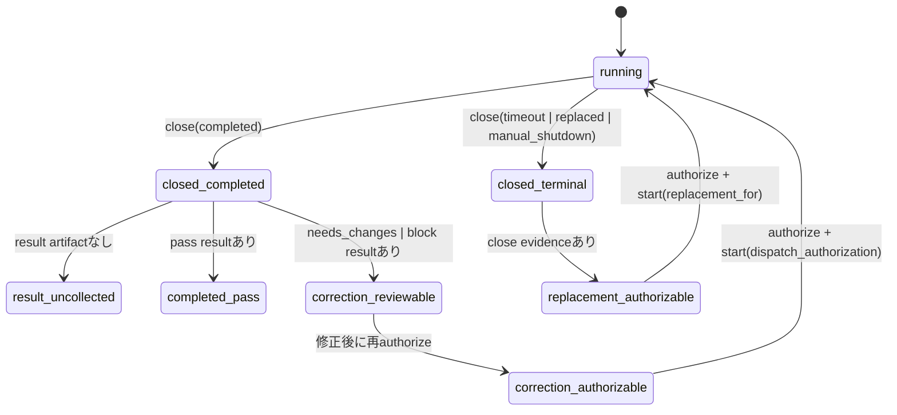

# Agent Review Replacement Recovery Architecture

## Decision

delivery efficiency policyへ渡すreview lifecycleの正規化で、
`closed`かつ結果artifactがない状態を一律に`result_uncollected`へ変換しない。
結果を正常回収できる`completed`だけを回収待ちにし、
`timeout`、`replaced`、`manual_shutdown`は完走していないterminal closeとして
既存のreplacement authorization経路へ戻す。

## State Boundary

- `running`は従来どおり`await_result`で重複dispatchを止める。
- `completed`かつ結果artifact未回収は`result_uncollected`として
  `await_result`を維持する。
- `completed`かつpass result artifact取得済みだけを`completed_pass`として
  再利用する。statusがpassでもartifact欠落なら回収待ちにする。
- `completed`かつ`needs_changes`または`block` result artifact取得済みは
  回収待ちやreuseへ変換せず、修正後の再review authorizationを従来どおり許可する。
- `timeout`、`replaced`、`manual_shutdown`は重複状態へ正規化せず、
  authorizationを新しく発行できる。
- 未知または欠落したclose reasonは、result artifactの有無・statusにかかわらず
  安全側で`result_uncollected`に残す。未知reasonからpass reuseや
  correction reviewを推測しない。

## Replacement Integrity

authorizationが`dispatch`を返しても、replacement startは既存契約を変更しない。

- `completed`かつ`needs_changes`または`block` result artifact取得済みの通常の
  correction reviewは、再authorizeで得たauthorization IDを
  `--dispatch-authorization`へ渡し、`--replacement-for`なしでstartする。
- `replacement_for`は同一Story・stage・roleの最新lifecycleを指す。
- 旧lifecycleはterminal close済みで、必要なclose evidenceを持つ。
- `manual_shutdown`と`replaced`の非空`close_evidence`は、coordinatorが
  旧agentの実停止完了を確認した正本証跡である。既存artifactを回復可能に保つため、
  同一HEAD closeへ別のcancellation flagは追加しない。
- 古いlineage、無指定、証跡不足、running lifecycleはfail closedとする。
- terminal closeへreview resultを後付けしない。
- authorizationは予算、role上限、bindingなど既存の全guardを通過した場合だけ
  `dispatch`を返す。
- stale HEADの`orphaned_agent`はこの同一HEAD terminal分類とは別であり、
  既存の`--cancellation-confirmed`とcancellation evidenceを要求する。

## Operator Recovery Boundary

status next action、review repair、PR recovery、英日両方の
`parallel-dispatch.md` coordinator手順は、単独のterminal replacement startを
生成してはならない。terminal recoveryについて各surfaceは次の順序付き手順を生成する。

1. 同じStory・stage・role・review kindで`review authorize`を実行する。
2. 返却されたauthorization IDを、`--dispatch-authorization`と
   `--replacement-for <closed-lifecycle-id>`を持つ`review start`へ渡す。

authorization IDは実行時に発行されるため、生成物は固定IDを捏造せず、
authorizeの出力を次のstepへ渡す明示的なplaceholderを使う。
statusはlifecycle履歴全体を表示しても、復旧actionの生成対象は
Story・stage・roleごとの最新lifecycleに限定する。同一roleの新しいlifecycleが
存在する場合、古い`manual_shutdown`、`timeout`、`replaced` entry向けの
authorize/start手順を生成しない。

## Implementation Boundary

変更対象は`src/agent-review.js`のdispatch向けlifecycle正規化、status action、
英日`parallel-dispatch.md`生成、
`src/review-repair.js`、`src/pr-manager.js`の復旧手順生成、および
`test/review-inspection-first.test.js`、`test/review-repair.test.js`、
`test/vibepro-cli.test.js`、`test/delivery-efficiency-guardrail.test.js`の
回帰契約に限定する。
delivery budget、role policy、Agent Review result validation、
subagent runtime、review artifact schemaは変更しない。

`.vibepro/config.json`の本Story専用budget overrideはproduct contractではなく、
必須の設計・実装・Gate reviewを有限回で完了するための追跡可能な実行予算である。
既定値、role policyの意味、budget計算、超過時のfail-closedは変更しない。

## Compatibility

既存の`running`と`completed`結果未回収の判定を維持する。artifact付き
completed passのreuseを維持し、artifact欠落passの誤った`completed_pass`
分類だけを厳格化する。completed non-pass result後の再reviewとstale HEAD
orphan cancellation境界も維持する。
status履歴の表示自体は維持し、復旧actionだけを最新同一role lifecycleへ絞る。
policy未設定repositoryのreview lifecycle、CLI引数、artifact path、JSON schemaにも
変更を加えない。

## Verification

回帰テストはdelivery efficiency policyを有効にし、次を確認する。

1. lifecycleをauthorizeしてstartする。
2. `manual_shutdown`として証跡付きcloseする。
3. 同じbindingで再authorizeすると`action: dispatch`になる。
4. 新lifecycleを`replacement_for`付きでstartできる。
5. `completed`結果未回収は引き続き`await_result`になる。
6. pass statusでもresult artifact欠落なら`await_result`になる。
7. completed non-pass result後は修正reviewを再authorizeし、そのauthorization IDを
   `--dispatch-authorization`へ渡して`--replacement-for`なしでstartできる。
8. aggregateおよびrole別budget exceededはreplacement authorizationを拒否する。
9. stale HEAD orphanはcancellation confirmation/evidenceなしでreplacementしない。
10. status、review repair、PR recovery、英日`parallel-dispatch.md`の全surfaceが
   authorize-firstの2段階手順を出す。
11. 同一roleの古いterminal entryと新しいlifecycleが併存する場合、statusは
    古いentry向けのauthorize/startを出さない。

同じterminal分類を使う`timeout`と`replaced`もtable-driven testで固定する。
未知または欠落したclose reasonは、artifactなし、pass artifact、
needs_changes artifact、block artifactの全組み合わせが`result_uncollected`になる
table-driven testで固定する。

## Rollback

正規化条件と対応する回帰テストを同一のfocused commitとしてrevertする。
artifact migrationや状態書換えは不要で、既存lifecycle JSONはそのまま保持する。
