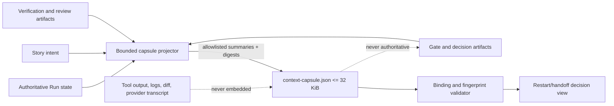

# Architecture

## Decision

Add a bounded, versioned Context Capsule beside every Guarded Run state. The capsule is a disposable projection of authoritative Story, Run, Gate, verification, review, and decision artifacts. It is optimized for restart and handoff reads; it never becomes an authority for lifecycle, readiness, evidence, or engineering intent.

The implementation lives in `src/run-context-capsule.js`. `src/guarded-run-session.js` calls the projection after an authoritative Run state write. Verification, review, and decision recorders call a best-effort active-Run refresh after their own authoritative write. Consumers use the capsule module's validated read/recovery contract instead of parsing the artifact directly.

## Artifact contract

The canonical path is:

`.vibepro/executions/<story-id>/runs/<run-id>/context-capsule.json`

The first schema version is `0.1.0`. It contains:

- `story_id`, `run_id`, and `head_sha` binding fields;
- bounded `objective` and `invariants` derived from the registered Story document;
- `bottleneck`, including the first blocking Gate or typed Run stop;
- `evidence_refs`, each containing a kind, repository-relative source reference, SHA-256 digest, and bounded decision-ready summary;
- `open_decisions`, containing only unresolved decision identifiers, prompts, and source references;
- `budget_state` and `last_progress` derived from Run state;
- `generation_reason`, `generated_at`, and sorted `source_fingerprints`;
- `truncated_sections` and `size_bytes`.

The serialized UTF-8 artifact MUST be at most 32 KiB. Size reduction is deterministic: bounded summaries are shortened first, then whole optional sections are replaced by source-reference descriptors. The original material remains in its existing authoritative source artifact; no duplicate raw-content sidecar is created. Every replaced section is named in `truncated_sections`.

## Source selection and data minimization

Required sources are the authoritative Run state and the registered Story document. Optional sources are the current Gate DAG/readiness projection, verification evidence, review summaries, and decision records when those artifacts exist.

The capsule extracts only allowlisted scalar fields needed for the next decision. It never embeds command output, full JSON artifacts, diffs, test logs, provider transcripts, agent transcripts, prompts, or hidden reasoning. Every included source has a SHA-256 fingerprint over its exact bytes and a repository-relative reference. Exact source bytes deliberately define event identity: a semantically equivalent rewrite with different authoritative bytes is a new event, while duplicate hooks over unchanged bytes are not. A summary is not evidence: downstream users must follow the reference when they need to validate a claim.

Story discovery checks active and completed Story locations and requires the document frontmatter `story_id` to match the Run. Artifact paths are normalized beneath the authoritative repository/worktree root. Missing required sources, path escape, corrupt JSON, unsupported schema, or invalid shapes produce typed non-mutating errors.

## Meaningful-event refresh

Capsules refresh only for these event classes:

- Run creation or migration;
- a persisted Run transition, including failure, human/runtime wait, resume, cancel, handoff, and terminal readiness;
- a changed authoritative HEAD;
- a newly recorded verification result;
- a newly recorded agent review or decision artifact;
- an explicit rebuild after stale or missing capsule detection.

The module computes an `event_fingerprint` from the Story/Run/HEAD/status binding and sorted source fingerprints. Generation reason is descriptive and intentionally excluded, so two hooks observing the same authoritative bytes do not create a false event. When the fingerprint matches the current capsule, refresh returns `regenerated: false` and does not rewrite bytes or timestamps. Thus repeated status reads and duplicate hooks are non-mutating. Conversely, any exact-byte change or newly appearing/disappearing optional source is intentionally a new event because otherwise the capsule could omit a current decision or evidence artifact.

Run state remains commit-first. Capsule generation runs only after authority and configured mirror state writes succeed. A capsule projection failure cannot roll back or rewrite Run state. Run mutation APIs preserve their existing return shapes; projection results remain internal diagnostics, while automatic verification/review hooks are best-effort and preserve their authoritative result. A later explicit read/rebuild exposes any stale or missing capsule as a typed contract error rather than silently treating old context as fresh.

## Authority and linked worktrees

The capsule is written beside the authoritative Run state and, for a configured linked copy, beside that mirror state. The authority copy is generated first; the mirror receives the exact serialized bytes. Reads resolve the Run through the existing Guarded Run authority contract, then validate the capsule against the selected state. A mirror alone is never promoted to authority.

`head_sha` must equal both the persisted Run `current_head_sha` and the currently resolved authoritative Git HEAD. `story_id` and `run_id` must equal the selected Run. Every recorded source must still exist and match its fingerprint, and the complete sorted fingerprint set must equal the sources currently available to the projector. This set equality detects an optional decision, Gate, verification, or review artifact created after capsule generation. Any mismatch returns `stale_binding` or `missing_source`; recovery may explicitly rebuild from current authoritative sources, but may not patch the capsule in place.

## Recovery contract

`recoverRunContext` performs a validated read or an explicit rebuild, then returns a smaller decision view:

- current Story, Run, HEAD, status, and last material progress;
- current blocking Gate or typed stop;
- unresolved decision prompts and source references;
- evidence references and freshness digests;
- remaining budget state.

It does not return transcript history. Restart and handoff tests delete all process-local state and reconstruct this view from files only.

## Integration boundaries

`guarded-run-session.js` receives a single closed injectable `refreshContextCapsule` dependency for deterministic tests. The dependency is called after successful persistence for creation, migration, and lifecycle transitions; non-mutating watch/status paths do not call it.

`recordVerificationEvidence`, `recordAgentReview`, and `recordDecision` call `refreshActiveRunContextCapsule` after their own writes. The helper discovers a unique active Run for the Story; zero Runs is a no-op and ambiguous/invalid candidates are reported in the refresh result without changing the authoritative recorder result. This keeps existing command contracts compatible while making successful evidence and decision events observable to a running session.

## Failure and rollback

Typed capsule errors include `capsule_not_found`, `invalid_capsule`, `unsupported_capsule_schema`, `stale_binding`, `missing_source`, `capsule_size_exceeded`, and `capsule_mirror_sync_failed`. All writes use temp-file-plus-rename. An authority rename failure preserves the previous capsule bytes. A mirror failure is reported only after the new authority bytes commit, so it cannot be mistaken for a fully synchronized projection.

Rollback removes the projection hooks and `src/run-context-capsule.js`; existing Run state, Gate, evidence, review, and decision artifacts remain sufficient to reconstruct execution state.

## Threat model

Path traversal is rejected before filesystem access, JSON parsing is bounded by the 32 KiB capsule budget on reads, and fingerprints prevent a source from changing underneath a seemingly fresh capsule. Digests prove identity, not truth; Gate and evidence readers remain responsible for semantic validation.

## Verification matrix

- exact required-field and schema validation;
- deterministic 32 KiB enforcement and `truncated_sections`;
- forbidden-body fixtures proving logs/diffs/transcripts are not copied;
- idempotent no-event refresh and byte-for-byte stability;
- HEAD, Story, Run, and source-fingerprint stale cases;
- missing required, previously referenced optional, and newly appearing optional sources;
- malformed capsule/source JSON, authority rename failure, and typed mirror failure;
- verification/review/decision event refresh with zero and ambiguous active Run compatibility;
- fresh-process restart and handoff recovery without transcript input;
- authority-first write failure preserving Run state and the previous capsule.
