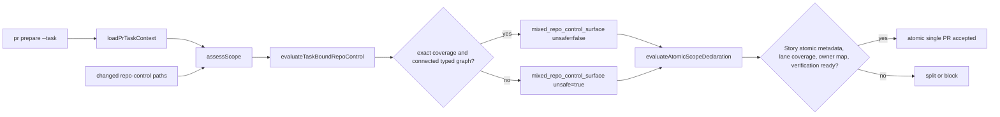

# Architecture

## Context

`pr prepare --task` already loads a canonical Task before assessing the changed
scope. The selected Task may describe workflow files in a typed
`classification: repo_control` target group and connect that group to runtime,
requirements, or tests through `depends_on`. Today `assessScope` does not use
that contract: every independent `.github/*`, `.claude/*`, package, or lockfile
change emits `mixed_repo_control_surface.unsafe_for_atomic_override=true`.

The safe change is not a general workflow exception. It is a second,
fail-closed proof for the existing signal: exact changed-path coverage plus a
typed dependency connection from repo-control to a non-repo-control group.

## Decision

Pass the already validated Task context from `preparePullRequest` into
`assessScope`. A pure evaluator builds a task-bound repo-control proof from:

- selected Task ID and canonical Task state path;
- every changed independent repo-control path (excluding the existing
  `.vibepro/config.json` registration exception);
- Task `target_groups[].id`, `classification`, exact `target_files[]`, and
  `depends_on[]`.

The evaluator returns eligible only when all of these conditions hold:

1. a Task was explicitly selected;
2. `target_groups` is a non-empty array with unique, non-empty IDs;
3. every relevant group has a string classification, an array of exact string
   target files, and an array of string dependency IDs;
4. every dependency resolves to another group in the same Task;
5. every changed independent repo-control path is exactly covered by at least
   one `classification: repo_control` group;
6. each covering repo-control group belongs to a dependency-graph connected
   component containing at least one non-repo-control group.

The graph is treated as undirected for connected-component membership. This
preserves the authored dependency direction as evidence while answering the
release-boundary question: whether the two surfaces form one declared Task
unit. No glob expansion, basename matching, or natural-language inference is
allowed.

## Data flow

## Evidence contract

The scope signal and split plan persist a machine-readable proof containing:

- `task_id`;
- `task_state_path`;
- sorted `covered_repo_control_paths`;
- sorted `repo_control_group_ids`;
- sorted dependency edges with `from` and `to`.

Ineligible evaluation also records a stable reason code. It does not claim
coverage or connectivity that was not proven.

## Security boundary

Task metadata can only remove this one unsafe reason. It cannot itself accept
atomic scope. The existing `atomic_single_pr` Story declaration, generated lane
facet and dependency coverage, strict current-HEAD review ownership, verification
evidence, Gate DAG, and PR creation rules remain authoritative.

Malformed groups, missing Tasks, unknown dependency IDs, partial coverage,
disconnected repo-control groups, or an extra changed workflow all fail closed.
Strict target validation remains unchanged.

## Compatibility and rollback

- Story-scoped `pr prepare` without `--task` retains the existing unsafe signal.
- `.vibepro/config.json` as the only mixed repo-control path retains its current
  exception.
- Tasks without the new typed proof retain the existing split behavior.
- Rollback removes the evaluator input and restores the unconditional
  independent repo-control unsafe flag.

This design changes only local PR scope adjudication. It grants no merge,
deployment, cloud apply, secret access, or Gate waiver authority.
