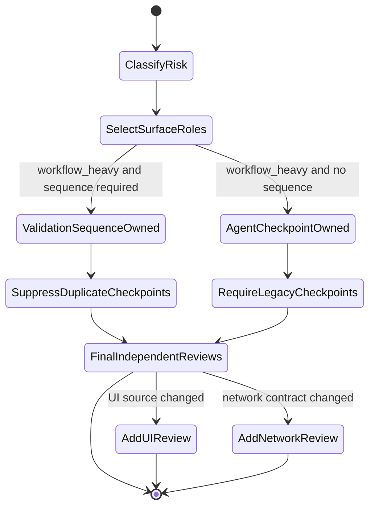

# Trusted Delivery Efficiency Guardrail Architecture

## Decision

Introduce one pure policy module, `src/delivery-efficiency-guardrail.js`, as the shared contract for delivery budgets, review dispatch decisions, lifecycle debt, metric aggregation, and compatible finding batches. Existing owners remain authoritative: `validation-sequencing` owns freeze ordering, `agent-review` owns lifecycle persistence, `pr-manager` owns Gate DAG/readiness, `review-finding-repair-loop` owns repair execution, and `story-run-portfolio` owns cross-Story summaries.

The guardrail consumes snapshots from those owners and returns deterministic decisions. It does not spawn agents, cancel providers, run tests, waive gates, or mutate repository state.

The host coordinator owns the provider API call, completion notification delivery, and actual shutdown. VibePro owns the pre-spawn authorization decision, exact binding, lifecycle accounting, and fail-closed record. This boundary prevents VibePro from claiming a push-notification guarantee it cannot provide: a conforming host must await its native completion notification rather than poll, while missing or incomplete provider delivery remains an external typed failure and cannot be recorded as a successful review.

## Components and boundaries

### Delivery efficiency policy

- Normalize machine-readable budgets for elapsed time, observed work, token/cost, subagent consumption, role dispatches, repair batches, and expensive verification.
- Resolve an optional, reason-required Story-specific budget amendment over the global policy so historical migration cost can be explicit without increasing every future Story's allowance; reject silent amendments.
- Preserve missing policy and missing measurements as `null`/`unknown`; never coerce them to zero.
- Evaluate each known measurement against its budget and return typed stops for exceeded or required-but-unknown dimensions.

### Review dispatch decision

- Require Story, stage, role, HEAD, surface digest, risk closure, expected judgment delta, evidence reuse, and budget snapshot.
- Build an idempotency key from Story/stage/role/HEAD/surface.
- Distinguish `preflight` from `final`; final dispatch requires source, Spec, tests, and review surface to be frozen.
- Reuse or block duplicate running, uncollected, or completed-pass lifecycle state instead of spawning.
- `review authorize` runs before provider spawn under a Story-level dispatch lock. It counts every stage lifecycle plus active reservation, enforces the intended model policy, and persists a short-lived binding authorization only for `dispatch`.
- `review start` cannot create a lifecycle under an efficiency policy without consuming that exact authorization. Story, stage, role, HEAD, surface digest, model, reasoning effort, and cost tier must still match; an authorization is single-use.
- `review record` cannot synthesize missing lifecycle evidence while the policy is enabled; a result without a consumed authorization is rejected instead of retroactively legitimizing an already-spawned agent.
- The host coordinator is the enforcement point for "do not spawn" and must use the provider's native completion notification. VibePro cannot stop a rogue caller from invoking an external provider directly; it makes that work unusable for required Gate evidence and visible as unattributed or orphaned debt.

### Risk-adaptive review coverage ownership

- `workflow_heavy` requires release-risk judgment, but does not by itself imply a UI or network surface. Human-usability review is selected only from changed UI source, and network-runtime review only from a detected network contract.
- When Risk-adaptive Validation Sequencing is required, it owns aggregate preflight, freeze ordering, expensive verification, and final-review binding. The legacy five workflow checkpoint roles are recorded as suppressed duplicates rather than dispatched again.
- The final source-change gate-evidence review and workflow-heavy release-risk review remain independent requirements. Surface selection reduces duplicated judgment; it does not weaken current-HEAD freshness or final review.

### Lifecycle debt

- Classify timed-out, obsolete, orphaned, duplicate, and budget-exceeded work separately from correctness readiness.
- `agent-review` captures HEAD and surface digest when a lifecycle starts. If the current HEAD no longer matches, status inspection derives `orphaned_agent` and fails closed until the provider result is explicitly collected or cancellation is confirmed.
- Explicit close after a HEAD mutation persists `obsolete`, the terminal HEAD, the mutation reason, and cancellation confirmation only when both `--cancellation-confirmed` and non-empty cancellation evidence are supplied. Evidence text alone does not prove provider cancellation; without both inputs the lifecycle remains running with terminal status `orphaned_agent`.
- `pr-manager` reads persisted lifecycle and repair-loop artifacts, evaluates the configured budget, and displays efficiency debt without changing required Gate semantics.
- `agent-review` and `pr-manager` use the same global-plus-Story policy resolver; authorization and readiness therefore cannot disagree about the effective ceiling.

### Finding batch planner

- Group repairable findings only when role and normalized code/test surface match and none requires human architecture/security/policy judgment.
- Preserve conflicting, split-required, human-decision, and non-actionable findings as separate batches/checkpoints.
- `review-finding-repair-loop` dispatches and records one batch while retaining per-finding fingerprints and compatibility with one-finding plans.

### Story efficiency metrics

- Aggregate Trusted PR-ready elapsed, observed work, wait union, subagent wall-clock, agent consumption, dispatch/accepted-finding/full-suite/evidence-reuse counters, fresh/total token, and cost.
- Parallel review wall-clock is represented separately from summed agent consumption.
- `story-run-portfolio` runs the shared aggregator over raw run timestamps, overlapping review intervals, dispatch records, and attribution input before storing and summarizing the expanded attribution shape. Explicit measurements are retained when no aggregate can be derived.

## Data flow

1. Story/Run policy and current measurements enter the pure guardrail evaluator.
2. Before provider spawn, a Story-level lock evaluates current freeze binding, all stage lifecycles, active reservations, intended model, decision value, and remaining budget. Only `dispatch` creates a reservation; the host coordinator then calls the provider and `review start` consumes the reservation after the runtime returns a real agent id. The host waits on its native completion notification while continuing independent work; VibePro does not poll or transport that notification.
3. On HEAD mutation, `agent-review` derives an orphaned stop from the stale lifecycle; explicit close persists the obsolete terminal state and binding evidence.
4. Repair findings are converted into compatible batches; each batch receives one targeted verification and one independent re-review.
5. `pr-manager` and portfolio surfaces consume the persisted lifecycle, repair, policy, and measurement records and display correctness readiness and efficiency debt independently.

## Review coverage state

## Invariants

- Required/critical Gates, independent final review, current-HEAD binding, and fail-closed behavior cannot be relaxed by an efficiency decision.
- Unknown is not zero, free, pass, or waiver.
- The dispatch idempotency key includes Story, stage, role, HEAD, and surface digest.
- A conforming host workflow never calls provider spawn before a current, unconsumed authorization exists; parallel reservations count against the same Story budget. Direct provider calls outside that host contract are not technically intercepted by VibePro and cannot satisfy required review evidence.
- Final review never starts before the exact source/Spec/test/review surface binding is frozen.
- Provider-specific cancellation is out of scope; unconfirmed cancellation is an orphaned-agent stop.
- A caller assertion is not provider confirmation unless it is explicit and evidence-bound; HEAD mutation never auto-sets `cancel_confirmed`.
- Changed lines are not a time, token, or value allocation basis.
- Review role count follows concrete risk surfaces and ownership; a broad risk profile cannot manufacture UI/network work or duplicate validation-sequence checkpoints.

## Compatibility and migration

- Existing callers without an efficiency policy continue in measurement-only mode; unknown fields remain explicit.
- Existing single-finding repair artifacts are accepted as one-item batches.
- Existing PR correctness readiness stays unchanged; the new efficiency debt is additive and cannot turn a failing Gate into pass.
- Rollback is removal of enforcement at integration points while retaining the pure summary output and existing Gate owners.

## Release and operator contract

- Release note: review dispatch now requires an authorization reservation before lifecycle start; workflow-heavy role selection no longer manufactures UI/network reviews and validation sequencing suppresses duplicate checkpoint reviews.
- Operator observation: use `vibepro pr prepare --view blocking-gates` and the Story efficiency summary. Treat `budget_exceeded`, `attribution_unknown`, `orphaned_agent`, stale authorization, or missing provider completion as stops, not transient success.
- Rollout: merge as one contract bundle because policy, lifecycle enforcement, readiness projection, portfolio metrics, and their regression tests must agree atomically. No migration or stored-data rewrite is required.
- Rollback trigger: unexpected rejection of a previously valid review lifecycle, unexplained orphan growth, or inability to produce a current-HEAD final review.
- Rollback action: revert the integration commit or disable the configured efficiency policy so legacy review semantics continue in measurement-only mode. Do not delete lifecycle artifacts; retain them for diagnosis. Owner: VibePro maintainer. Support evidence: Story id, current HEAD, `review status --all --history`, and bounded blocking-gates view.

## Verification strategy

- Unit matrix for unknown budgets, budget stops, preflight/final barrier, same-key duplicate states, HEAD mutation, timeout/orphan, parallel timing, and unknown metrics.
- Repair-loop tests for compatible batching and separation of conflicting/human findings.
- Portfolio and PR-manager contract tests for additive metrics/debt and unchanged correctness readiness.
- Existing validation sequencing, review lifecycle, repair loop, portfolio, and PR manager suites plus the full test suite.

## Acceptance mapping

- TDEG-S-1/S-2/S-3/S-4/S-6/S-7: policy, dispatch, lifecycle functions in the guardrail module.
- TDEG-S-5: batch planner integrated into `review-finding-repair-loop`.
- TDEG-S-8: separate efficiency debt surfaced by `pr-manager`.
- TDEG-S-9: metrics aggregation integrated into `story-run-portfolio`.
- TDEG-S-10: performance artifacts compare equivalent risk class; no changed-line allocation.
- TDEG-S-11: dedicated E2E-style unit matrix across the pure orchestration contract.
- TDEG-S-12: existing contract suites and full suite remain green.
- TDEG-S-13: risk-adaptive coverage selection keeps final gate/release review while suppressing irrelevant surface roles and validation-sequence checkpoint duplicates.
- TDEG-S-1: Story-specific amendments merge narrowly over the global budget, including role limits, while unlisted Stories retain the global policy unchanged.
