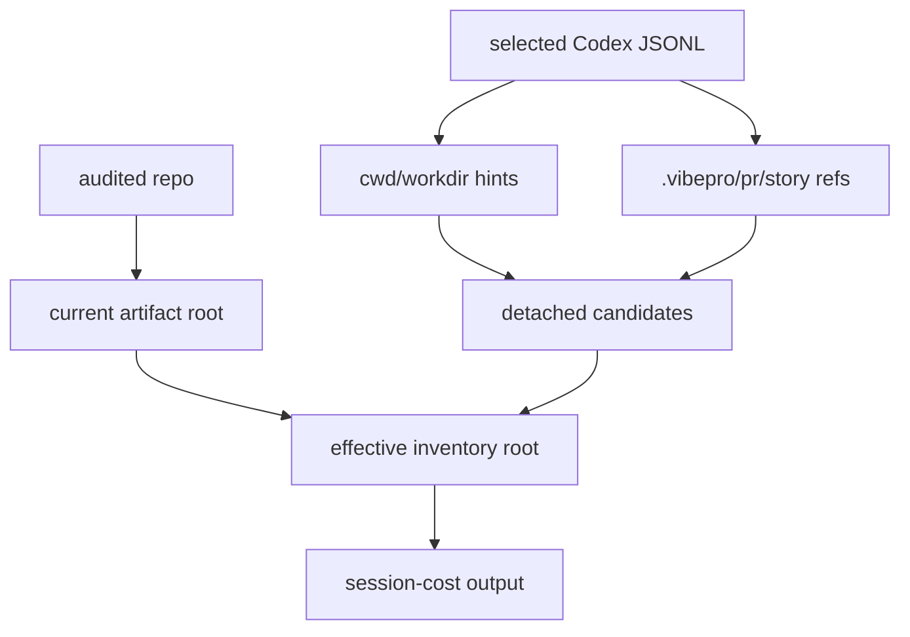

# Architecture

## Decision

Artifact lineage belongs in `audit session-cost` because that command already
binds repo, story id, Codex session, token window, and changed-line accounting.
The value audit should consume a richer diagnosis instead of re-implementing
worktree archaeology.

## Flow

## Boundaries

- Current worktree artifacts remain authoritative when present.
- Detached readable artifacts can be used for inventory but are labeled with
  their absolute source path.
- Observed but unavailable detached artifacts are surfaced as a lineage warning;
  they are not counted as artifact lines.
- Canonical import or copying is left to a future explicit reconcile command.
