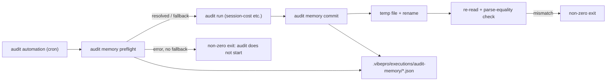

# Architecture

## Decision

Audit window continuity moves from prompt-level discipline to a deterministic
CLI guard: two new subcommands, `vibepro audit memory preflight` and
`vibepro audit memory commit`, backed by a single parser shared with the
existing automation-memory reader.

Today, `resolveAutomationMemoryWindow` in `src/session-efficiency-audit.js`
degrades silently: a missing or unparseable `memory.md` yields
`status: 'unavailable'` and the audit proceeds without a memory-derived
window. The 2026-07-09 value audit survived only because the automation
prompt happened to embed `Last run:` — unplanned redundancy. The guard makes
the two failure points explicit and machine-checkable:

- **preflight** validates existence, parseability, and ISO validity of the
  continuity block, and returns `resolved | fallback | error`. Fallback is
  never implicit: it requires `--fallback-last-run <iso>` or
  `--fallback-hours <n>`, and the adopted source and reason are part of the
  result.
- **commit** writes the continuity metadata (last_run, window bounds, run
  note) via temp-file-plus-rename, then re-reads and re-parses with the same
  parser preflight uses, failing non-zero on parse inequality. Free-form
  sections of the memory file (`## Key findings`, session notes) are
  preserved byte-for-byte; only the continuity block is owned by the guard.

The guard lives in VibePro rather than the automation scripts because the
memory contract is already a VibePro CLI input (`--automation-memory` on
`audit session-cost` and `execute merge`, env `VIBEPRO_AUTOMATION_MEMORY`);
putting validation next to the consumer keeps one parser as the single
source of truth for the format.

## Public Contract

- `vibepro audit memory preflight --memory <path> [--fallback-last-run <iso>] [--fallback-hours <n>] [--json]`

```json
{
  "schema_version": "0.1.0",
  "status": "resolved",
  "memory_path": "~/.codex/automations/vibepro-value-audit/memory.md",
  "window_start": "2026-07-08T00:01:57.465Z",
  "source": "memory_last_run",
  "fallback": null
}
```

  On missing/corrupt memory without a fallback option: exit non-zero with
  `status: "error"` and a reason. With a fallback option:
  `status: "fallback"`, `source: "explicit_last_run" | "approximate_hours"`,
  and the adopted values echoed.

- `vibepro audit memory commit --memory <path> --last-run <iso> --window-start <iso> --window-end <iso> [--note <text>] [--json]`
  Exit non-zero unless the post-write read-back parses to the same
  continuity values.

- Both commands persist a continuity artifact under
  `.vibepro/executions/audit-memory/<run-id>.json` so later audits can
  reconstruct when fallbacks happened.

- The continuity block is a fixed machine-readable header at the top of the
  memory file, compatible with what `extractLastRun` /
  `extractAutomationWindows` already match (so existing memory files parse
  without migration).

## Execution Topology

No new process, worker, or network surface. Both subcommands run
synchronously inside the existing CLI process; commit's only side effects
are the memory file (temp + rename) and the continuity artifact.



## Flow

```text
run start:
  audit memory preflight --memory <path>
    file exists + last_run valid      -> resolved, window_start returned
    missing/corrupt, fallback given   -> fallback, source + reason recorded
    missing/corrupt, no fallback      -> non-zero exit (audit must not start silently)
run end:
  audit memory commit --memory <path> --last-run ... --window-start ... --window-end ...
    write continuity block (preserve free-form sections)
    re-read, parse with the shared parser
    parse-equal -> exit 0; else non-zero
```

## Boundaries

- The guard owns only the continuity block; findings and session notes are
  opaque payload it must not rewrite.
- It never derives or edits audit results, token accounting, or gate
  artifacts.
- `resolveAutomationMemoryWindow` and the existing `--automation-memory`
  behavior on `audit session-cost` / `execute merge` are unchanged; the
  shared parser is extracted, not modified in behavior.
- Fallback adoption always requires an explicit operator/automation-supplied
  option; the guard has no built-in "assume 24h" default.

## Invariants

- Preflight on a valid memory file is read-only: zero writes to the memory
  file.
- Commit is atomic from the reader's perspective (temp + rename); a crashed
  commit leaves the previous memory intact.
- Commit success implies the next preflight parses `last_run` to the exact
  committed value.
- Every fallback adoption is recorded in a continuity artifact; there is no
  code path that silently substitutes an approximate window.
- Existing automations that never call the guard see byte-identical CLI
  behavior everywhere else.

## Rollback

Revert the guard module, its `vibepro audit` subcommand wiring, and the
parser extraction in one commit. Memory files written by commit remain
parseable by the pre-existing `resolveAutomationMemoryWindow` because the
continuity block reuses its matched forms.
