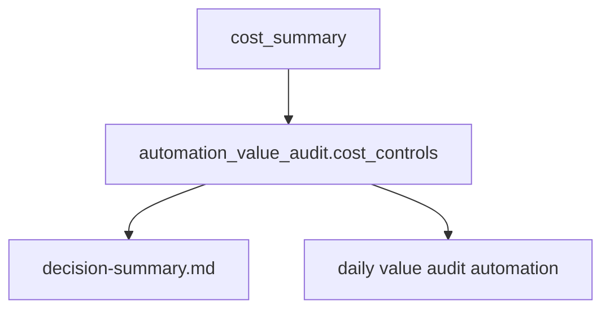

# Architecture

## Decision

Budget excess is a value-audit signal. It should be emitted in the canonical
automation contract so daily automation can compare audit burden against
implementation value without scraping prose.

## Flow

## Boundaries

- Cost controls do not replace `budget_status`.
- Recommendations are stable machine-readable hints.
- Merge remains controlled by existing gate/review/CI checks.
