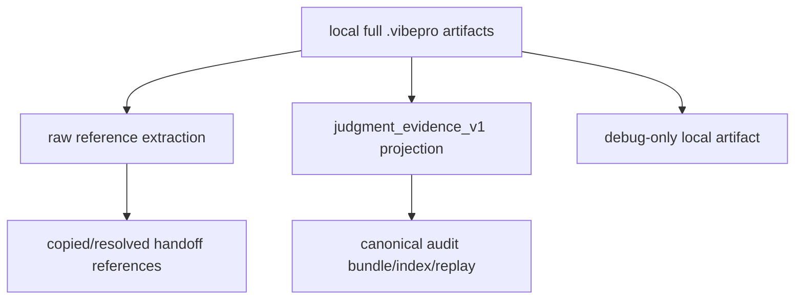

# Architecture

## Decision

Canonical audit promotion now treats local `.vibepro` artifacts as raw source
material, not as the audit artifact itself. The canonical audit artifact is a
scoped judgment-evidence projection.

## Scope Model

## Included In Canonical Audit

- final gate status, blockers, waivers, and follow-up decisions;
- active engineering judgment axes and their evidence refs;
- verification command status, targets, scenarios, artifacts, and digestable
  summaries;
- traceability, review findings, PR/merge status, CI status, and cost
  accounting;
- raw source digest and raw line count for provenance.

## Excluded From Canonical Audit

- full design registry inventory when only counts and changed docs matter;
- inactive judgment axis detail;
- verbose matched-evidence debug payloads;
- duplicated full gate DAGs embedded in PR lifecycle artifacts;
- raw command stdout/stderr beyond bounded excerpts;
- UI/HTML reports and local progress snapshots.
