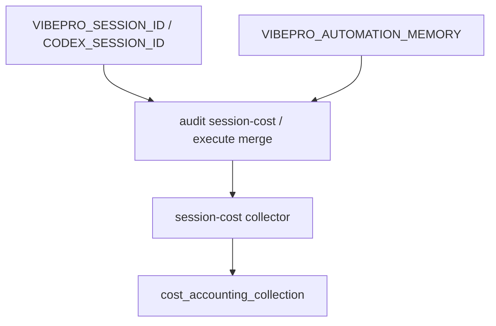

# Architecture

## Decision

Automation-owned runtime identifiers are adapter inputs, not product-value
judgments. VibePro should accept them at the CLI boundary and pass them into the
existing session-cost collector.

## Flow

## Boundaries

- Explicit CLI options override env defaults.
- Env defaults only select telemetry inputs.
- Value interpretation remains in the daily audit automation.

