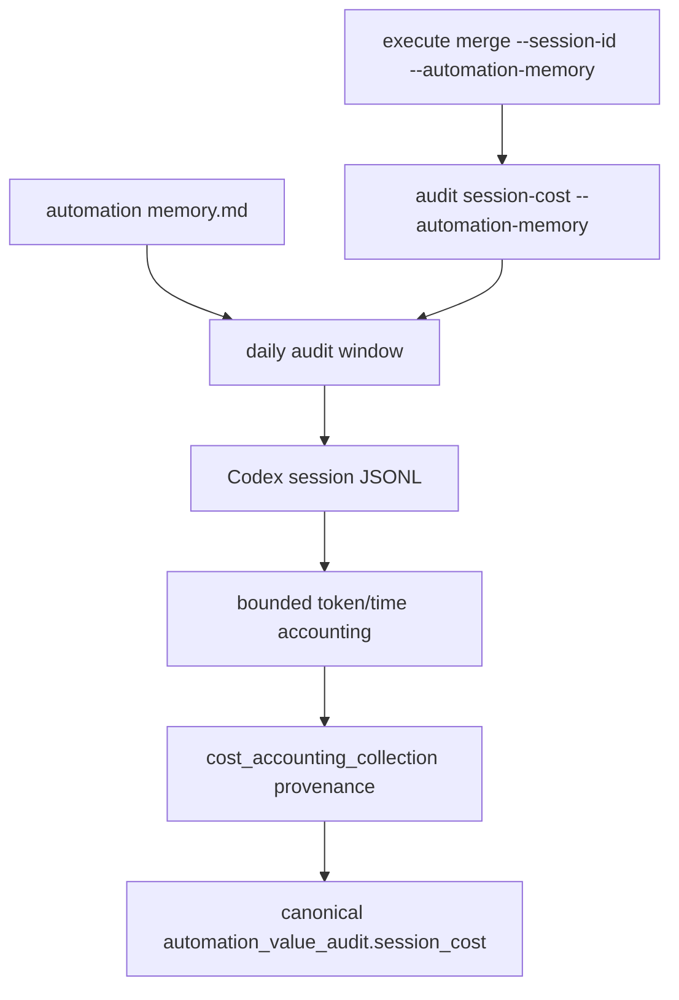

# Architecture

## Decision

VibePro should not infer final value from automation logs. The daily Codex automation owns that
cross-repository judgment. VibePro's role is to expose a stable way to bind Codex session telemetry
to the daily audit window so canonical artifacts can contain measured token/time evidence.

The smallest useful boundary is the existing `audit session-cost` collector. It already resolves
Codex JSONL, token deltas, elapsed time, changed-line buckets, and `.vibepro` artifact volume. This
Story adds automation-memory window resolution to that collector and forwards the same option through
`execute merge`.

## Flow

## Boundaries

- Automation memory provides window provenance only.
- Session selection remains explicit via `--session-id`.
- Explicit CLI bounds override automation memory.
- Unknown token/time remains unknown; missing memory never becomes zero.

## Residual Risk

This does not solve automatic story/session attribution. Daily automation still needs to decide
which sessions belong to which product changes, then pass the relevant session id and memory path.
