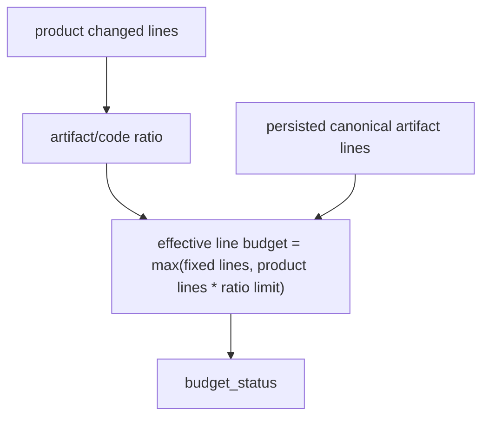

# Canonical Audit Budget Policy Semantics Architecture

## Decision

Canonical audit cost has two different controls:

- Relative budget: persisted canonical audit lines divided by product changed
  lines.
- Absolute guard: minimum fixed line budget for small or irregular diffs.

The relative budget is the product-value signal. For normal stories, the
accepted policy is `artifact_code_ratio <= 3`. The absolute guard should not
override that signal when product changed-line stats are available and the
relative 3x budget allows the persisted line count.

## Flow

## Boundaries

- This does not change merge permission. Budget excess remains an automation
  value-audit signal.
- This does not hide token/time unavailability. Session cost remains a separate
  signal.
- This does not bless raw artifact bloat. Raw source artifact ratio remains
  visible separately from persisted compact ratio.

## Rollback

Reverting this story restores the previous normal `artifact_code_ratio = 1`
budget and fixed `canonical_artifact_lines = 500` hard cap.
