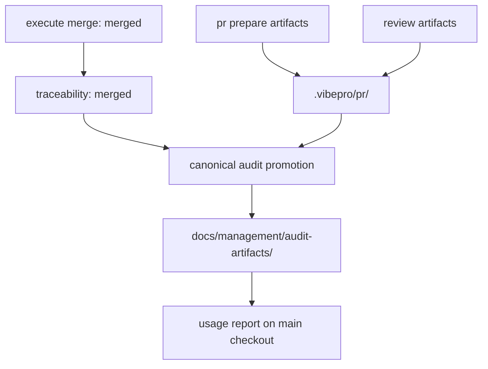

# Architecture

## Decision

VibeProは `execute merge` が成功した後に、merge判断を再構成するための最小JSON artifactを `docs/management/audit-artifacts/<story-id>/` に昇格する。

`.vibepro/` は作業中のcontrol-plane workspaceであり、raw logsや途中状態を含む。これを丸ごとmainに入れると、実装入力、一時ログ、監査証跡が混ざる。代わりに、merge後の監査に必要なJSONだけをcanonical audit bundleとして永続化する。

## Boundary

- `execute merge` は最終監査とmerge結果記録の境界なので、canonical昇格の責務を持つ。
- `pr prepare` / `pr create` / `review record` は引き続き `.vibepro/` に作業中artifactを出す。
- `usage report` はローカル `.vibepro/` を優先し、無い場合に canonical audit bundle を読む。
- canonical audit bundleは後から判断を読むための証跡であり、実装やテストの正本ではない。

## Artifact Model

## Persisted

- PR audit core: `pr-prepare.json`, `pr-create.json`, `gate-dag.json`, `pr-merge.json`, `traceability.json`, `verification-evidence.json`
- Review handoff core: `review-summary.json`, `review-result-*.json`, `lifecycle.json`
- Bundle index: `audit-bundle.json`

## Excluded

- HTML reports
- raw logs
- dispatch scratch artifacts
- temporary execution state
- secrets or raw provider payloads

## Tradeoff

This makes successful merge runs produce tracked audit files. The tradeoff is intentional: merged decisions must be reconstructable from a main-readable surface. In-progress work remains local to `.vibepro/`, so normal iteration does not turn every scratch artifact into product history.
