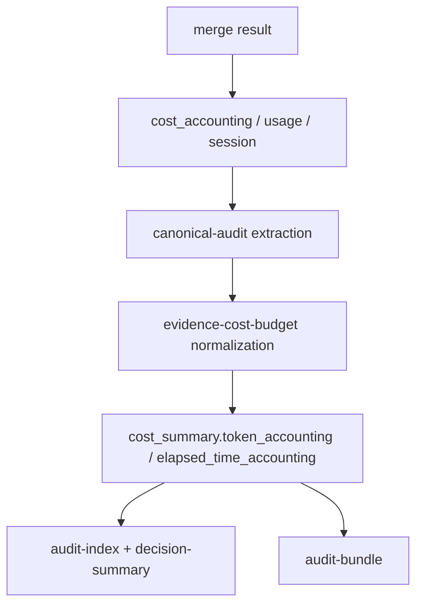

# Architecture

## Decision

Canonical audit promotion should be a persistence boundary for cost data, not a log-discovery
system. The component accepts token/time accounting that upstream execution layers already know,
normalizes the shape, and stores the result next to changed-line and evidence-cost data.

This keeps the boundary small while closing the value-audit gap: when session accounting exists, the
canonical audit no longer discards it; when it does not exist, the audit remains honestly
`unavailable`.

## Boundary

- `execute merge` and automation runners own discovery of Codex/Claude/session runtime data.
- `canonical-audit` extracts accounting from merge/session result payloads.
- `evidence-cost-budget` normalizes accounting and protects the unknown-is-not-zero invariant.
- `usage-report` and value audits read the canonical `cost_summary`.

## Data Model

`token_accounting` includes:

- `status`
- `total_tokens`
- `input_tokens`
- `output_tokens`
- `cached_input_tokens`
- `source`
- `window`
- `reason`

`elapsed_time_accounting` includes:

- `status`
- `elapsed_ms`
- `started_at`
- `finished_at`
- `source`
- `window`
- `reason`

## Invariants

- Unknown values are not zero.
- Partial accounting is explicit.
- Canonical audit promotion does not crawl local session stores.
- Compact evidence remains auditable without expanding the replay bundle.
