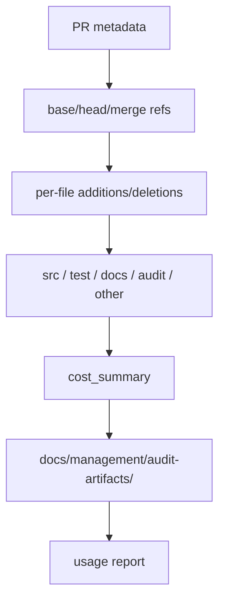

# Architecture

## Decision

Canonical audit cost accounting must be based on the PR diff that was actually merged, not on the
post-merge audit persistence commit and not on absent data treated as zero.

`execute merge` becomes the owner of diff-stat provenance because it is the point where VibePro knows
the PR, base branch, head branch, and merge result. It passes normalized per-file stats into canonical
audit promotion.

## Boundary

- `merge-manager`: resolves PR refs and collects or forwards numstat.
- `evidence-cost-budget`: classifies changed files and computes ratios.
- `canonical-audit`: persists cost summary and provenance.
- `usage-report`: renders stored stats and reports unavailable data honestly.

## Data Model

`cost_summary` should include:

- `diff_stats_status`
- `diff_stats_source`
- `diff_stats_refs`
- `changed_lines.by_bucket`
- `product_changed_lines`
- `artifact_lines`
- `artifact_code_ratio`
- unavailable reasons when any input is missing

## Invariants

- Unknown is not zero.
- Audit persistence commits are not product diffs.
- Bucket classification is shared by merge and usage-report paths.
- The report must be useful even when token/time accounting is still unavailable.
