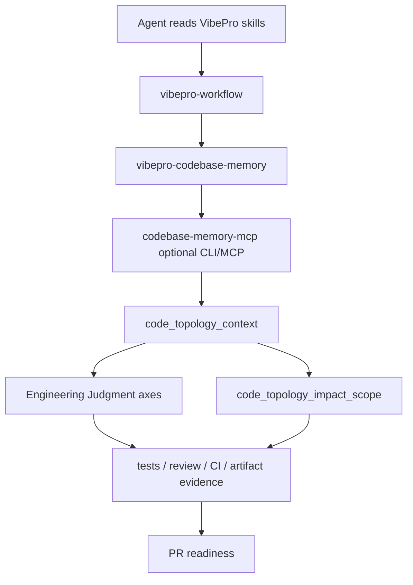

# Architecture

## Decision

VibePro adds a native bundled skill, `vibepro-codebase-memory`, that explains how to use `codebase-memory-mcp` inside VibePro's Story / Gate DAG / PR evidence workflow.

The skill is intentionally a VibePro adapter, not a copy of the upstream `codebase-memory` skill. Upstream owns tool-specific usage details. VibePro owns the boundary between topology context, Engineering Judgment, required verification, and PR readiness.

## Architecture Quality

- Alternatives considered: rely only on upstream `codebase-memory` skill; add instructions only to `vibepro-workflow`; add a separate bundled VibePro adapter skill.
- Decision rationale: relying only on upstream skill loses VibePro Gate boundaries; adding only a paragraph to `vibepro-workflow` makes the instruction too thin. A separate skill keeps the integration reusable while allowing `vibepro-workflow` to reference it at the right point.
- Compatibility impact: `vibepro skills list/install/verify/lint` already discovers skill directories dynamically, so adding a directory is enough. Tests assert the new count and installed content.
- Rollback plan: removing `skills/vibepro-codebase-memory/` and the workflow/doc references returns skill count to the previous state without affecting `pr prepare` provider behavior.
- Boundary: VibePro does not install, update, vendor, or require `codebase-memory-mcp`. The provider remains optional. Topology context can guide investigation and axis activation, but correctness still requires current evidence.

## Model

## Responsibilities

- `vibepro-codebase-memory` explains when to use the provider and how to map output into VibePro decisions.
- `vibepro-workflow` points agents to the skill during impact-sensitive work.
- `src/skills-manager.js` remains unchanged because bundled skills are directory-discovered.
- Public docs describe installation and the proof boundary for human users.
