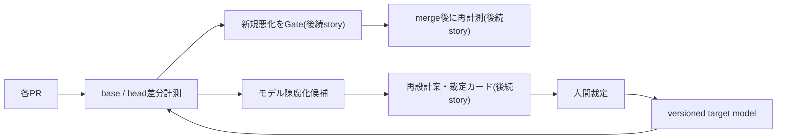

# Conformance Delta Ledger Architecture

## Decision

VibeProを「PRを通す仕組み」から「コードベースを継続的にversioned target architectureへ収束させる制御系」へ進化させる。その第一段として、conformance計測を単発スナップショットからbase/head差分観測へ拡張し、pr prepareのshadow stage（info専用・非ブロック）として毎PRで実行・永続化する。

全体構想は速いループと遅いループの分離:



毎PRの高速ループは「現行モデルに対する悪化を止める」。低頻度の設計ループは「現行モデル自体が妥当かを人間が裁定する」。本storyは両ループが共有するセンサー（計測・差分・永続化）だけを実装し、執行（ratchet）と裁定（rebaseline）は後続storyに分離する。

## 権限の三分法

- **機械**: 差分計測、violation ID付与、割当候補・依存候補・裁定カードの生成（後続story）
- **人間**: 設計規範（rules）の変更、新モジュール、新規許可依存の承認
- **機械的投影**: 人間が承認した裁定結果の反映のみ自動化可能

target-model.json の note（自動生成・自動改訂の禁止）はこの三分法の「人間」領域を指す。本storyはtarget-modelを読み取り専用でのみ扱う。

## 計測の設計原則

1. **件数は距離ではない**。軽微な違反2件の解消と重大な逆転依存1件の追加は相殺されない。サマリーは severity別新規 / 解消 / 既存 / 孤児 / 予算超過 / 循環依存 / inconclusive を分離して持つ。
2. **測定不能は違反ゼロではない**。スキャナ例外・対象0件・model欠落は理由付き `inconclusive`。実測根拠: dirty実環境で `check architecture` がstack overflowでクラッシュした際、件数だけ見れば違反0に見え得た。
3. **IDは要素自身の値から**。violation IDは kind + module対 + 関与ファイル等の意味値から決定論的に導出する。グループ内序数・配列indexによる識別は無関係な変更で破れる（mutation site識別の既知の教訓）。
4. **スナップショットではなく差分**。violation件数はHEADごとに 91/86/85/84/76 と揺れた実測がある。固定baselineではなく、base/headの再現可能な差分証跡として扱う。

## Data Flow

```text
docs/architecture/target-model.json (read-only)
  + base ref import scan
  + head ref import scan
  -> stable violation IDs
  -> delta {new, resolved, unchanged} × 次元
  -> .vibepro/architecture/conformance/conformance.json / delta.json
  -> pr prepare shadow stage (info専用 gate node)
  -> senior-gap judgment ideal_state (conformance_summary が null から実データへ)
```

## Authority Boundary

- 本stageはderive-only。実行のたびに再計算し、recorded evidence（review/verify record）を新設しない。したがってstrict-head束縛のstale化ループを持ち込まない。
- gateノードはinfo専用であり、block / needs_review に遷移しない。執行はratchet gate storyが、統治はgovernance-rebaseline storyが担う。

## Staged Follow-ups (separate stories)

1. target-model-governance-rebaseline — 孤児24件・未宣言依存41件の裁定、モデルversion確定
2. architecture-ratchet-gate — 新規悪化のみblock（content-surface-bound、既存負債はledger管理、例外は人間裁定）
3. refactoring-candidate-derivation — 違反クラスタリングとRefactoring Story候補提示（1 violation = 1 storyにしない）
4. post-merge-convergence-reconciliation — merge後再計測、baseline更新、陳腐化裁定カード生成（--baseはorigin/main）
