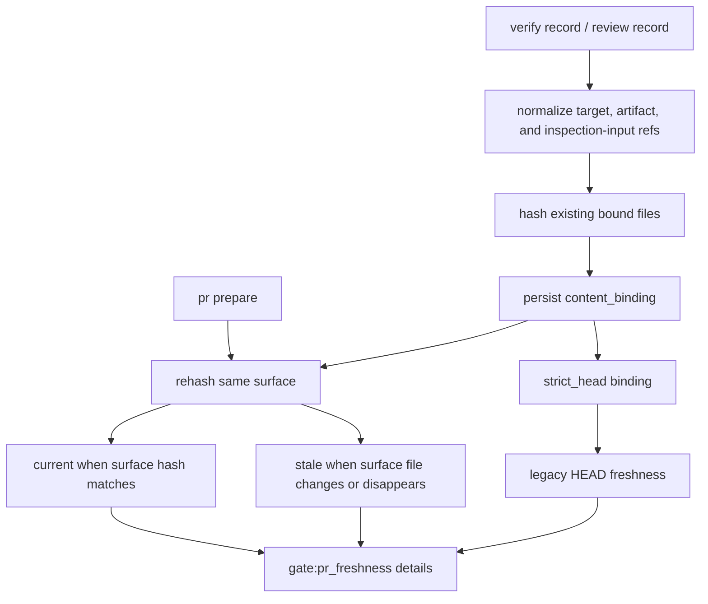

# Architecture

## Decision

Verification and review evidence freshness is evaluated from the content hash of
the evidence-bound surface before falling back to whole-HEAD freshness. The
recorded HEAD remains diagnostic context, but a later commit outside the bound
surface does not by itself make the evidence stale.

## Flow

## Boundaries

- `verify record` binds explicit `--target` paths and artifact paths.
- `review record` binds `--inspection-input` paths and artifact paths.
- `.vibepro/` artifacts are not part of the source surface, so recording or
  regenerating audit artifacts does not self-invalidate evidence.
- Passing review evidence must name at least one existing source, test, Story,
  Spec, contract, or configuration file outside `.vibepro/`. Generated review
  artifacts may supplement that surface, but cannot replace it.
- Evidence without a usable content surface is rejected when recording a passing
  review instead of silently broadening the review to whole-HEAD freshness.
- `--strict-head-binding` intentionally bypasses content freshness and preserves
  the previous "any HEAD change invalidates" behavior. It requires
  `--strict-head-reason` so the exception remains reviewable.

## Review freshness policy

`agent_reviews.defaults.freshness_mode` may explicitly retain
`content_surface`. Strict binding is role-specific:
`agent_reviews.roles.<role>.freshness_mode` accepts `strict_head` only together
with `freshness_reason` on that role. A global `strict_head` default is rejected
so an unrelated ordinary role cannot become HEAD-bound without an explicit,
reviewable risk decision.

`gate_evidence` and `release_risk` remain built-in strict-HEAD roles because they
currently cover head-bound canonical artifacts or the complete release
candidate. A repository can opt either role into `content_surface` only through
an explicit role-specific policy. This exception is an operator-owned risk
decision; VibePro records and hashes the supplied inspection surface but does
not claim that the first model can prove transitive impact completeness. A
global `defaults.freshness_mode` cannot weaken a built-in strict role, and the
exception is not inferred from review keywords.

An operator can override one record with `--strict-head-binding
--strict-head-reason <reason>`. The persisted `freshness_policy` records the
configured mode, effective mode, source, and reason so a later reviewer can
distinguish policy from an ad hoc override.

## Invariants

- A matching content surface hash is enough to keep a passing verification or
  review evidence item current across unrelated commits.
- A changed or missing bound surface file makes that evidence stale and reports
  the exact changed or missing files.
- Strict HEAD evidence remains stale after any commit that changes the HEAD.
- `gate:pr_freshness` exposes the binding model, bound surface, recorded/current
  heads, surface hashes, and stale reason for each bound evidence item.
- Any `review record --status pass` command emitted by CLI help or stale-evidence
  remediation includes the same inspection-summary, inspection-input, and
  judgment-delta contract enforced by the recorder. Recovery guidance is a
  public contract consumer, not detached documentation.

## Tradeoff

The first model is explicit-surface only. It does not infer dependency graphs or
runtime transitive impact, which keeps the default conservative for unbound or
ambiguous evidence while removing the common false-stale case caused by docs-only
or audit-artifact commits.
