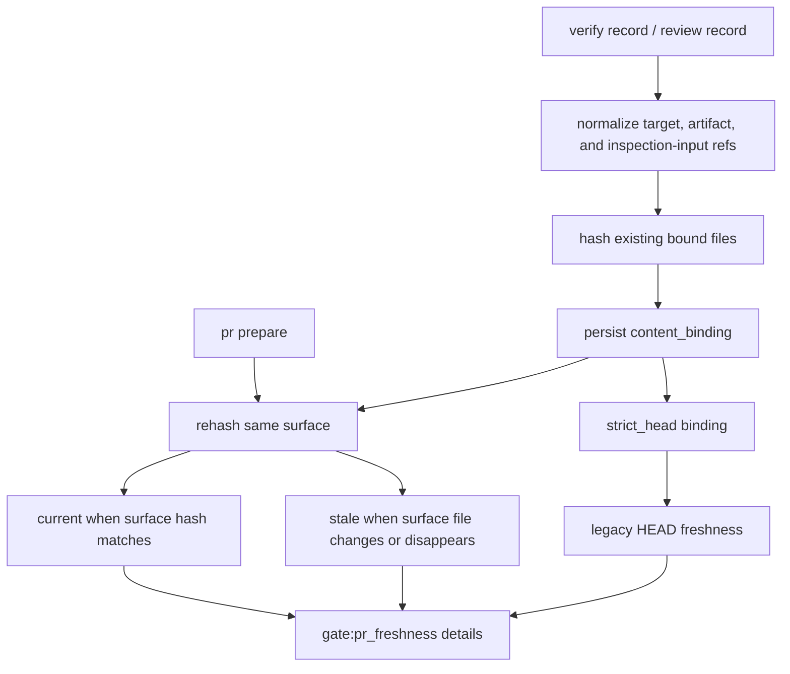

# Architecture

## Decision

Verification and review evidence freshness is evaluated from the content hash of
the evidence-bound surface before falling back to whole-HEAD freshness. The
recorded HEAD remains diagnostic context, but a later commit outside the bound
surface does not by itself make the evidence stale.

## Flow

## Boundaries

- `verify record` binds explicit `--target` paths and artifact paths.
- `review record` binds `--inspection-input` paths and artifact paths.
- `.vibepro/` artifacts are not part of the source surface, so recording or
  regenerating audit artifacts does not self-invalidate evidence.
- Evidence without a usable content surface falls back to the existing HEAD and
  fingerprint freshness checks.
- `--strict-head-binding` intentionally bypasses content freshness and preserves
  the previous "any HEAD change invalidates" behavior.

## Invariants

- A matching content surface hash is enough to keep a passing verification or
  review evidence item current across unrelated commits.
- A changed or missing bound surface file makes that evidence stale and reports
  the exact changed or missing files.
- Strict HEAD evidence remains stale after any commit that changes the HEAD.
- `gate:pr_freshness` exposes the binding model, bound surface, recorded/current
  heads, surface hashes, and stale reason for each bound evidence item.

## Tradeoff

The first model is explicit-surface only. It does not infer dependency graphs or
runtime transitive impact, which keeps the default conservative for unbound or
ambiguous evidence while removing the common false-stale case caused by docs-only
or audit-artifact commits.
