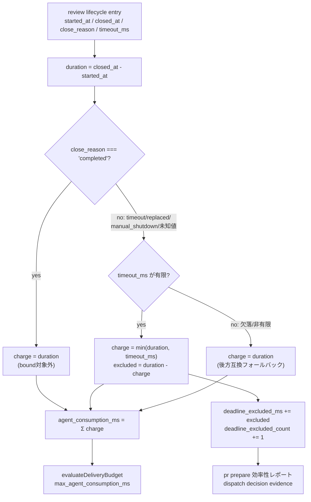

# Deadline Bounded Review Consumption Architecture

## Decision

review lifecycle 1件が予算に計上する agent 消費量を、`close_reason` によって区別する。`close_reason === 'completed'`（正常終了）は現在どおり `closed_at - started_at` の全区間を計上し続ける。それ以外（`timeout` / `replaced` / `manual_shutdown`、および将来追加されうる未知値）は、システムが既に内部に持っている「これ以上は生存とみなさない」境界である `timeout_ms` を使って `min(duration, timeout_ms)` に縮める。実装は集計関数 `aggregateDeliveryMetrics` 1箇所に置き、削られた量は `deadline_excluded_ms` / `deadline_excluded_count` として黙って消さずに可視化する。

## 実測: 何が壊れていたか

`src/delivery-efficiency-guardrail.js:231-271` の `aggregateDeliveryMetrics` は `agent_consumption_ms` を

```js
intervals.reduce((sum, item) => sum + item[1] - item[0], 0)   // :252
```

として計算する。review lifecycle の `closed_at - started_at` を上限なしに単純合算するだけであり、同じ関数内の `review_wait_ms` / `subagent_wall_clock_ms`（`:250-251`）が使う `unionDuration` のような区間処理を経ない。

2026-08-05、story `story-vibepro-content-scoped-evidence-reuse-key` で `architecture_boundary` 4件・`gate_evidence` 6件、計10件の lifecycle が閉じた。全件 `timeout_ms=600000`。

| # | role | 経過 (ms) | timeout_ms | close_reason | timeout_ms 超過? |
|---|---|---:|---:|---|---|
| 1 | architecture_boundary | 493,790 | 600,000 | completed | no |
| 2 | architecture_boundary | 744,613 | 600,000 | completed | **yes** |
| 3 | architecture_boundary | 387,105 | 600,000 | completed | no |
| 4 | architecture_boundary | 633,099 | 600,000 | completed | **yes** |
| 5 | gate_evidence | 393,137 | 600,000 | completed | no |
| 6 | gate_evidence | 286,896 | 600,000 | completed | no |
| 7 | gate_evidence | 477,438 | 600,000 | completed | no |
| 8 | gate_evidence | 183,390 | 600,000 | completed | no |
| 9 | gate_evidence | 456,606 | 600,000 | completed | no |
| 10 | gate_evidence | 7,017,457 | 600,000 | **timeout** | **yes** |
| **合計** | | **11,073,531** | | | 3/10 超過、うち close_reason=timeout は1件のみ |

10件目（lifecycle_id `feab8687...`）は `started_at: 2026-08-05T12:49:56.929Z` から `closed_at: 2026-08-05T14:46:54.386Z` まで 7,017,457ms（116.9分）かかって `close_reason=timeout` で閉じた。`close_evidence` は「subagent adb0d8a8d01998f2b timed out per review status; closing before replacement dispatch」とだけ記録されているが、実体は Anthropic API の過負荷（529）で subagent が応答を止め、後続セッションが気づいて close するまで誰も作業していなかった時間である。

10件の合計は 11,073,531ms（184.6分）。同じ story の `.vibepro/config.json` override `amendment_reason` に記録された `measured=11,073,531ms` と一致し、単純合算モデルを実測で裏付ける。limit は 9,000,000ms（150分）だったため合計が上限を超え、`remaining=0` となって以後の dispatch がすべて拒否され、3件目の owner budget 承認が必要になった。3件のうち最後の1件は story の重さではなくインフラ障害由来である。

`resolveLifecycleEffectiveStatus`（`src/agent-review.js:4065-4079`）は既に「`elapsed_ms > normalizeTimeoutMs(entry.timeout_ms)` なら `timed_out`」という締切をシステム内部に持っている。システムは「これ以上は生存とみなさない」境界を既に持っているのに、`agent_consumption_ms` の計算だけがその境界を無視して合算を続けている。この内部矛盾が本設計の出発点である。

## 設計: deadline-bounded attribution



`reviews[]` の各要素（現在は `role` / `started_at` / `finished_at`）に `close_reason` / `timeout_ms` を追加する。`aggregateDeliveryMetrics` は各要素について:

1. `close_reason === 'completed'` なら `charge = duration`（現行どおり、bound しない）。
2. それ以外で `timeout_ms` が有限数値なら `charge = min(duration, timeout_ms)`、`excluded = duration - charge` を `deadline_excluded_ms` に加算し `deadline_excluded_count` を+1する。
3. `timeout_ms` が欠落・非有限なら `close_reason` に関わらず `charge = duration`（後方互換フォールバック。新フィールドを渡さない既存呼び出しは現行動作のまま）。

呼び出し側は2箇所のみで、どちらも `reviews[]` を構築する箇所に `close_reason` / `timeout_ms` を渡すだけでよい:

- `src/agent-review.js`（`authorizeAgentReviewDispatch` 内、`:819-824`）: `lifecycleEntries.map((item) => ({ role: item.role, started_at: item.started_at, finished_at: item.closed_at }))` に `close_reason: item.close_reason, timeout_ms: item.timeout_ms` を追加する。
- `src/pr-manager.js`（`buildDeliveryEfficiencyContext` 内、`:11741-11745`）: 同様に `reviews.push({ role, started_at, finished_at })` へ2フィールドを追加する。

### なぜ aggregateDeliveryMetrics 1箇所に置くか

`agent_consumption_ms` の生産者は `story-run-portfolio.js` の `mergeCostAttribution`（`:400-407`）を含め3箇所あるが、いずれも最終的に `aggregateDeliveryMetrics` を呼ぶ。bound をこの関数の内部に置けば、呼び出し側は生データ（`close_reason` / `timeout_ms`）を素通しするだけで済み、`min(duration, timeout_ms)` の判断ロジックを3箇所に複製しない。`mergeCostAttribution` は `next.reviews` をそのまま `aggregateDeliveryMetrics` に渡している（`:400-407`）ため、この経路は呼び出し元コードの変更なしに恩恵を受ける。

### なぜ review_wait_ms / subagent_wall_clock_ms は変えないか

この2つは `unionDuration(intervals)`（`:250-251`）で、並行 dispatch を二重計上しないための「実際に経過した wall-clock」を測る指標であり、「誰にいくら agent 予算を課金するか」という attribution の指標ではない。deadline で縮めるべきなのは後者だけである。前者を縮めると、「実際には2時間何も進んでいなかった」という運用上の事実そのものが見えなくなる。

### なぜ deadline_excluded_* を可視化するか

上限による除外を静かに行うと、`agent_consumption_ms` の値が実測より小さく見える理由が追跡できなくなり、「予算を甘くするための細工」と区別がつかなくなる。`deadline_excluded_ms` / `deadline_excluded_count` を戻り値に必ず含め、`pr prepare` の効率性レポートと dispatch decision evidence の両方に伝播させることで、除外がいつ・何件・何ミリ秒起きたかが常に見える状態を保つ。

## 非退化性: なぜ count × timeout_ms へ潰れないか

実 ledger 10件のうち、600,000ms の timeout_ms を超えているのは3件（744,613 / 633,099 / 7,017,457ms）だが、束縛されるのは `close_reason=timeout` の1件だけである。残る2件は `close_reason=completed`（=正常に完了した review）のため免除される。

**束縛率 = 1/10 = 10%**。

これが本設計の中心的な防御である。もし全 lifecycle を一律 `timeout_ms` で切っていたら（却下案 (c)）、10件の消費は `10 × 600,000 = 6,000,000ms` という「lifecycle 件数 × timeout 定数」だけで決まる値に潰れ、実際の作業時間という情報を失う。これはまさに先行した `story-vibepro-work-based-agent-consumption-budget`（未merge、branch `claude/zealous-jones-a4447a`）の3段 tier 設計が、「計測」段に producer が無く `count × timeout` へ退化して停止した失敗そのものである。本設計は `close_reason` という実際の review 結果に基づく discriminator を使うことで、10件中9件を非退化のまま（実測値のまま）保ち、締切を超えて応答を失った1件だけを縮める。

## 却下した代替案

**(a) `vibepro review close --closed-at <iso>` による retroactive 補正** — 採用しない。補正値は予算を制限される側が自己申告する値であり、突き合わせる独立記録が無い。これは `story-vibepro-owner-gated-budget-override` が拒否したのと同型の「検証不能な自己都合の値」であり、かつ人間が気づいて明示的に使わない限り既定の経路は誤ったままになる。deadline bound は運用者の操作なしに支配的なケースを直す。

**(b) lifecycle heartbeat を新設し、最後の heartbeat を実質的な `closed_at` として使う** — 採用しない。本リポジトリが実際に使っている dispatch 形態（手動起動する Claude Code review subagent）に producer が存在しない。tree 内で唯一の heartbeat 相当は `.vibepro/runtime-inbox/<dispatch_id>/`（codex runtime adapter が書く）であり、`src/agent-review.js` はこれを一切読まない。採用すると、`story-vibepro-work-based-agent-consumption-budget` を停止させたのと同じ「producer が無い measured tier」の欠陥を再現する。

**(c) close_reason に関わらず全 lifecycle を timeout_ms で一律に束縛する** — 採用しない。実 ledger では10件中3件が締切を超えるが、そのうち2件（744,613 / 633,099ms）は実際に完了した正当な review であり、これを縮めるのは前述の「非退化性」で述べた退化そのものである。

**(d) 締切超過分を0として扱う（束縛された lifecycle を集計から除外する）** — 採用しない。締切まで生存していた dispatch は締切までの agent capacity を実際に消費している。0として扱うと「完走するより落ちる方が安い」という逆インセンティブを作る。

**(e) `max_agent_consumption_ms` をグローバルに引き上げる** — 採用しない。計測の欠陥を緩い guardrail の後ろに隠すだけであり、将来のインフラ障害のたびに実予算を消費し続ける構造は変わらない。

**(f) `result_artifact !== null` を discriminator として使う** — 実データで検証した上で採用しない。architecture_boundary lifecycle `657ff5ab...`（744,613ms、`close_reason=completed`、`close_evidence` に needs_changes の verdict JSON 内容が明記）は `result_artifact: null` である。10件中 `close_reason=completed` の9件のうち8件は `result_artifact` が非null（path）だが、この1件だけ null であり、`close_reason=timeout` の1件（`feab8687...`）も null である。`result_artifact !== null` を discriminator にすると、正当に完了しこの story の指摘（CRK-S-3 の premise 誤り）を発見した review まで 600,000ms へ縮めてしまう。`close_reason` は review の結果 JSON の有無ではなく lifecycle の終了理由そのものを表すため、こちらの方が弱い近似にならない。

## 残余リスク

`close_reason` は運用者・エージェントが `review close --close-reason` で明示的に設定する値であり、原理的には正当に40分かけて完了した review を `timeout` として close すれば、計上を `timeout_ms`（10分）まで圧縮できてしまう。これは防止ではなく軽減である。

**主たる歯止め（検証済み）**: `review record` は、close 済みの lifecycle の `close_reason` が `'completed'` 以外であれば結果の添付を拒否する（`src/agent-review.js:505-508`: `entry.closed_at && entry.close_reason !== 'completed'` の場合に `review record ${stage}:${role} cannot attach a result to lifecycle closed as ${entry.close_reason}` を throw する）。この経路は既存の passing test `review record persists no result after timeout, replacement, or manual shutdown`（`test/review-inspection-first.test.js:836`）で裏付けられている。したがって、実際には review が完了して結果を残せる状態にあるのに、計上を減らす目的で `close_reason=timeout` と偽って close すると、その review 結果は current artifact にも history にも一切残らない。過小計上を狙う偽装は review dispatch を最初からやり直すコストを発生させ、節約できたはずの計上分より高くつく。これは「証跡整合性を土台にしたシステムでは虚偽の evidence 主張になる」という定性的な牽制より強い、コードが強制する具体的な牽制である。

**副次的な歯止め（可視性。範囲は機械可読サーフェスに限る——過大な主張をしない）**: `deadline_excluded_ms` / `deadline_excluded_count` は `pr prepare` の機械可読サーフェス — `pr-prepare.json` の `gate_dag.summary.efficiency_debt.metrics`、`--summary-json` / `--view blocking-gates` / `--view gate-evidence` の各投影、および各 lifecycle の `dispatch_decision.decision_evidence.budget` — には必ず現れる。ただし人間向け HTML レポート（`gate-dag.html` / `pr-prepare.html` を生成する `src/html-report.js` の `renderGateDagHtml`・`renderAgentReviewPanel`）にはこれらのフィールドへの参照が一切なく（`efficiency|agent_consumption|deadline_excluded` を `src/html-report.js` に grep すると0件）、`src/pr-manager.js` の `risks` / `review_points` にも除外量に基づく callout がない。JSON/CLI サーフェスを直接見ない human reviewer にとって、大きな除外は「目立つ形で人間の目に入る」わけではなく、機械可読サーフェスに正しく記録されているに留まる（HTML への反映は「後続に残すもの」参照）。

## Invariants

- `close_reason === 'completed'` の lifecycle は deadline bound の対象にならない。全区間がそのまま計上される。
- `timeout_ms` が欠落・非有限の lifecycle は `close_reason` に関わらず deadline bound の対象にならない（後方互換フォールバック）。
- 束縛は `min(duration, timeout_ms)` であり、実測値を超えて計上することはない。
- `review_wait_ms` / `subagent_wall_clock_ms`（`unionDuration` ベース）は本設計の対象外であり、上限を持たない。
- 上限で削られた量は必ず `aggregateDeliveryMetrics` の戻り値の `deadline_excluded_ms` / `deadline_excluded_count` に現れ、`pr prepare` の機械可読サーフェス（`gate_dag.summary.efficiency_debt.metrics` および `--summary-json`/`--view blocking-gates`/`--view gate-evidence`、各lifecycleの`dispatch_decision.decision_evidence.budget`）まで伝播する。人間向け HTML レポート（`gate-dag.html` / `pr-prepare.html`）には伝播しない。
- `evaluateDeliveryBudget` の budget 評価・`budget_exceeded` stop・fail-closed 送出経路（`throwReviewDispatchStop`）は本設計によって変わらない。
- budget override authority（human grantor 必須・agent self-grant fail-closed・digest 束縛）は本設計の対象外であり、変更しない。
- `aggregateDeliveryMetrics` の呼び出しシグネチャは変わらない。`close_reason` / `timeout_ms` を渡さない既存呼び出しは現行動作のまま動く。

## 変更しないもの

- budget override authority（human grantor 必須・agent self-grant fail-closed・digest 束縛、`src/budget-override-authority.js`）。
- `--closed-at` のような retroactive 時刻編集コマンドの追加。
- lifecycle heartbeat の新設、および新しい runtime producer の追加。
- `src/usage-report.js` の `--subagent-roi`（別の reporting metric。合算のままでよい契約は `docs/specs/vibepro-agent-runtime-metrics.md` の `ARM-CONTRACT-002` で pin 済み）。
- `hasCompleteReviewTiming` の `.every()` 完全性ゲート（1件でも open な lifecycle があると `agent_consumption_ms` が `unknown` に落ちる挙動）。
- `.vibepro/config.json` の limit 値そのもの（`max_subagent_count` / `max_review_dispatches_by_role` 等）。
- 既に記録済みの `amendment_reason` 履歴の遡及的修正。
- `src/story-run-portfolio.js` の永続化 `cost_attribution` 形状（`emptyCostAttribution()` / `COUNT_COST_KEYS`）への `deadline_excluded_ms` / `deadline_excluded_count` の追加。Portfolio state は `.vibepro/` 配下の git-ignored ファイルであり、`validateState` は `hasExactKeys(cost, COST_KEYS)` で closed schema を強制する。フィールド追加を含むコミットを `git revert` してもコードだけが戻り、既にディスク上にある state ファイルは新フィールド付きのまま残るため、ロールバック後のコードがそれを `invalid_portfolio_state` として拒否し Portfolio 操作を永続的にブロックする——rollback の非対称性がある。DBA-S-6 が求める可視性（`pr prepare` の効率性レポートと dispatch decision evidence）は `gate_dag.summary.efficiency_debt.metrics` と各 lifecycle の `dispatch_decision.decision_evidence.budget` で既に満たされており、`story-run-portfolio.js` を経由しない。

## 後続に残すもの

- `hasCompleteReviewTiming` の `.every()` 完全性ゲート自体の見直し（1件の open lifecycle が次元全体を `unknown` にする設計。`story-vibepro-owner-gated-budget-override` の architecture_boundary preflight が既に指摘済みの、本設計とは別の欠陥）。
- `budgets.delivery_efficiency`（global default）に対する承認 gating（`story-vibepro-owner-gated-budget-override` の残余として明記済み、GE-004）。
- 予算消費が Story 単位でモノトニックに増加し、リセット経路が無い設計そのものの見直し（同じく既知の残余）。
- Portfolio の `agent_consumption_ms` は本 story により上限付きの値になるが、`story-run-portfolio.js` の永続化形状は `deadline_excluded_ms` / `deadline_excluded_count` を持たないため、どれだけ除外されたかを示す併記情報がない。これを埋めるには closed schema へ素朴にキーを足すのではなく、schema_version を上げた上でのマイグレーション（既存 git-ignored state ファイルの読み込み時アップグレード、または schema_version 不一致の明示的ハンドリング）が必要になる。
- `deadline_excluded_ms` / `deadline_excluded_count` を人間向け HTML レポート（`gate-dag.html` / `pr-prepare.html`。`src/html-report.js` の `renderGateDagHtml`・`renderAgentReviewPanel`）にも描画する。現状は機械可読サーフェス（`pr-prepare.json` / `--summary-json` / `--view blocking-gates` / `--view gate-evidence` / 各lifecycleの `dispatch_decision.decision_evidence.budget`）にしか現れず、JSON/CLIを見ない human reviewer には大きな除外が伝わらない（詳細は「残余リスク」参照）。
- `vibepro usage report --subagent-roi` の `agent_consumption_elapsed_ms`（上限なし、`ARM-CONTRACT-002` で pin 済み）と、本 story 後の budget の `agent_consumption_ms`（上限あり）は、deadline-bounded な lifecycle を含む story では値が乖離する。`ARM-CONTRACT-002` を知らない読者はこの乖離を欠陥と誤読しうるため、いずれ両レポートが差異に名前を付けるか注記すべきである。
- **開いたままの問題（本 story の対象外、docsのみで記録）**: deadline bound は「配信されずに終わった lifecycle」の無稼働時間だけを縮める。`close_reason=completed` で正常に配信された lifecycle は本設計の対象外のままであり、配信後に coordinator が `review close` / `review record` を実行するまでのコーディネーター遅延は無制限に計上され続ける。本 story 自身の `gate_evidence` / `release_risk` review lifecycle 2件（2026-08-06T02:02:09.650Z〜02:37:57.270Z の 2,147,620ms、および 02:02:11.062Z〜02:38:37.570Z の 2,186,508ms、合計 4,334,128ms）が実例であり、`max_agent_consumption_ms=1,800,000ms` を超過した。実際の subagent 作業はそれぞれ概ね9分・17分で終わっており、残り約46分はsubagentが verdict を返してから coordinator が `review close`/`review record` を実行するまでの遅延である。両lifecycleとも `close_reason=completed` で閉じているため本 story の deadline bound は適用されず、`deadline_excluded_ms=0` のままである。`review record --agent-closed` は `closed_at` を `result.recorded_at`（coordinator側が記録した時刻）から設定するため、計上は「coordinator がどれだけ迅速に記録したか」に束縛される。真に直すには、coordinator の観測時刻ではなく subagent 自身が報告する delivery timestamp が要る——これは producer 側の変更を要する別問題であり、本 story にそのまま乗せない。
