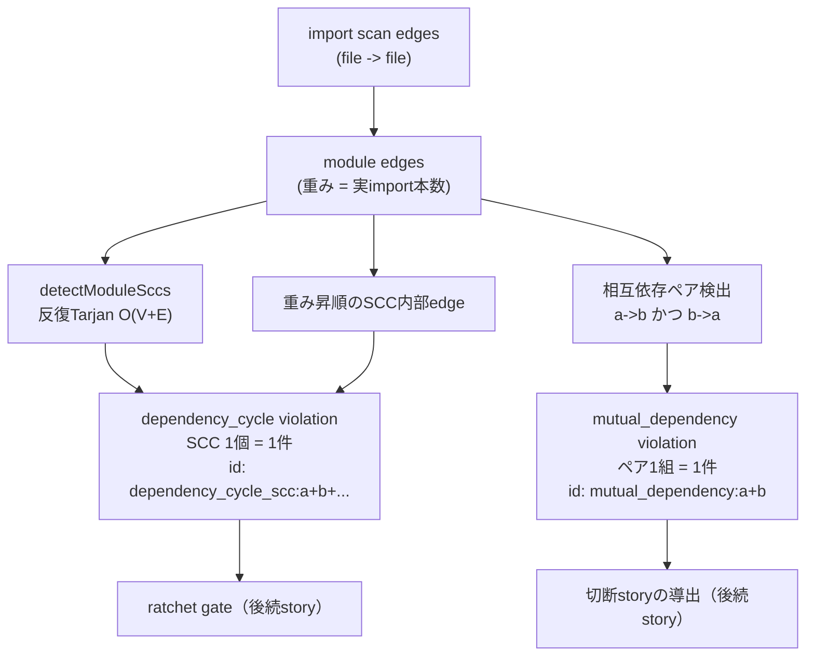

# Dependency Cycle SCC Reduction Architecture

## Decision

`dependency_cycle` の計測単位を「全単純閉路（simple cycle）1本ごと」から「強連結成分（SCC）1個ごと」へ変更する。SCC は絡まりの**外形**を、新しく分離する `mutual_dependency` 次元は絡まりを解く**着手点**を表す。前者は 1 件に畳まれるので ratchet gate の対象にでき、後者は 20 件程度に収まるのでリファクタリング story の入力になる。

## 問題: 単純閉路列挙の組合せ爆発

`origin/main` (`882c3df8`) の実測:

| 次元 | 件数 |
|---|---|
| dependency_cycle | 69,490 |
| undeclared_dependency | 22 |
| budget_violation | 11 |
| orphan_file | 1 |
| **合計** | **69,524** |

閉路長ヒストグラム:

```
 2:    20      7:  4,027     12: 10,530
 3:    73      8:  7,098     13:  5,966
 4:   237      9: 10,458     14:  2,016
 5:   735     10: 12,943     15:    295
 6: 1,885     11: 13,200     16:      7
```

分布の形（長さ 10〜12 が最頻）は、密に絡んだ小さなグラフの単純閉路数がモジュール数に対して階乗的に増えることを示している。実際、循環に関与する 16 モジュールは**単一の SCC** を成す。69,490 件が伝えている命題は「1つの絡まった塊がある」だけであり、69,489 件は冗長である。

この冗長性は 3 つの実害を持つ:

1. **ratchet が載らない**: モジュール間 edge が 1 本増えるだけで数千件の「新規 violation」が湧く。本当の悪化が埋もれ、`new_count` が意味を失う。
2. **計測コスト**: 列挙が計測時間を支配する。
3. **着手不能**: 「gate-pr -> workspace-infra -> review -> run-session -> gate-pr」という 1 本の閉路を見せられても、どこを切ればよいかは分からない。

## 設計: 外形と着手点の分離



### なぜ SCC が正しい単位か

有向グラフにおいて「循環に参加しているノード集合」の正準な分割は強連結成分である。SCC は一意に定まり（分解の仕方に依存しない）、線形時間で求まり、SCC の集合は元のグラフの循環構造を過不足なく表す。単純閉路の集合は同じ情報を指数的に冗長な形で符号化したものにすぎない。

id は構成モジュールのソート済みリストから導出する（`dependency_cycle_scc:agent-runtime+architecture+...`）。SCC のメンバー集合は探索順に依存しないので、この id は CDL-S-1/S-2 の「violation id は要素自身の意味値から導出し、配列 index やグループ序数を使わない」という不変条件を満たす。

### なぜ反復版 Tarjan か

再帰版は本リポジトリの 16 モジュールでは問題ないが、この検出器は将来ファイル単位（数千ノード）のグラフにも使われうる。VibePro には過去に「8 個の walker が spread 引数上限でスタックを飛ばした」（PR #409）実績があり、深さがノード数に比例する再帰は同種の罠を残す。明示スタックによる反復実装にして、深さ由来の破綻経路を作らない。

### なぜ mutual_dependency を分離するか

SCC 1 件は「塊がある」としか言わない。塊を解くには edge を切る必要があり、最も明白で最も小さい切断候補が相互依存ペア（長さ 2 の閉路）である。2-cycle は SCC の内部構造として最も強い制約であり、それを 1 組でも解消すると SCC が分裂しうる。20 組という規模は人間が読め、1 組 = 1 リファクタリング story に対応づけられる。

これを SCC violation の中の配列だけにせず独立 kind にするのは、delta ledger が `by_kind` で次元別に new/resolved を数えるからである。独立 kind にして初めて「相互依存ペアが 1 組解消された」が計測結果として現れる。

### feedback edge 候補の位置づけ

SCC を分解するために切るべき edge の厳密な最小集合（minimum feedback arc set）を求めるのは NP 困難であり、決定論的・線形時間という計測器の性質と両立しない。代わりに **SCC 内部のモジュール間 edge を実 import 本数の昇順**に並べた上位候補を提示する。「実 import が 1 本しかない依存」は切るコストが最も低いという素朴な近似で、厳密解ではないことを出力フィールド名（`feedback_edge_candidates`）とコードコメントの双方で明示する。

## 後方互換: detectModuleCycles を残す判断

`export function detectModuleCycles(moduleEdges) {` は **merge 済みの** `story-vibepro-conformance-delta-ledger` の Spec clause S-003 が

- `origin.code_refs`: `src/architecture-conformance.js` の anchor `export function detectModuleCycles(moduleEdges) {`
- `verifiable_by.code_pattern`: 同 anchor の `must_contain`
- `verifiable_by.test_pattern`: `CDL-S-6: detectModuleCycles finds a normalized 2-module cycle regardless of start node`

で拘束している。関数を削除すると過去 story の spec anchor が解決不能になり、`vibepro spec drift --id story-vibepro-conformance-delta-ledger` が壊れる。

選択肢は 2 つあった:

- **(a) export を維持し、非推奨コメント + SCC 版を追加**（採用）
- (b) 過去 story の Spec を本 story で改訂する

(b) を採らない理由: merge 済み Spec は「その story が何を約束したか」の履歴記録であり、後続 story が遡って書き換えると、Spec が「約束の記録」ではなく「現在のコードの写し」に退化する。S-003 の statement（「モジュール間の有向閉路が独立次元として検出され、閉路 id は最小回転で正規化され start node に依存しない」）は今も真であり、改訂すべき事実の変化がない。

(a) の残る懸念は「全単純閉路列挙関数が残ること自体が罠」である。これは以下で抑える:

- 関数を conformance パイプラインから外す（唯一の呼び出し元は CDL-S-6 テスト）
- 関数本体に実測値（16 モジュールで 69,490 閉路）と代替（`detectModuleSccs`）を明記した非推奨コメントを置く
- 署名・戻り値契約は一切変えない（変えると anchor と S-003 の statement の両方を壊す）

## 変更しないもの

- `target-model.json`（modules / allowed_dependencies / rules[] / governance / model_version）
- 他次元（undeclared_dependency / orphan_file / budget_violation / stale_pattern）の判定ロジック
- `EDGE_SOURCE = 'import_scan'`（PR #387 の決定）
- 過去 story の Spec

## 後続に残すもの

- ratchet gate（新規悪化 block）: SCC が 1 件に畳まれて初めて載せられる
- 相互依存ペア 20 組からの切断 story 導出
- 未宣言依存 22 件の解消
