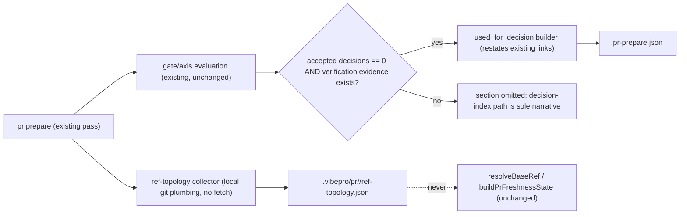

# Architecture

## Decision

Two additive artifacts produced at `pr prepare` time in
`src/pr-manager.js` `preparePullRequest`, both observation-only:

1. **`ref-topology.json`** — a read-only snapshot of the repo's remote/ref
   landscape at prepare time. Today `resolveBaseRef` picks a base via
   `origin/HEAD` then the hardcoded preference list
   `origin/develop → origin/main → develop → main → master`, and only
   `buildPrFreshnessState` persists the chosen `base_ref`. Which rule chose
   the base, what other remotes existed, and whether a same-named branch
   diverged across remotes (the SalesTailor `origin/*` vs
   `salestailor-inc/*` failure mode, where a wrong guess makes `src/test`
   look like zero) is reconstructed by hand in every audit. The collector
   enumerates `git remote`, resolves base candidates / head / story branch
   against each remote's locally-known refs (`git rev-parse --verify`,
   no fetch), and records the chosen base plus its selection rule
   (explicit `--base` / origin HEAD / preference-list index) and per-branch
   divergence flags. Extending `resolveBaseRef` to scan all remotes was
   rejected: it would change base selection behavior for every repo;
   observation cannot.

2. **`used_for_decision` section in `pr-prepare.json`** — derived only when
   the story has zero accepted decisions (the BFD-230 shape: empty
   `decision-records.json`, judgment carried by `verify import-ci`
   evidence). The builder restates existing links the gate evaluation
   already computed: which verification evidence records (kind,
   current-head binding, imported-CI flag from `src/ci-evidence.js`) were
   consumed by which axis blockers (`unresolvedCounterEvidence` matches),
   gates, and the readiness verdict. It creates no new judgments and no
   substitute for decision records; when accepted decisions exist, the
   existing decision-index path remains the sole narrative and the section
   is omitted.

## Public Contract

- `.vibepro/pr/<story-id>/ref-topology.json`:

```json
{
  "schema_version": "0.1.0",
  "status": "complete",
  "remotes": [{ "name": "origin", "url_kind": "github" }, { "name": "salestailor-inc", "url_kind": "github" }],
  "refs": [
    {
      "branch": "codex/bfd-230-timerex-cta-materialization",
      "role": "head",
      "per_remote": { "origin": "abc123…", "salestailor-inc": "def456…" },
      "diverged": true
    },
    { "branch": "develop", "role": "base_candidate", "per_remote": { "origin": "…", "salestailor-inc": null }, "diverged": false }
  ],
  "base_selection": { "base_ref": "origin/develop", "rule": "preference_list", "rule_detail": "index 0" }
}
```

  Collection failures (no remotes, detached HEAD) produce
  `status: "partial"` with reasons; `pr prepare` always completes.

- `pr-prepare.json` gains, only when accepted decisions = 0 and
  verification evidence exists:

```json
{
  "used_for_decision": {
    "schema_version": "0.1.0",
    "reason": "no_accepted_decisions",
    "entries": [
      {
        "evidence": { "kind": "integration", "source": "imported_ci", "head_bound": true },
        "supported": ["axis:rollback_sensitive", "gate:verification", "readiness:ready_for_pr_create"]
      }
    ]
  }
}
```

- Both artifacts live in `.vibepro/pr/<story-id>/`, already on the read
  path of `audit session-cost` artifact classification and
  `execute merge` — no new audit acquisition step.

## Execution Topology

No new process, command, or network surface. The topology collector runs
local git plumbing only (never fetch); the summary builder is a pure
function of evaluation results already in memory during
`preparePullRequest`. Both run synchronously inside the existing prepare
pass.



## Flow

```text
pr prepare
  resolve base (existing resolveBaseRef, unchanged)
  collect topology:
    list remotes; for base candidates + head + story branch:
      resolve SHA per remote (locally-known refs only)
    mark divergence where same branch differs across remotes
    record base_selection { base_ref, rule, rule_detail }
    write ref-topology.json (partial + reasons on failure)
  evaluate gates (unchanged)
  if accepted decisions == 0 and verification evidence exists:
    map each consumed evidence record -> axes/gates/readiness it satisfied
    write used_for_decision section into pr-prepare.json
```

## Boundaries

- The collector never fetches, never mutates refs, and never influences
  base selection; `resolveBaseRef` and `buildPrFreshnessState` are
  unchanged.
- The summary restates evidence-to-judgment links the evaluator computed;
  it cannot create, upgrade, or substitute evidence, and it cannot
  fabricate a decision narrative where the evaluator recorded none.
- CI import rules (head-SHA match required, pass-only recording) in
  `src/ci-evidence.js` are consumed as-is.
- Neither artifact is read by gate evaluation — they are outputs for
  audit/handoff, not inputs to verdicts.

## Invariants

- Same repo state → byte-stable snapshot (remote/ref enumeration is
  sorted; no timestamps beyond the prepare run id).
- A same-named branch with different SHAs across remotes always carries
  `diverged: true` with both SHAs.
- `base_selection.rule` is always one of `explicit | origin_head |
  preference_list`, matching what `resolveBaseRef` actually did.
- `used_for_decision` appears iff accepted decisions = 0 and at least one
  verification evidence record exists; stories with accepted decisions are
  byte-identical to today's output.
- Topology collection failure never fails `pr prepare` or changes
  gate_status.

## Rollback

Revert the collector, the summary builder, and their two wiring points in
`preparePullRequest` in one commit. Existing artifacts remain valid:
`ref-topology.json` becomes inert data and the optional `used_for_decision`
field is ignored by all readers.
