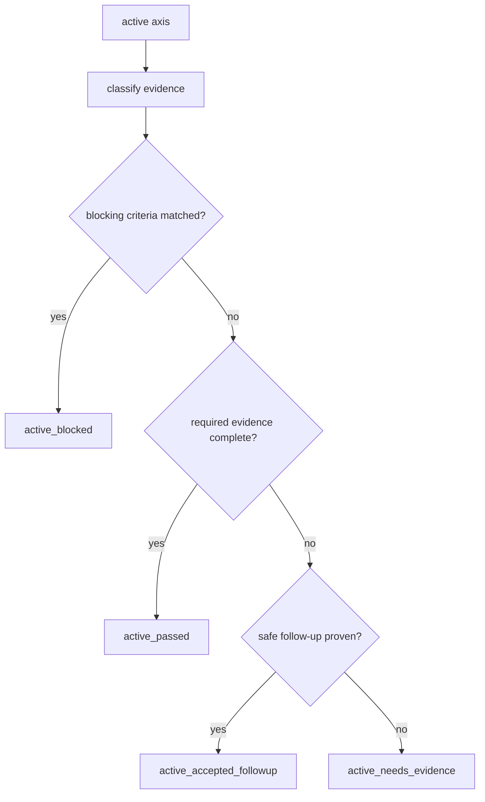

# Architecture

## Decision

Engineering Judgment axisのstatus解決を、単なる missing evidence 判定から
`blocker evaluation` を含む4段階へ拡張する。

判定順序は以下に固定する。

1. axis activation
2. matched evidence classification
3. blocker evaluation
4. follow-up / waiver resolution
5. final axis status emission

これにより「証拠不足」と「今止めるべき条件一致」を分離する。

## Status Model

- `active_passed`: 必須evidenceを満たし、blocker不一致
- `active_accepted_followup`: blocker不一致で、未充足evidenceが安全にdefer可能
- `active_needs_evidence`: blocker不一致だが、未充足evidenceがあり安全deferも成立しない
- `active_blocked`: blocker一致。PR create/merge判断を止める

## Boundary

- `active_blocked` は「missing evidence がある」だけでは発火しない
- `active_accepted_followup` は blocker を打ち消すために使ってはいけない
- waiver は follow-up の別名ではなく、blocker source に紐づく明示判断とする

## Flow

## Tradeoff

この変更は false block のリスクを持つため、初期実装では
blocker一致根拠を必ず artifact 上に出す。
止める精度を監査できない blocker は導入しない。
