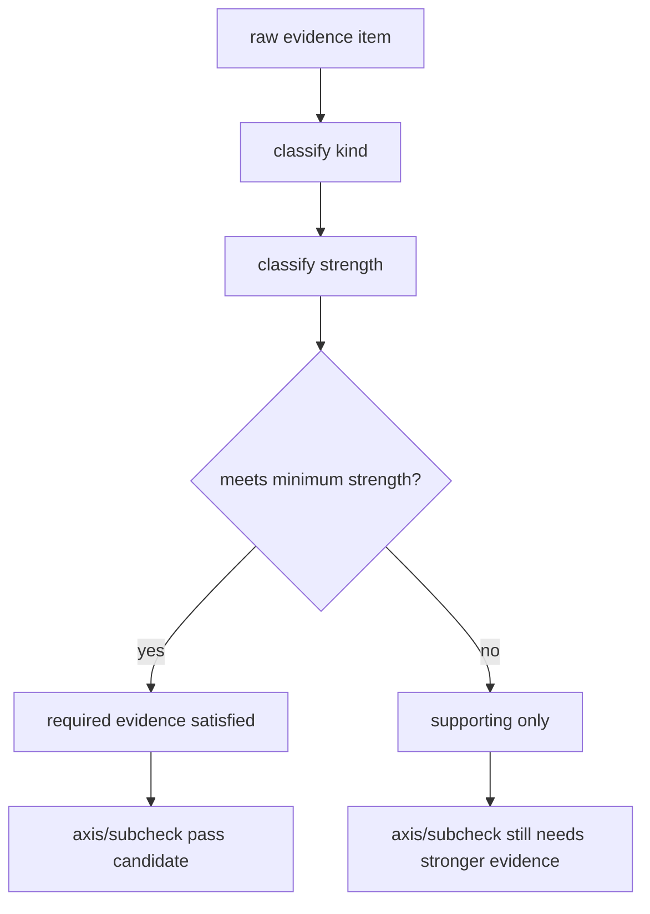

# Architecture

## Decision

Engineering Judgment evidence を presence 判定から strength 判定へ移す。

各 evidence item は少なくとも以下を持つ。

- `kind`
- `ref`
- `strength`
- `strength_reason`
- `binding_status`
- `artifact_quality`

`strength` は初期実装では `declared`, `supporting`, `strong` を使う。

## Rules

- `declared`: 自己申告や手書きsummaryはあるが、再現可能 artifact が弱い
- `supporting`: changed tests, broad suite, indirect artifact, partial replay などの補助根拠
- `strong`: 対象一致した machine-readable artifact、focused replay、negative path、old/new behavior comparison など

高リスクaxisは required evidence kind ごとに `minimum_strength` を要求する。
presence は満たしていても、strength が閾値未満なら axis pass には使えない。

## Boundary

- strength は truth guarantee ではない。evidence の信用度モデルである
- Graphify は optional supporting evidence に留める
- human review summary は strong evidence ではなく、strong evidence を読む入口として扱う

## Flow

## Tradeoff

strictにしすぎると light changes で friction が増える。
そのため初期導入は `high-risk surface` と `critical evidence kind` から始め、
low-risk docs-only には従来の軽量passを残す。
