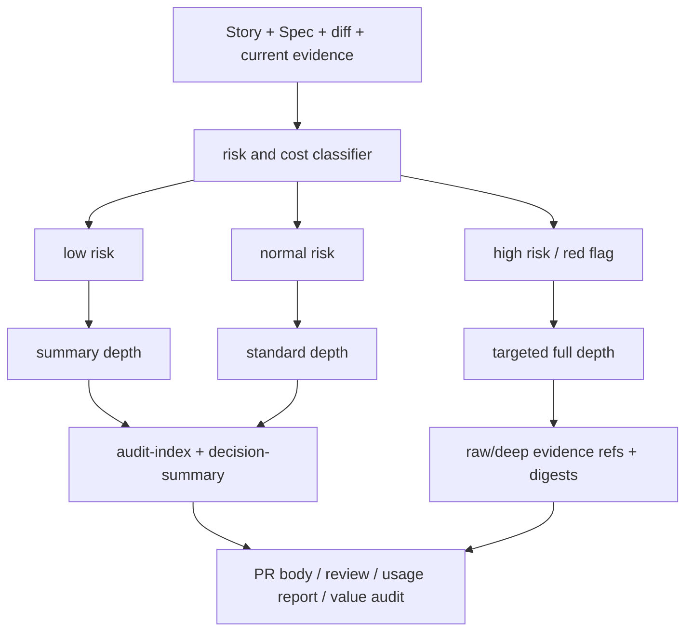

# Architecture

## Decision

VibeProは監査証跡を「常にfullで生成する」のではなく、risk profileに応じて `summary` / `standard` / `full` の段階に分ける。

コストを下げる対象は保存だけではない。生成、LLM読込、canonical保存の3つを同時に制御する。通常はcompactな `audit-index` と `decision-summary` を作り、赤信号が出たsurfaceだけfull evidenceへ降りる。

## Boundary

- `pr prepare`: changed files、Story、Spec、Architecture、verification stateからevidence depthとbudgetを決める。
- `review prepare`: 既存summary/indexをreview inputとして優先し、必要なsurfaceだけdeep evidenceを渡す。
- `review record`: full evidenceを使った場合、その理由とconsumerを記録する。
- `execute merge`: canonical audit diff量とartifact/code比を測り、budget超過時はfull copyを避ける。
- `usage report`: summary/indexを先に読み、missing/stale/unresolved/waiverなどの赤信号がある時だけraw/deep artifactを読む。

## Evidence Depth Model

## Canonical Artifact Model

Canonical main should contain:

- decision summary
- audit index
- cost summary
- artifact digests
- retrieval references for raw evidence
- unresolved reference list
- explicit `missing_evidence` / `unverified` status

Canonical main should not contain by default:

- full raw transcript
- provider raw log
- generated HTML report
- full review lifecycle dump
- full Gate DAG dump when no red flag needs it
- duplicated copies of artifacts that can be summarized and referenced

## Cost Accounting

Every PR/merge/value-audit surface should classify changed lines into:

- `src`
- `test`
- story/spec/architecture docs
- audit artifacts
- other

When logs expose token/time metrics, VibePro records them next to this line split. When unavailable, it reports `未確認` rather than inferring zero.

## Invariants

- Engineering Judgment gate must continue to catch real risk.
- Traceability from Story to PR to code/test must remain visible.
- Missing evidence must never become pass.
- Handoff must remain possible from compact canonical artifacts plus raw evidence references.
- Full evidence remains available as escalation, but it is not the default path.

## Tradeoff

This design makes VibePro less self-contained by default than a full copied bundle, but more faithful to product value. The canonical branch stores the decision surface, not every intermediate object. Deep replay is still possible through digests and retrieval references when the summary/index says it is needed.
