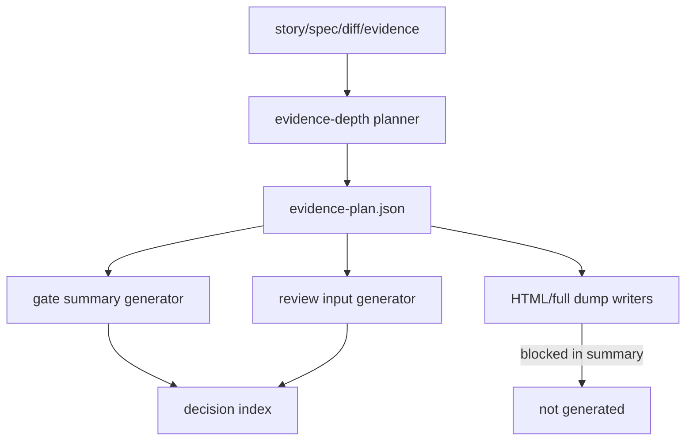

# Architecture

## Decision

Evidence depth must be decided before expensive generation. The planner is a front gate inside
`pr prepare`, not a cleanup step after artifacts already exist.

## Boundary

- Planner inputs: Story metadata, Spec clauses, architecture docs, git diff stats, selected story state, existing verification/review artifacts.
- Planner output: `evidence-plan.json` with depth, allowlist/blocklist, escalation reasons, and consumers.
- Generators: Gate DAG, PR body, review cockpit, HTML reports, review lifecycle and raw/deep evidence writers must consult the plan before writing.
- Review and merge paths consume the plan but do not silently broaden it.

## Flow

## Invariants

- Reducing artifact volume must not reduce risk detection.
- Summary means compact output, not blind success.
- Full evidence is an escalation path with provenance.
- Missing evidence remains missing or blocked.

## Tradeoff

Some existing consumers may assume HTML/full JSON always exists. This story intentionally changes that
contract: consumers must read `evidence-plan.json` and `decision index` first, then request targeted full
evidence only when the plan says it exists or a red flag requires it.
