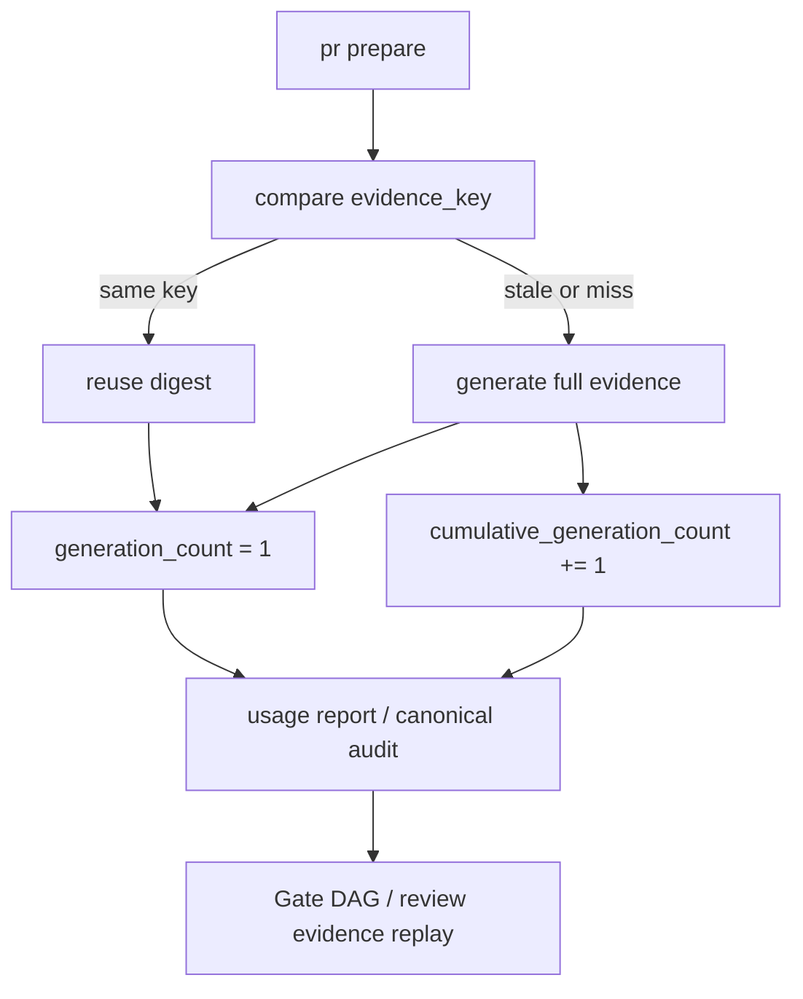

# Architecture

## Decision

VibePro keeps the existing `generation_count` field for compatibility, but fixes its semantic scope to
the current `evidence_key`. A new cumulative field carries lifecycle cost history. This preserves the
original reuse contract while making audit cost interpretation explicit.

## Boundary

- `evidence-reuse`: owns metric calculation and emits scoped fields.
- `usage report`: renders same-key and cumulative counts side by side.
- `Gate DAG / review evidence`: consumes scoped metrics as replayable evidence rather than reinterpreting a cumulative count as reuse failure.
- `canonical audit`: persists both metrics through full and compact audit artifacts.
- Existing historical artifacts: remain readable through fallback from legacy `generation_count`.

## Flow

## Invariants

- `generation_count` is never a cross-key cumulative cost metric.
- `cumulative_generation_count` is never used as proof that same-key reuse failed.
- Compact canonical audit must not discard metric scope.
- Legacy artifacts without scoped fields remain interpretable through fallback, but new artifacts must be explicit.

## Tradeoff

The field name `generation_count` is ambiguous, but changing or removing it would break existing consumers.
Adding scope and explicit companion fields gives current consumers a stable migration path without hiding
the audit signal that triggered this story.
