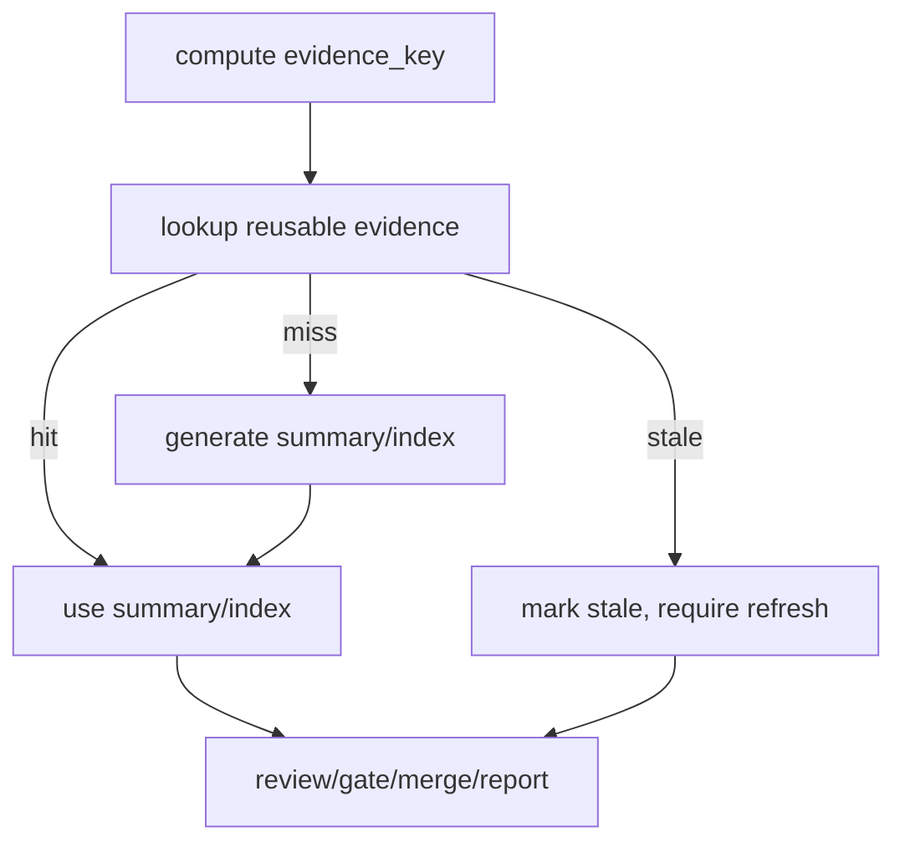

# Architecture

## Decision

The reusable unit is not "a file path exists"; it is an evidence key bound to the Story, refs,
Spec, risk surface, verification state, and planner version. VibePro reuses summaries only when those
inputs still match.

## Boundary

- `pr prepare`: creates or refreshes summary/index for the current evidence key.
- `review prepare`: consumes fresh summary/index first and records reuse status.
- `review record`: may reference reused evidence digests.
- `execute merge`: persists final reuse status into canonical audit.
- `usage report`: surfaces hit/miss/stale counts as value/cost signals.

## Flow

## Invariants

- Reuse cannot hide stale evidence.
- Reuse cannot drop blocking findings.
- Full raw evidence is referenced by digest and generated once per key.
- Summary/index remains the first-class handoff surface.

## Tradeoff

The key may initially be conservative and mark artifacts stale more often than ideal. That is acceptable:
false stale costs time, but false fresh corrupts judgment. The system should optimize hit rate only after
staleness safety is proven.
