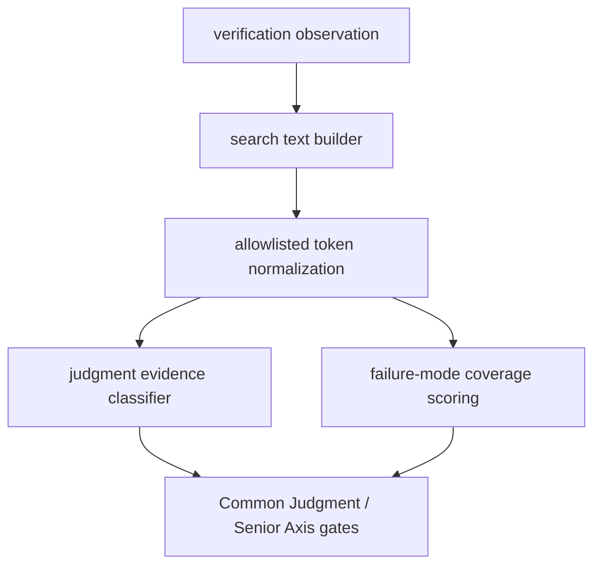

# Architecture

## Decision

Evidence classification gets a small allowlisted canonical token layer before existing
regex and keyword scoring. The layer converts supported underscore, hyphen, and space
variants into canonical evidence terms while leaving the original text available for
natural-language matching.

## Flow

## Invariants

- Canonicalization is allowlisted to evidence vocabulary only.
- Natural-language evidence matching remains valid.
- The same normalized text is used for observation targets, scenarios, and observed
  key/value pairs.
- Failure-mode coverage recognizes canonical ids even when evidence uses hyphen or
  space variants.
- Gate feedback reports the accepted canonical terms for missing failure-mode evidence.

## Tradeoff

This is intentionally narrower than generic token stemming. It fixes spelling-sensitive
workflow tokens without making unrelated underscored identifiers count as verification
evidence.
