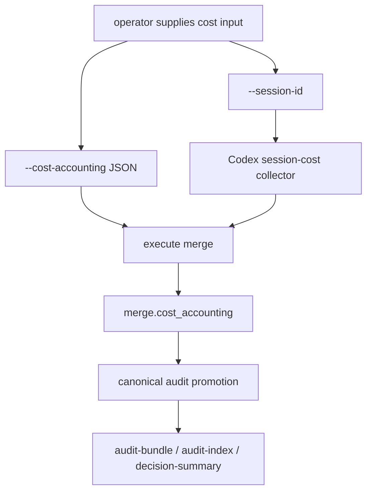

# Architecture

## Decision

`execute merge` becomes the bridge between measured session cost and canonical audit persistence, but
it does not guess local agent sessions. Cost accounting is ingested only from explicit operator input:
`--cost-accounting <json>` for a prepared accounting artifact, or `--session-id <id>` for the existing
Codex session-cost collector.

This keeps the canonical artifact trustworthy. Unknown cost remains unknown, while measured cost can
finally survive the merge boundary that value audits treat as the source of truth.

## Boundaries

- `audit session-cost` owns Codex JSONL discovery and worktree/session interpretation.
- `execute merge` owns explicit cost-accounting ingestion and attaches the normalized result to
  `merge.cost_accounting`.
- `canonical-audit` remains the persistence boundary and extracts accounting from the merge payload.
- Future Claude Code support should add another collector/adapter that emits the same canonical
  accounting schema; it should not fork canonical audit semantics.

## Flow

## Invariants

- No implicit session guessing.
- Missing or unreadable telemetry is explicit and never zero.
- Cost accounting is non-blocking for merge readiness.
- The canonical schema is agent-independent even when the first collector is Codex-specific.
