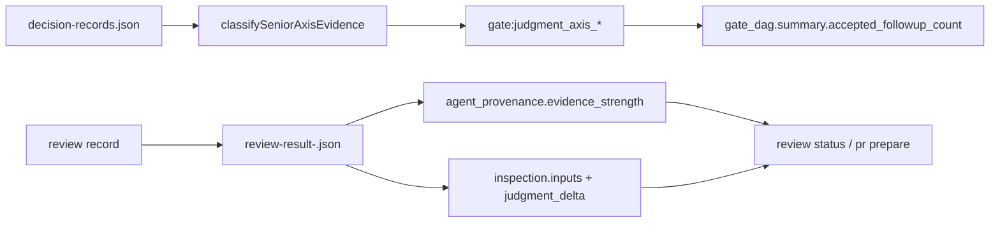

# Architecture

## Decision

VibeProのgreen signalを2段階に分ける。証拠が揃ったものだけを`passed`にし、missing evidenceをaccepted follow-upで後送したものは`accepted_followup`として表示する。これはPR作成を止めないが、cockpit、Gate DAG、handoff artifactで通常通過と区別できる。

Agent Reviewはhuman必須にしない。代わりに、エージェントだけで回るための再構成可能性を最低条件にする。`agent_id`だけでは実行を辿れないため、thread/session/call idまたはtranscript artifactを強いprovenanceの条件にする。

## Boundaries

- `accepted_followup`はnon-blockingだが、fake greenではない。
- Axis decision recordは、current safetyの理由とartifact referenceがある場合だけaxis evidenceとして使う。
- `gate_evidence` passは、inspection summaryに加えて、見た入力と判断差分がない場合は新規記録を拒否する。
- 既存artifactの読み取り互換性は維持する。過去の空配列artifactを壊さず、今後の記録だけを厳格化する。

## Data Flow

## Tradeoff

この変更はreview recordの入力要件を少し増やす。しかしhuman review必須化より軽く、別engineer/agentが判断を再構成できるため、エージェントループの速度を維持したままfake-valueを減らせる。
