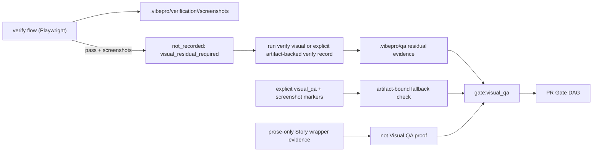

# Architecture

`vibepro verify flow` already captures full-page screenshots under
`.vibepro/verification/<run-id>/screenshots/`, but screenshot existence is not
the same thing as visual review. The bridge keeps the producer side explicit:
after a passing flow run that captured screenshots, the flow verifier reports
`auto_visual_evidence.status=not_recorded` with
`reason=visual_residual_required` and points operators to residual or explicit
artifact-backed evidence instead of auto-recording `visual_qa` markers.

Visual QA Gate keeps its two-source model: residual analysis first,
verification fallback second. The fallback is tightened so prose-only
verification evidence cannot satisfy the gate; a current verification claim
must carry explicit `visual_qa` / `screenshot` markers tied to an existing
screenshot image or residual Visual QA artifact.

## Decision

- Producer-side flow verification records not-recorded Visual QA metadata, not
  Visual QA pass evidence. Consumer-side fallback in `pr-manager` requires real
  visual artifacts before treating explicit verification evidence as Visual QA
  proof.
- Reuse the marker vocabulary normalized by
  story-vibepro-visual-evidence-gate-ux; do not introduce new marker tokens.
- Passing flow runs with saved screenshots still produce no visual markers
  automatically; failing runs and screenshot-less runs record nothing visual.
- Flow runs expose a structured `not_recorded` reason in JSON, Markdown, and
  CLI output.
- Not-recorded metadata embeds provenance (flow run id, screenshot paths) so
  operators can run residual Visual QA against the originating run.
- Residual analysis under `.vibepro/qa/<qa-id>/` remains authoritative when
  present; the bridge never outranks it.

## Boundary and Rollback

- Boundary: producer side only. Curated Journey authority, residual formats,
  and gate activation conditions stay where they are.
- Rollback: revert the flow-verifier not-recorded metadata and its tests in
  one commit; manual `verify record` with explicit markers keeps working.
