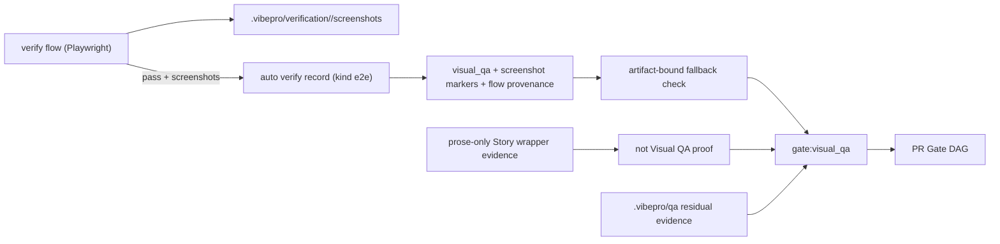

# Architecture

`vibepro verify flow` already captures full-page screenshots under
`.vibepro/verification/<run-id>/screenshots/`, but that evidence never reaches
`gate:visual_qa`. The bridge closes this gap on the producer side: after a
passing flow run that captured at least one screenshot, the flow verifier
records current-head verification evidence (kind `e2e`) carrying the explicit
`visual_qa` and `screenshot: <path>` scenario markers that the gate already
accepts.

Visual QA Gate keeps its two-source model: residual analysis first,
verification fallback second. The fallback is tightened so prose-only
verification evidence cannot satisfy the gate; a current verification claim
must carry explicit `visual_qa` / `screenshot` markers tied to an existing
screenshot image or residual Visual QA artifact.

## Decision

- Producer-side recording lives in the flow verifier / verification-evidence
  path. Consumer-side fallback in `pr-manager` requires real visual artifacts
  before treating verification evidence as Visual QA proof.
- Reuse the marker vocabulary normalized by
  story-vibepro-visual-evidence-gate-ux; do not introduce new marker tokens.
- Only passing flow runs with at least one saved screenshot produce visual
  markers; failing runs and screenshot-less runs record nothing visual.
- Flow runs that do not auto-record Visual QA evidence expose a structured
  `not_recorded` reason in JSON, Markdown, and CLI output.
- Auto-recorded evidence embeds provenance (flow run id, screenshot paths) so
  gate details can point back to the originating run.
- Residual analysis under `.vibepro/qa/<qa-id>/` remains authoritative when
  present; the bridge never outranks it.

## Boundary and Rollback

- Boundary: producer side only. Curated Journey authority, residual formats,
  and gate activation conditions stay where they are.
- Rollback: revert the flow-verifier recording step and its tests in one
  commit; manual `verify record` with explicit markers keeps working.
