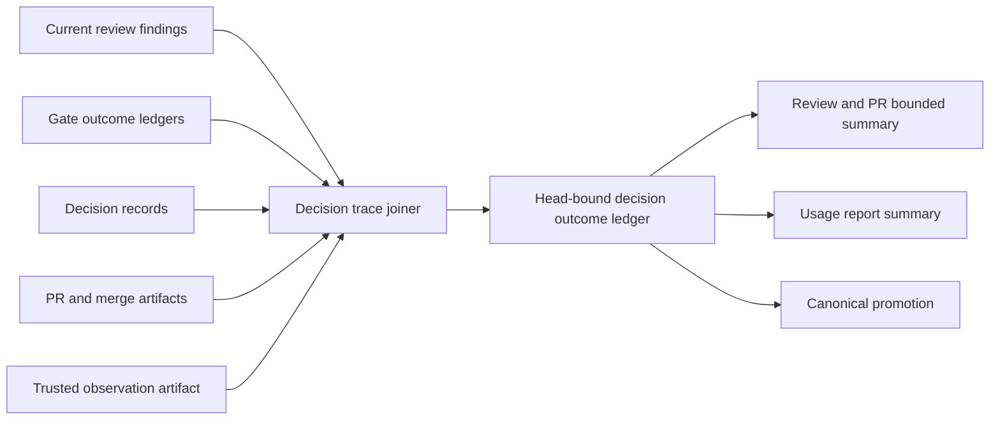
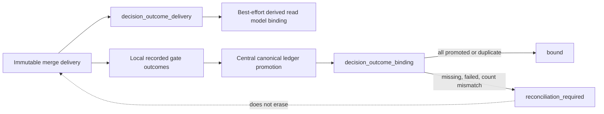

# Gate Decision Outcome Ledger Architecture

## Decision

findingからdownstream outcomeまでを追うledgerは、新しい判断正本ではなく、既存正本を結合する**head-bound derived read model**とする。`.vibepro/pr/<story-id>/decision-outcome-ledger.json`へ生成し、merge時にcanonical audit bundleへ追加する。well-formedな既存ledgerのfield、entry key、promotion動作は維持し、schema・binding・digestが不正なledgerだけをcanonical promotion前にfail-closedで拒否する。

## Source Matrix and Precedence

採用単位はartifact全体ではなくfield単位とし、すべての非null値に`source_ref`、`source_kind`、利用可能なら`source_head_sha`を持たせる。

| Claim | Authoritative current source | Fallback | Conflict / stale behavior |
|---|---|---|---|
| finding・review disposition | current-head `.vibepro/reviews/<story>/**/review-result-*.json` | close済み・verified-agent provenanceを持つhistorical review finding、canonical audit上の同一finding revision | historical findingは`detected_head_sha`を保持して因果入力にだけ採用し、current verdictとして再利用しない。stable keyが同じで値が異なれば`conflicting` |
| explicit decision・waiver | decision records | canonical decision index | 同一decision IDの矛盾は両refを保持して`conflicting` |
| gate resolution | repo-local gate outcome ledgerの同一story entry | canonical/central gate outcome ledger、manifest由来legacy entry | localを無条件優先せず、head/revision一致を必須化。判定不能は`unknown_source_revision` |
| behavior delta・verification | managed verification artifactの`commands[].observation.values.decision_trace_key`、`commands[].observation.values.behavior_before`、`commands[].observation.values.behavior_after`と`commands[].observation.targets[]` | gate outcomeの`source_fix`分類をpartial evidenceとして使用 | commandはkindごとに保存されたentryを走査する。`content_binding.mode=strict_head`はrecorded/current HEAD一致、`content_surface`は`evaluateContentBinding`相当のsurface current判定を必須とし、docs-only HEAD進行だけでは除外しない。明示fieldが揃わなければ`not_observed`または`partial`。changed fileだけからbefore/afterを推定しない。stale verificationは除外理由を保持 |
| PR・merge delivery | GitHub live PRの`state/headRefOid/baseRefName/mergeCommit.oid`と`.vibepro/pr/<story>/pr-create.json`、merge artifact | canonical auditの同一PR/merge revision | local artifactだけでは権威とせず、live PRが`MERGED`で全identityが一致し、merge commitがcanonical base上にある場合だけ採用する。PR/merge identity不一致は`conflicting` |
| downstream outcome | 下記Observation Contractを満たすartifactのみ | なし | 非存在は`observation_missing`、malformedは`observation_malformed`、authority/digest不一致は`observation_untrusted`、binding不一致は`observation_binding_mismatch`として固定分類する |

sourceが欠損・unreadableでもentryを捨てず、`trace_status`、`missing_reason`、`source_errors[]`へ残す。ただしverified-agent provenanceまたはartifact refを欠くreview finding/dispositionは`claim_authority_invalid`/`claim_provenance_missing`としてfail-closedにし、そのsource由来のclaimを`observed`へ昇格しない。authorityはlinked trace全体へ伝播させずclaim provenanceごとに判定し、無効なfinding/dispositionと同じsubjectへ結合された独立authority-valid claimおよびeligible outcome sourceは保持する。manifest fallbackはlegacy discovery専用であり、current-headの具体的主張を上書きしない。

## Downstream Observation Contract

`story_id`は`.vibepro/pr/<story-id>`、`.vibepro/observations/<story-id>`、`.vibepro/executions/<story-id>`、`.vibepro/reviews/<story-id>`、canonical audit pathの境界キーである。公開CLIとmanaged-worktree/review lifecycleはstateやartifactを読む前、manager APIはledger/observation/temp-worktree pathを組み立てる前に、単一の共有validatorで単一path segment、`story-*`契約、`..`・slash・backslash・percent/encoded form不在を検証する。artifact routingが受け入れてきた大文字混在の安全なlegacy入力は検証後に従来どおりslug化し、opaque tracker IDは既存形式を維持する。無効IDは各surfaceのtyped errorとして非zeroで拒否し、story-scoped stateを読まず変更しない。

canonical audit本文から抽出する`.vibepro/`参照も、正規化結果が入力と一致し、空segment・`..`を含まず、source rootとcanonical references rootの双方にcontainされるものだけを扱う。canonical directoryの再帰収集はfile数・総byte数・depthを有限上限でfail-closedにし、巨大または深すぎるartifact treeをmerge/refresh時に無制限にメモリへ展開しない。rollbackはsnapshotを同一filesystem上のstagingへ完全copyしてから現行directoryを退避し、renameで置換する。置換失敗時は退避済み現行directoryを戻し、snapshotからの復旧自体が失敗した場合はrecovery snapshotを削除せずoperatorへ返す。

公開`trace_source_ref`からmultiplicityを除く安定化以前に保存されたobservationは、旧式selectorと旧parent revisionを決定的read aliasとして解決する。新規出力・新規recordは現行selectorだけを生成し、aliasは過去値をsilentに`not_observed`へ落とさないupgrade互換境界に限定する。また、decision-ledger文脈の「claimの競合」「downstream outcomeの観測」をruntime bug-physicsへ誤分類しないが、「データ競合」「状態を観測できない」は引き続きtiming/observability gateを選ぶ正負回帰を契約とする。`design-ssot.json`は本StoryのStory/Spec/Architecture lineageなのでrequirements SSOT laneへ含める。

観測artifactは`vibepro outcome record`が生成・manifest登録する`.vibepro/observations/<story-id>/<observation-id>.json`、またはcanonical audit bundle内の`kind: downstream_observation`としてのみ受理する。record commandは`source_ref`が指すmanaged verification artifact `.vibepro/pr/<story>/verification-evidence.json` またはmanaged decision-records artifact内のaccepted waiver decisionのstory・source・artifact bindingを照合する。refresh時にもledgerのselector/parentへ再束縛し、managed source bytes、digest、story、current content bindingまたはaccepted waiver authorityを再検証する。decision-record ref自体に現行schemaにないdigest fieldを要求せず、読取時のmanaged artifact bytesからSHA-256を計算し、生成するauthorityへ固定する。verification authorityはartifact-levelの`schema_version`/`story_id`と、選択した`commands[]` entryの`git_context`/`content_binding`/`observation`から判定し、存在しないproducer fieldへ依存しない。検証後にartifactへ`authority.kind: verification_evidence|decision_record`、`authority.source_digest`、`authority.recorded_by: vibepro`を付与する。canonical entryはcanonical provenanceとdigestを照合する。自由形式のproducer文字列、未登録の手書きJSON、digest不一致はuntrustedとして`source_errors[]`へ残し、derived builder自身はproducerにならない。

ローカルmanifestとobservation IDは事故・片側編集・stale sourceを検出するintegrity境界であり、同一OSユーザーに対する暗号学的authenticity境界ではない。同一ユーザーがobservation、manifest、managed sourceを整合するよう共同改ざんする攻撃は、外部署名鍵やremote attestationを導入しない本Storyの脅威境界外とする。そのため「CLI生成だけを証明できる」とは主張せず、canonical化前のsource authority再検証と完全schema/双方向manifest照合を保証範囲とする。

必須fieldは`schema_version`、canonical body digestから導出した`observation_id`、`story_id`、排他的one-ofの`trace_selector`、`parent_revision_fingerprint`、`status: observed|not_applicable`、有効な`observed_at`、`producer`、control文字・absolute/traversal/encoded segmentを含まないrelative `source_ref`、`authority`である。authorityは`kind: verification_evidence|decision_record`、64桁SHA-256 `source_digest`、`recorded_by: vibepro`をすべて必須とする。`trace_selector`は`{ decision_trace_id }`またはnull-ID trace向けの`{ collision_group, trace_source_ref }`のどちらか一方だけを持ち、parent revision内で厳密に1件へ解決されなければならない。`observed`には非null `value`とnull `reason`、`not_applicable`にはnull `value`と非空`reason`を必須とする。この完全schema validatorをpure resolverとmanaged manifest ingestionで共有する。story、selector、parent revisionのいずれかが一致しないartifactは採用せず、`observation_binding_mismatch`として残す。任意JSONやreview本文を観測値として昇格しない。managed manifestとartifactは双方向に照合し、artifactからmanifest entryが見つかることに加え、全manifest entryに対応する安全なbasenameのartifactが存在し、ID/name/digestが一意かつ一致することを必須とする。登録済みartifactの欠損・unreadable・digest不一致を観測0件へ縮退させない。

公開CLIは次で固定する。

- `vibepro outcome record <repo> --id <story-id> (--trace <decision-trace-id> | --collision-group <id> --trace-source-ref <ref>) --parent-revision <fingerprint> --status observed|not_applicable [--source <managed-ref>] --producer <identity> [--value-json <json>|--reason <text>] [--json]`
- `vibepro outcome refresh <repo> --id <story-id> [--base <ref>] [--json]`

`record`はledger内のtrace selector/parent revisionを完全一致で解決し、`source`のmanaged verificationまたはaccepted waiver decisionを含むmanaged artifact digestを検証する。一意traceは`--trace`、null-ID衝突traceはbounded summaryに露出する`collision_group`とstableな`trace_source_ref`の組で選択する。selectorが0件または複数件へ解決される場合は非zeroで拒否し、推測選択しない。各traceのbounded summaryはauthority-validな`eligible_outcome_sources`を最大5件、`kind/ref/digest`の辞書順で返し、`total_count`、`returned_count`、`omitted_count`、`truncated`を添える。`--source`省略時は候補が厳密に1件のときだけ自動解決する。候補0件は選択不能なので、current trace-specific verification evidenceまたはaccepted waiverを記録し、`pr prepare`とreportを再実行する復旧導線を返す。複数件だけがbounded reportから明示`--source`を選ぶ導線を返す。指定source不一致、stale source、未merge、producer欠損、status別必須値欠損は非zeroで、`error_id`、bounded候補、ledger path/digestを返し、既存観測artifactを変更しない。merge authorityはlocal artifactを信用せず、GitHub live PRが`MERGED`で、URL、created head、base、authoritative merge commit OIDがartifactと一致し、そのcommitがcanonical base上にあることを必須とする。merge/squash/rebaseの正当性はwhole-tree equalityではなくGitHubのauthoritative merge commit identityで判定する。`producer`はoperatorが明示する観測主体であり、VibeProが検証・付与する`authority`とは別物である。成功時はobservation path/digest、解決済みtrace selector、parent revisionを返す。`refresh`も未merge・canonical identity不一致を非zeroで拒否し、成功時は追加またはalready-present revisionを返す。promotion失敗の既定textはpersistenceの構造化fieldだけからprimary failure、push postcondition、cleanup、temporary worktree residual、復旧手順を描画し、commandのstdout/stderr本文は再掲しない。helpは`outcome`、`record`、`refresh`ごとの短いscopeに分ける。parser、JSON出力、既存command非衝突を公開契約に含める。

## Stable Identity and Revisions

各sourceはnative IDとは別にsource非依存の`correlation_key = story_id + normalized_subject_key`を導出する。正規化は次の表だけに従う。

| Source | Native field | Normalized namespace / rule |
|---|---|---|
| review finding | `findings[].id` | `finding:<id>` |
| finding disposition | `finding_dispositions[].finding_id` | `finding:<id>`。対応findingが1件のときだけ結合 |
| decision record | `source` | `finding:<id>`または`gate:<id>`の明示prefixを必須化。prefixなしはincomplete |
| gate outcome | authority-validなaccepted `decision_refs[].source`、次に`gate_id` | 各`decision_id`をmanaged decision-records artifactへ再解決し、story一致、`type: waiver`、`status: accepted`、source一致、refのartifactとdecisionのartifact一致を検証する。managed artifact digestは読取時に計算してprovenanceへ付与する。valid refの`finding:`/`gate:` prefixを持つdistinct sourceが1件のときだけ結合し、同一sourceの複数refは1候補へ縮約する。open/superseded/rejected/missing decision、source/artifact不一致はsource errorとして除外し、valid sourceが複数ならambiguous、valid accepted refが0件なら`gate:<gate_id>`のgate-only trace |
| verification command | `commands[].observation.values.decision_trace_key` | `finding:`/`gate:` prefixを必須化し、同じcommand entryをidentityとbehavior deltaの双方に使用 |

同じ文字列でもnamespaceが違えば結合しない。候補が1:N、相互に異なる明示linkの場合は推測結合しない。同じnormalized subjectが複数のrole/stage/source instanceに現れ、同一実体だと証明する明示linkがない各入力は、`decision_trace_id: null`、`collision_group = "cg_" + sha256(canonical JSON of {story_id, reason: "ambiguous_subject_instance", normalized_subject_key})`、`trace_status: incomplete`、`missing_reason: ambiguous_subject_instance`として個別に保持する。stable key欠損時も推測IDを付けず、`decision_trace_id: null`、`collision_group = "cg_" + sha256(canonical JSON of {story_id, reason: "stable_source_key_missing", source_kind, source_ref, native_id})`、`trace_status: incomplete`、`missing_reason: stable_source_key_missing`とする。source refまたはnative IDがnullでもnullをcanonical JSONへ明示的に含め、時刻や配列indexはbasisに使わない。したがって全null-ID traceは決定的な`collision_group`を持つ。各入力の`trace_source_ref`は`tsr_` + SHA-256(canonical JSON of `{story_id, normalized_subject_key, source_kind, source_ref, native_id, role, stage, source_instance_digest}`)とする。`source_instance_digest`は当該source instanceから生成時刻、記録時刻、配列indexを除いたcanonical JSONのSHA-256であり、配列reorderとcanonical再読込で不変、同一artifact内のrole/stage違いでは異なる。null IDはcanonical promotionのID dedupe対象外とし、`collision_group + trace_source_ref`を含むrevision fingerprintで全件を保存する。旧トップレベル`observed.*`は結合入力にしない。一意なstable keyの`decision_trace_id`は`correlation_key`から決定的に生成し、source kind、timestamp、配列順、PR prepare run idを含めない。

`parent_revision_fingerprint`は観測を除くsource identities、head binding、delivery identityから決定する。観測artifactはこのparentへ束縛する。採用後の`revision_fingerprint`はparentとobservation identityから決定し、表示順や生成時刻は含めない。同一`decision_trace_id + revision_fingerprint`はcanonical promotionでdedupeするため、観測追加による循環は起こらない。

## Build and Finalize Flow

配送時のbindingは責務別に二つのlaneへ分ける。

`decision_outcome_delivery`はread modelの後処理なので、失敗は`unavailable`としてmerge lifecycleを巻き戻さない。`decision_outcome_binding`は既にrepo-local ledgerへ記録された判断の配送完全性を表すため、local entryがある場合だけ全件説明を要求する。`promoted_count + duplicate_count`が期待件数と一致しない場合はfail-closeだが、配送済みPR URLとmerge SHAはimmutableな事実として保持し、reconciliation laneへ送る。local entryがない場合は`not_applicable`である。binding summaryをcompact bundle、compressed replay、decision index、automation value auditへ投影し、central ledgerと同じcanonical persistence commitへ含める。

`pr prepare`でprovisional ledger、`pr create`後にdelivery revision、`execute merge`でmerge revisionを生成する。authoritative local ledgerの生成・refresh一時露出/復元・delivery binding・最終確定は、same-directoryにexclusive tempを作り、file fsync後にatomic renameし、可能ならdirectoryもfsyncする単一writerを使う。replacement失敗時は旧ledger bytesを残し、tempをcleanupする。PR作成またはmergeの外部side effectが成功した後のderived delivery bindingは補助処理であり、失敗しても既存PR/merge lifecycleを失敗へ巻き戻さない。binding結果を`bound|not_available|unavailable`としてlifecycle artifactへ保存し、`unavailable`は安全なbounded code、固定message、固定recoveryだけをwarningへ保存する。parser message、入力断片、credential-like文字列、stackは公開surfaceへ渡さず、既存artifactをauthorityに保つ。後日観測は`vibepro outcome record`でauthority-bound artifactとして記録し、`vibepro outcome refresh`がmerge artifactとcanonical audit identityを確認してledgerを再生成・promoteする。公開CLIだけでなく、`recordOutcome`、`refreshOutcome`、`bindDecisionOutcomeDelivery`、`tryBindDecisionOutcomeDelivery`を含むexport済みmanager entrypointも、ledger/observation pathのlookupまたはwriteより前に同じStory ID validatorを通す。canonical generationは`canonical-audit`、base確認・idempotent commit/push・detached worktree cleanupは共有`canonical-persistence` service、`merge-manager`と`outcome-manager`はorchestrationだけを担当する。private writerを複製しない。

共有serviceの入力は`prepare(baseWorktree)` callbackで、domain builderが返す`{ files: Map<repo-relative-path, bytes>, metadata }`を受ける。serviceはpathを許可済みcanonical root配下へ制限し、全fileを同じdetached worktreeへ書込・stageして、1 commit・1 pushで原子的に永続化する。canonical audit bundle、central gate outcome ledger、decision outcome revisionの内容計算と所有権はdomain側に残し、serviceは内容を解釈しない。revision writerは`decision_trace_id`、null-ID用`collision_group`、`trace_source_ref`、`revision_fingerprint`を固定形式で検証し、全targetを`path.resolve`でcanonical revision root配下へ解決・containment確認してから最初のdirectory/fileを書き込む。1件でも不正なら`decision_outcome_revision_invalid`で全件を拒否し、部分revisionを残さない。戻り値は共通persistence summaryに加えdomain `metadata`をそのまま返し、merge callerが必要な`roi_ledger_promotion`もここから取得する。

外部process lifecycleは共有managed executorを境界とする。各git/GitHub commandは非対話環境、段階名、有限deadline、boundedかつcredential-redactedなstdout/stderrを持ち、POSIXでは所有process groupへ`SIGTERM`後に短い猶予を置いて`SIGKILL`し、`close`観測にも上限を設ける。注入runnerにも外側deadlineを適用する。detached worktree取得はcleanup対象の状態遷移内で行い、部分取得やprimary timeoutの後もcleanupは独立deadlineで試行し、primary結果を上書きしない。push timeoutは`ls-remote`でremote refのpostconditionを照合し、`applied|not_applied|indeterminate`を明示する。prepare、write、stage、commit、pushの失敗時はpartial commit/pushを成功扱いせず、cleanupを必ず試行する。既存canonical bundleとROI ledger promotionが同一commitに入る保証を維持する。concurrent base updateは再fetch/ancestry確認後に安全に再試行または非zero、同一revisionは`already_present`、fetch/push/cleanup失敗は段階別errorとして返す。未merge、binding mismatch、untrusted、canonical不在は非zeroで止めてbounded error artifactを返す。過去正本は変更せず、新しいderived revisionを追加する。

## Public Contract

Live merge authority first binds the PR URL to the configured `remote.origin.url` by exact host and `owner/repo`. GitHub.com and GitHub Enterprise HTTPS/SSH/scp forms are accepted; local paths, unparseable remotes, and host/repository mismatches are unproven identity and fail closed before observation mutation.

各traceは`decision_trace_id`、`trace_source_ref`、null-ID時に必須の`collision_group`、`parent_revision_fingerprint`、`revision_fingerprint`、`trace_status`、`finding`、`decision`、`behavior_delta`、`delivery`、`downstream_outcome`、`source_errors[]`、boundedな`eligible_outcome_sources`を持つ。`downstream_outcome.status`は`observed|not_observed|not_applicable`だけを許し、unreadable/untrustedはsource error分類に限定する。review、pr-prepare、usage-reportのbounded summaryは共通projectorを使い、最大20件を`conflicting → incomplete → partial → complete`、次に`decision_trace_id`（nullは`collision_group + trace_source_ref`）の昇順で選ぶ。3 surfaceすべてが各entryの`collision_group`と`trace_source_ref`を省略せず返し、CLI成功JSONのresolved selectorも同じ値を返す。本文を複製せず、各段階のstatus、stable IDs、path、digestと`total_count`、`returned_count`、`omitted_count`、`truncated`、full ledgerのpath/digestだけを返す。

Lower-level decision-ledger path/read/write helpers are a separate compatibility boundary: they preserve path-safe opaque tracker IDs such as `STR-047` and `US-002` under `^[A-Za-z0-9][A-Za-z0-9._-]*$`, while rejecting traversal, separators, percent, and encoded separators before path composition. This does not widen the public outcome-manager contract.

## Compatibility and Failure Behavior

- legacy field欠損は`null`/`unknown`として保持し、current authorityが同一delivery identityを証明した場合だけ不足しているimmutable identityを補完する。PR番号・URL・merge SHAはimmutable identityとして相互検証し、URL内のPR番号と明示番号の食い違いもconflictにする。PR/merge状態と`merged_at`はcurrent authorityだけでrefreshし、省略された可変値にlegacy値を混ぜない。
- malformed/unreadable sourceを空の成功ledgerへ変換しない。
- 外部PR/merge side effect成功後のderived delivery binding失敗は既存lifecycleを失敗扱いにせず、`unavailable`と秘密情報を含まない固定warning/recoveryをartifactへ残す。
- authoritative local ledgerの置換失敗は旧bytesを保持し、切り詰められたJSONやpartial revisionを残さない。
- canonical revisionのidentifier/pathは書込前に全件検証し、不正targetが1件でもあればrevision directoryを部分生成しない。
- `not_observed`は成功でも失敗でも価値ゼロでもない。
- derived ledgerはgate verdict、waiver、merge可否、既存ledgerを逆更新しない。

観測入力の失敗分類は固定する。artifact不在は`status: not_observed`、`missing_reason: observation_missing`でsource errorなし。malformedは`observation_malformed`、authority/digest不一致は`observation_untrusted`、story/selector/parent revision不一致は`observation_binding_mismatch`をそれぞれ`missing_reason`と`source_errors[].code`の両方へ設定する。`source_errors[].source_ref`は安全に読める場合だけ原値を保持し、それ以外は`null`とする。

## Implementation Boundary

Detached worktree ownership is not inferred only from the `worktree add` exit status. After any ordinary nonzero, timeout, or indeterminate add result, the service probes the repository worktree registry with a finite deadline. A registered path or an inconclusive probe is treated as possible partial acquisition and enters the independent cleanup lifecycle.

- pure builder/read model: `src/decision-outcome-ledger.js`
- authoritative local replacement: `src/atomic-file.js`
- local-to-central gate outcome promotion and validation: `src/gate-outcome-ledger.js`
- observation record/refresh CLI: `src/outcome-manager.js`、`src/cli.js`
- PR lifecycle wiring: `src/pr-manager.js`
- bounded review handoff: `src/evidence-reuse.js`はpreferred orderへledger path/digestを追加し、`src/agent-review.js`は同じ共通projectorの最大20件summaryをreview plan/requestへ投影する。evidence reuseがverification timestamp差分でstaleになっても、HEADが一致する現HEAD由来のdecision summaryは抑止しない。HEAD不一致時だけsummaryを隠す。review ownerはpath参照だけで済ませず、各entryのstatus、`decision_trace_id`、null-ID時の`collision_group + trace_source_ref`、parent revision、count/omission metadata、full ledger path/digestを保持する。full ledger本文は埋め込まない。full ledgerがartifact budgetを超える場合も、生成物inventoryへledgerを登録し、bounded siblingにdigest、HEAD、status countsと最大5 selectorを残す
- canonical finalize/promotion: `src/canonical-audit.js`、共有`src/canonical-persistence.js`、orchestratorである`src/merge-manager.js`/`src/outcome-manager.js`
- bounded ROI/report surface: `src/usage-report.js`
- focused tests: `test/decision-outcome-ledger.test.js`、`test/agent-review.test.js`および既存consumer integration tests。review plan/request fixtureはpre-fixの`src/agent-review.js`で失敗し、key欠損・subject衝突の両null-ID selector、最大20件、count/omission metadata、full本文非複製を直接assertする

## Rollback

builder、wiring、bounded view、canonical promotionを削除する。strict promotion validatorに問題がある場合はvalidator wiringをrevertしてoperator retryを停止し、既存ledgerとhistorical canonical artifactsは書き換えない。別ADRは作らない。この変更は新しいstorageやdeployment topologyを導入せず、既存canonical promotion trust boundaryをfail-closedへ強化するものであり、Storyの`reason`と本節がalternatives、compatibility、ownership、rollbackを完結して記録する。

## Release and Operations

- Release note: additiveな`outcome record`/`outcome refresh` CLIとbounded decision-outcome summaryを追加する。well-formedな既存ledger fieldと既存PR gate/merge判定は維持する。一方、model、story/head binding、trace required fields/enums、fingerprint、digestが不正なledgerをcanonical promotionが受理していた挙動は廃止し、永続化前に非zeroで拒否する互換性 tightening である。
- Rollout plan: merge後から新しいbounded summaryを読み取り可能にする。downstream outcomeの追記はoperatorが明示的にcommandを実行したときだけ行い、自動migrationや一括backfillは行わない。
- Operator action: リリース時の必須操作はない。後日観測を結びたいoperatorだけが下記runbookに従う。
- Observability evidence: CLIのbounded JSONに`error_id`、selector、ledger path/digest、persistenceの`status`/`reason`/`commit_sha`/`push_postcondition`/`cleanup`、`promoted|already_present`を返し、summaryの`trace_status`、`delivery_status`、`downstream_outcome_status`を監視点とする。command、args、env、stdout、stderr、temporary worktree path、独立した`stage` fieldは公開契約にしない。
- Rollback instruction and owner: VibePro maintainerが新CLI、builder wiring、bounded projectionをrevertする。immutableなhistorical ledger/observationは削除せず、既存PR gateとmerge経路はderived outcome ledger非依存のまま維持する。

## Operator Runbook and Recovery

merge後の観測追加は、まず`vibepro usage report <repo>`または`pr prepare --view gate-evidence`のbounded selector・ledger digestを確認し、`vibepro outcome record`、続いて`vibepro outcome refresh`の順で行う。`record`がselector/source/producer/merge authorityを拒否した場合は手書きartifactを作らない。source候補0件ならcurrent trace-specific verification evidenceまたはaccepted waiverを記録して`pr prepare`とreportを再実行し、複数件なら表示された最大5件の候補とomitted countから正しいmanaged sourceを明示選択する。`refresh`がpromotionを拒否した場合、workspace ledgerは直前revisionへ復元されるため、公開persistence summaryの`status`、`reason`、`push_postcondition`、`cleanup`とbounded `recovery`から失敗箇所を特定して同じcommandを再実行する。内部command resultやtemporary worktree pathは公開しない。`already_present`は成功であり再commitしない。

観測点はbounded summaryの`trace_status`、`delivery_status`、`downstream_outcome_status`、ledger digest、およびcanonical persistence summaryとする。緊急停止はoutcome commandの実行を止めるだけでよく、既存PR gateとmerge判定はderived ledgerに依存しない。コードをrevertする場合も既存の`.vibepro/observations`とcanonical historical revisionsは削除せず、将来の再導入・監査用のimmutable evidenceとして保持する。
