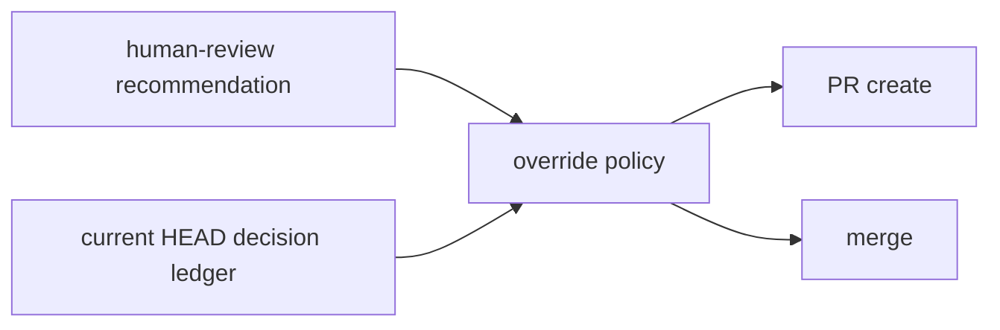

# Human review override architecture

`human-review.json`を推奨の正本、`decision-records.json`をoverride責任の正本とする。共通policy moduleをPR作成とmergeの副作用前に呼び、`human-review:<recommendation>` source、accepted status、理由、reviewer、current HEAD bindingを同一規則で検証する。

