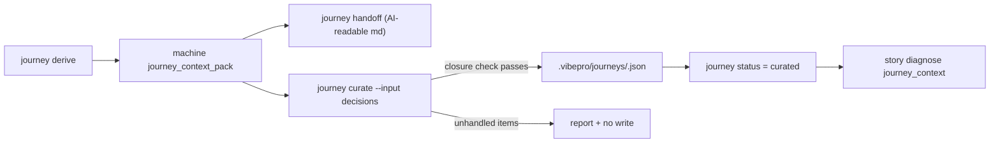

# Architecture

Journey flow today breaks at curation: `journey derive` produces a
machine-derived context pack, `journey handoff` renders AI-readable markdown,
and then the operator must hand-write raw JSON at
`.vibepro/journeys/<journey-id>.json` with no validation that the curated
artifact addresses the machine-detected conflicts and open questions.

`vibepro journey curate` becomes the standard path from `machine_derived` to
`curated`. It reads the latest context pack, carries structural content
(walking skeleton, segments) forward mechanically, and accepts only the human
judgment as input: rulings on conflicts, answers or explicit deferrals for open
questions, and the next-slice choice. A closure check runs before any write —
every conflict and open question must be resolved or explicitly deferred, or
the command reports the unhandled items and writes nothing.

## Decision

- Curation authority stays in `journey-map.js`; the command composes existing
  derive/read/write primitives rather than introducing a parallel model.
- The curated JSON schema is unchanged; hand-authored curated files remain
  valid. `curate` is a generator plus validator, not a new format.
- Judgment input arrives as a file (`--input` JSON or YAML); no interactive
  TUI. This keeps the command scriptable for agents and humans alike.
- Deferrals are first-class: an explicitly deferred open question passes the
  closure check and is preserved with its reason in the curated artifact.
- `story diagnose` next-action guidance adds `vibepro journey curate .` for the
  `machine_derived` state; `gate:journey_context` in the PR Gate DAG is
  unchanged.

## Boundary and Rollback

- Boundary: additive CLI command plus diagnose guidance text. No schema,
  gate, or handoff format changes.
- Rollback: remove the curate command wiring, its journey-map helpers, and the
  diagnose guidance line in one commit.
