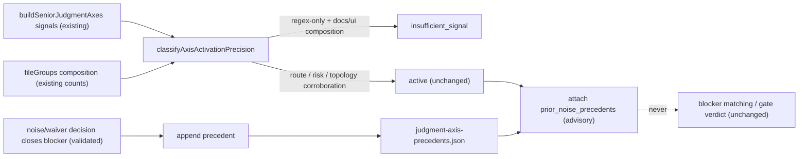

# Architecture

## Decision

Two additive mechanisms, both anchored to existing seams in
`src/pr-manager.js`:

1. **Composition precondition.** `classifyAxisActivationPrecision`
   (the existing noise filter that already downgrades text-only signals to
   `insufficient_signal`) gains one more downgrade rule for
   `security_boundary` and `scope_reviewability`: when every candidate
   signal is a changed-path/text regex match AND the diff composition —
   derived from the `fileGroups` counts `buildSeniorJudgmentAxes` already
   computes (`sourceCount`, `testCount`, `architectureDocCount`,
   `specDocCount`, UI-surface detection) — is docs/spec/UI-only with no
   auth-adjacent source change, the axis classifies as
   `insufficient_signal`. Signals originating from route type, risk
   surfaces, scope status, or code topology are corroborating and always
   keep the axis `active`, so detection power on genuinely security-touching
   diffs is preserved. Regex patterns themselves are not narrowed: signals
   are still collected and visible in the axis output, only their
   activation precision changes. This mirrors how the design-token false
   positive on `style-preset-token-gate` (PR #301) actually failed: the
   `token` path-regex fired with no corroborating route/risk/topology
   signal on a UI-token-only diff.

2. **Noise-precedent ledger.** When an axis blocker is closed by a
   noise/waiver decision that passes the existing validation
   (`isAcceptedBlockerWaiver` in `src/senior-gap-judgment.js`: decision_id,
   reason, artifact all required), a typed precedent
   `{ axis, signal_fingerprint, decision_id, story_id, closed_at }` is
   appended to `.vibepro/evidence/judgment-axis-precedents.json`. The
   fingerprint is `axis + signal kind + matched token`, deterministic from
   the signal record. On a later run where the same fingerprint fires, the
   axis output carries `prior_noise_precedents[]` as advisory context.
   Precedents can never close, waive, or downgrade anything — surfacing
   only. Self-declared story-type suppression was rejected (invites gaming);
   global regex narrowing was rejected (loses recall).

## Public Contract

- Axis objects in `pr-prepare.json` engineering_judgment gain two optional
  fields:

```json
{
  "axis": "security_boundary",
  "activation_precision": "insufficient_signal",
  "activation_precondition": {
    "rule": "docs_ui_composition_regex_only",
    "composition": { "source": 0, "test": 0, "docs": 7, "ui_surface": true }
  },
  "prior_noise_precedents": [
    {
      "decision_id": "dec-…",
      "story_id": "story-vibepro-uiux-style-preset-token-gate",
      "signal_fingerprint": "security_boundary:path_regex:token",
      "closed_at": "2026-07-08T…"
    }
  ]
}
```

- Ledger file: `.vibepro/evidence/judgment-axis-precedents.json`, append-only
  entries, schema_version field, tolerant reader (missing/empty/corrupt →
  axis evaluation proceeds, corruption reported as a warning).
- `JUDGMENT_AXIS_DEFINITIONS` (axis ids, decision questions,
  required_evidence, blocking_criteria) unchanged.

## Execution Topology

No new process, command, or network surface. Both mechanisms run inside the
existing `preparePullRequest` evaluation pass: the precondition is a pure
function of already-computed signals and fileGroups; the ledger is one
small JSON read during axis evaluation and one append when a qualifying
decision closes a blocker.



## Flow

```text
pr prepare
  collect axis signals (unchanged)
  classify activation precision:
    candidates all path/text regex AND composition docs/spec/ui-only
      -> insufficient_signal (new rule, security_boundary / scope_reviewability only)
    any corroborating signal -> active (unchanged)
  for active axes: look up ledger by fingerprint -> attach precedents (advisory)

decision record (noise/waiver, reason + artifact) closes an axis blocker
  -> append { axis, fingerprint, decision_id, story_id, closed_at } to ledger
```

## Boundaries

- Applies only to `security_boundary` and `scope_reviewability`; other axes
  opt in via a future story once precedent data exists.
- The precondition can only downgrade regex-only signals; it can never
  suppress route/risk-surface/scope/code-topology signals.
- The ledger is written only after the existing waiver validation passes;
  it is not an alternative decision store and holds references, not
  evidence.
- Precedent presence is invisible to blocker matching, gap judgment, and
  gate verdicts — asserted by tests that run evaluation with and without
  the ledger and require identical verdicts.

## Invariants

- Every existing activation test case (route-, risk-surface-, and
  topology-triggered) classifies identically after the change.
- A docs/spec/UI-only diff whose only `security_boundary` candidates are
  path-regex matches never yields an active axis.
- Adding an auth-adjacent source file to that same diff flips the axis back
  to active.
- Ledger entries are append-only and deterministic: same closing decision →
  same fingerprint entry.
- Missing, empty, or corrupt ledger never changes evaluation results.

## Rollback

Revert the precondition rule in `classifyAxisActivationPrecision`, the
ledger module, and the attach/append wiring in one commit. Existing
`pr-prepare.json` artifacts with the new optional fields remain valid;
the ledger file becomes inert data.
